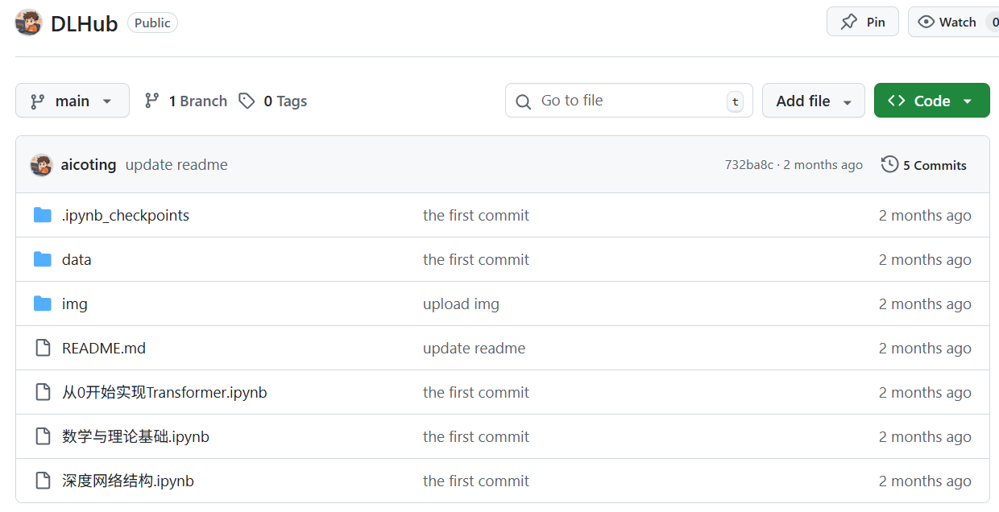

# 前言
前段时间机器学习知识库发出之后，受到很多同学的关注，大家一直催更深度学习知识库和大模型知识库，我也是通宵达旦系统的整理出了深度学习知识库，但是是一部分，包括深度学习概述、数学与理论基础、神经网络基础以及深度网络结构。

由于大家最近可能在金九银十的秋招阶段，很多同学急需，所以先放出来供有需要的同学参考，后续我会持续更新。

## 🌟 希望大家
创建这个知识库工程量还是很大的，从大纲确立到内容书写再到排版，可以说是日积月累的结晶。  

目的就是帮助大家能够建立起深度学习的完整的 属于自己的体系框架。  

这个知识库是 深度学习，建议大家看完机器学习知识库之后再来看深度学习知识库，会有更好的理解，后面我会继续更新 AI 大模型知识库。  

如果大家急需的话，可以催更我。

## ❤️ 最后

学习需要坚持。  
无论是找工作、找实习，还是为了提升自己把握未来机会，  
希望这个知识库能让你有所收获，哪怕只是一点点！

## 注意！
注意！本文中的所有可执行代码均在https://github.com/aicoting/DLHub 中！

大家可以结合学习。

最新的文章都在公众号更新，别忘记关注哦！！！如果想要加入技术群聊，扫描下方二维码回复【加群】即可。

