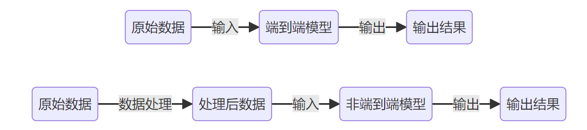

# 定义与核心思想
说到深度学习，大家第一反应可能是“大模型”“神经网络”“AI黑箱”，但如果非要一句话总结：深度学习就是用多层神经网络自动学习数据的表示，并在端到端的框架下完成任务。
这句话看起来有点抽象，拆开来其实就两点：
1. 多层神经网络：和传统的机器学习方法（比如 SVM、KNN）不同，深度学习不是靠人工设计特征，而是通过一层层神经元堆叠，把原始数据逐步映射到更高层的特征空间。简单来说，就是让机器自己“炼”特征。

2. 端到端学习：以前我们做任务，要先想办法提特征，再交给分类器；现在深度学习直接把输入和输出连起来，输入数据丢进去，输出结果吐出来，中间特征学习的过程全是自动完成的。

为什么说这是“深”的学习？因为传统的浅层模型，能力有限，最多学到一些简单的线性或非线性关系；但深层网络可以层层叠加，把数据拆解、组合、再抽象，逐步逼近复杂的非线性函数，这才是真正的“深”。

核心思想其实很朴素：
- 模仿大脑：神经元之间的连接和权重决定了信息如何传播和处理，深度学习就是借鉴了这个灵感。
- 表示学习：不再依赖人工规则，而是靠模型自己学“什么特征重要”。这就像人类小孩学识物，不需要人告诉他“猫的耳朵是尖的”，看多了猫的图像，他自然就能把猫和狗区分开。
- 大规模驱动：当你有了足够的数据、强大的算力，再加上合适的网络结构，模型就能表现出惊人的学习和推理能力。

换句话说，深度学习的魅力就在于它解放了我们对特征工程的依赖，让机器真正具备了从原始数据中“自我进化”的能力。也正是这套逻辑，让它成为今天 AI 的基石。

最新的文章都在公众号更新，别忘记关注哦！！！如果想要加入技术群聊，扫描下方二维码回复【加群】即可。

