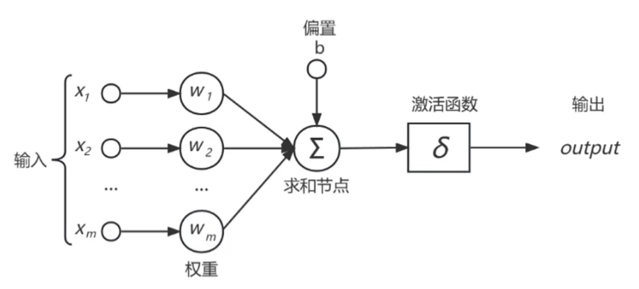
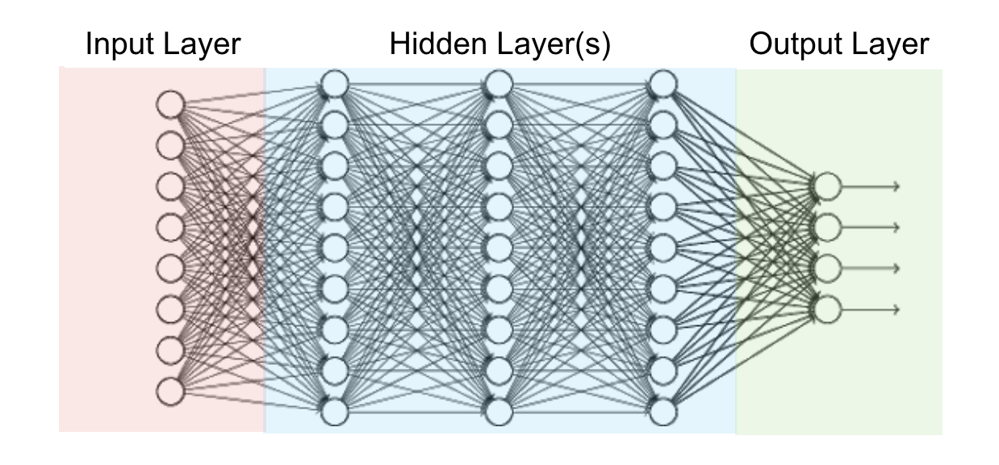
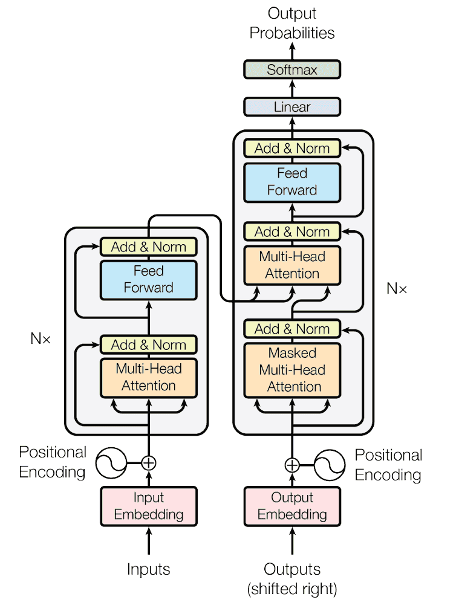
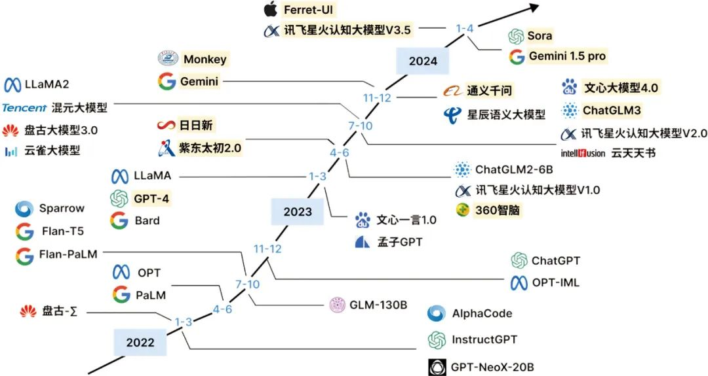

# 深度学习的发展历程
深度学习的发展，其实就是一部神经网络打怪升级史。

从上世纪的感知机开始，到如今动辄千亿参数的大模型，中间踩过不少坑，也迎来过几次巅峰。

我们来顺一遍：
## ① 感知机（Perceptron）
 20 世纪 50 年代，Rosenblatt 提出了感知机。它就是一个最简单的神经元：加权求和，再过个激活函数。
 
 它能解决简单的分类问题，但局限性也明显，比如著名的异或问题（XOR）它就搞不定。
 
 那时候大家对它寄予厚望，但很快失望，于是迎来了第一波**AI 寒冬**。
## ② 多层感知机（MLP）
 后来有人发现，如果把感知机堆起来构成多层网络，再用 反向传播（Backpropagation） 来训练，就能解决非线性问题。
 
 这就是多层感知机（MLP）。
 
 它证明了神经网络具备通用逼近能力，只要层数和参数足够多，几乎可以拟合任意函数。虽然在实际中受算力和数据限制，MLP 并没彻底改变局面，但它奠定了深度学习的数学基础。
## ③ 卷积神经网络（CNN）
 1998 年 LeCun 提出 LeNet，第一次把 CNN 用在手写数字识别上。
 
 后来 2012 年的 AlexNet 在 ImageNet 大赛上一战封神，把图像识别的准确率直接提升了 10 个百分点，让所有人都意识到：深度学习真能干大事！
 
 此后 VGG、ResNet、DenseNet、EfficientNet 一波接一波，CNN 成为计算机视觉的绝对霸主。
## ④ 循环神经网络（RNN）
 图像搞定了，大家把目光投向了文本和语音。
 
 这类数据有序列依赖，传统的 MLP、CNN 不太适合。于是 RNN 上场，可以处理时间序列。

 但普通 RNN 有梯度消失/爆炸的问题，于是升级版 LSTM 和 GRU 出现，成功支撑了早期的机器翻译、语音识别。那时候 Seq2Seq + Attention 的组合，在翻译任务上打败了传统方法。
## ⑤ Transformer
 2017 年，Google 的论文《Attention is All You Need》横空出世，把 Transformer 推到舞台中央。

 它完全抛弃了循环结构，靠自注意力机制（Self-Attention）建模序列关系，训练效率高，还能捕捉长距离依赖。
 
 短短几年，BERT、GPT 系列、ViT（视觉 Transformer）相继登场，几乎把 CNN、RNN 都挤下了舞台。
## ⑥ 大模型时代
 进入 2020 年后，AI 彻底进入大模型时代。
 
 GPT-3、ChatGPT、LLaMA、Claude 这些动辄上千亿参数的语言模型，展现出惊人的语言理解和生成能力。
 
 再加上多模态方向的 CLIP、Stable Diffusion、Sora，AI 已经不仅能读、能说，还能看、能画、能生成视频。这个阶段的特点就是规模即能力，数据越多、模型越大，能力越强。

每一步的突破，背后都是数据、算力和算法三方面的共同作用。也正因为这条路走通了，才有了今天 AI 席卷全球的局面。

最新的文章都在公众号更新，别忘记关注哦！！！如果想要加入技术群聊，扫描下方二维码回复【加群】即可。
