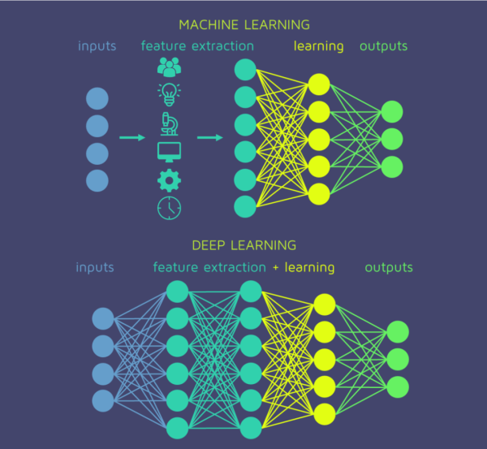

# 深度学习 vs 机器学习
很多同学一开始学 AI，都会有个疑问：传统机器学习和深度学习到底差在哪？

简单一句话：传统机器学习靠人造特征，深度学习靠模型自己学特征。

咱们细说下：
##  ① 特征工程
 

- 传统机器学习：要靠人来设计特征。比如做图像分类，你得先提边缘、纹理、颜色直方图这些东西，再交给 SVM、随机森林去分类。换句话说，人要先告诉模型我觉得这些维度有用。
- 深度学习：不需要人操心这些。你只管把原始数据（图片像素、语音波形、文本序列）丢进去，网络自己会在不同层次学到边缘、形状、语义这些特征。层数越深，学到的特征越抽象。

这就是为什么大家常说深度学习自动化程度高。
##  ② 表达能力
- 传统机器学习：模型往往是浅层的，表达能力有限，遇到特别复杂的非线性关系就有点吃力。
- 深度学习：多层堆叠的神经网络，本质上就是个“通用逼近器”，理论上只要参数够、数据够，它能拟合任意复杂函数。

所以说，深度学习是算力换效果。
##  ③ 数据和算力需求
- 传统机器学习：数据量不大时更靠谱，比如几千条、几万条样本就能训练一个不错的模型。算力需求也低，用笔记本都能跑。
- 深度学习：想要真正发挥威力，必须有海量数据和强大算力支撑。没有 GPU，没有大数据，深度学习就跑不动。

这也解释了为什么深度学习是在大数据和 GPU 普及后才火起来的。
## ④可解释性 vs 黑箱
- 传统机器学习：模型相对透明，比如线性回归能直观解释哪个特征权重大，树模型能画出来决策路径。
- 深度学习：基本是黑箱，虽然有 Grad-CAM、可解释性 AI 这些研究，但整体还是很难说清楚为什么网络做了这个判断。

这也是深度学习饱受争议的地方。
## ⑤ 泛化与适应性
- 传统机器学习：在小数据集上更稳健，但迁移到新任务上，往往要重新设计特征。
- 深度学习：靠表示学习和预训练模型，可以轻松迁移。比如训练好的 BERT，可以拿去做分类、翻译、问答，稍微微调一下就能上新任务。

总结一下就是传统机器学习更轻便、解释性强，但依赖人工特征；深度学习更强大、自动化，但需要大数据、大算力。

传统机器学习就像手工艺人，精雕细琢，深度学习像流水线工厂，规模化生产。两者并不是完全替代关系，而是各有用武之地。

最新的文章都在公众号更新，别忘记关注哦！！！如果想要加入技术群聊，扫描下方二维码回复【加群】即可。
