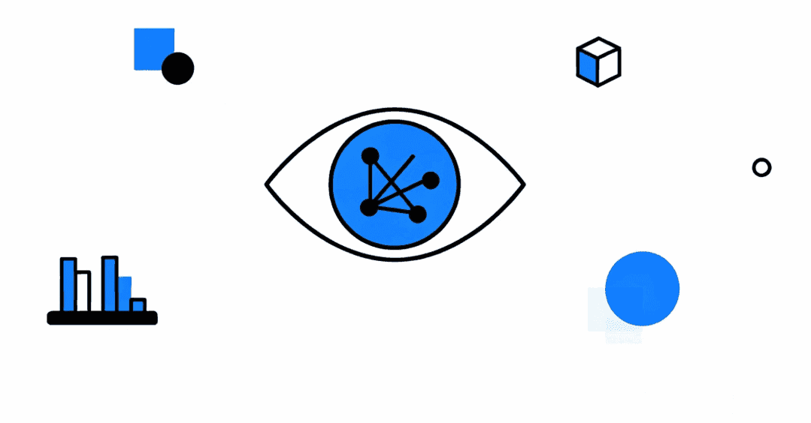
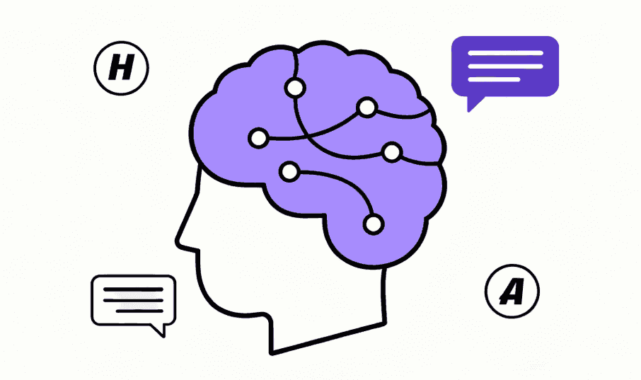
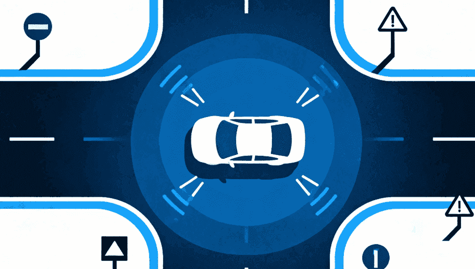

# 应用领域
深度学习能火，不是因为它长得酷，而是因为它真的在各个领域都搞出了大动静。

你要问它能干啥？其实就是一句话：哪里有数据，哪里就能用深度学习。我们来盘几个最典型的应用场景：
## ① 计算机视觉（CV）
 以前电脑看图片，就像我们看天书，只能处理像素点，根本不懂里面是猫还是狗。
 
 CNN 出现后，图像识别的准确率直接飙升，后来各种目标检测（YOLO、Faster R-CNN）、图像分割（U-Net、DeepLab）相继登场。
 
 现在不光能识别猫狗，还能做安防监控、自动驾驶的路况分析，甚至能帮医生看 CT、MRI，效率和准确率都在逐年提高。
## ② 自然语言处理（NLP）
 文本是另一大宝藏。
 
 早期 NLP 要搞复杂的语法树、规则库，但现在直接上 Transformer，大规模预训练模型（BERT、GPT）一出，翻译、问答、对话统统拿下。
 
 今天大家用的 ChatGPT，本质就是 NLP 的超级升级版。它不仅能理解语义，还能生成流畅的回答，几乎成了很多人的日常助手。
## ③ 语音领域
 语音这块，深度学习也彻底颠覆了传统。
 
 以前的语音识别需要手工提取声学特征，现在直接端到端训练，比如 DeepSpeech，输入语音波形就能输出文字。
 
 合成这块也很猛，Tacotron、WaveNet 让机器说话越来越自然，甚至能模仿人声。如今语音助手、智能音箱、车载语音交互，全都离不开这套技术。
## ④ 多模态学习
 光会看、会听还不够，人类的大脑是多模态的：我们看图、听声音、读文字，可以同时理解。
 
 深度学习也在往这方向走。比如 CLIP 能同时理解图像和文本，“看图说话”不再是难事；Stable Diffusion 能根据文字生成图片，现在玩 AI 绘画的朋友们天天用；再到视频生成模型（Sora），直接把文本变成动态视频。可以说，AI 正在变成一个通用的内容创造器。
## ⑤ 医疗健康
 医疗是个高门槛的行业，但 AI 在这块的应用潜力巨大。
 
 比如影像诊断，AI 可以辅助医生发现早期病灶；在药物研发上，AlphaFold 直接用深度学习预测蛋白质结构，推动了整个生物学领域。未来，AI 医生可能不是取代人类，而是帮医生减轻负担，让医疗资源更均衡。
## ⑥ 自动驾驶
 自动驾驶几乎把深度学习能用的全用上了：视觉感知（CV）、激光雷达点云处理、路径规划、行为预测……每个环节都是算法的较量。
 
 特斯拉、Waymo、百度 Apollo 都在砸钱做，虽然完全自动驾驶还没到来，但 L2、L3 辅助驾驶已经很常见。可以预见，深度学习会是未来交通革命的关键引擎。

深度学习的应用范围还在不断扩张，几乎渗透到我们生活的方方面面。正因为它这么万能，才会被称作这个时代最通用的技术。

最新的文章都在公众号更新，别忘记关注哦！！！如果想要加入技术群聊，扫描下方二维码回复【加群】即可。
