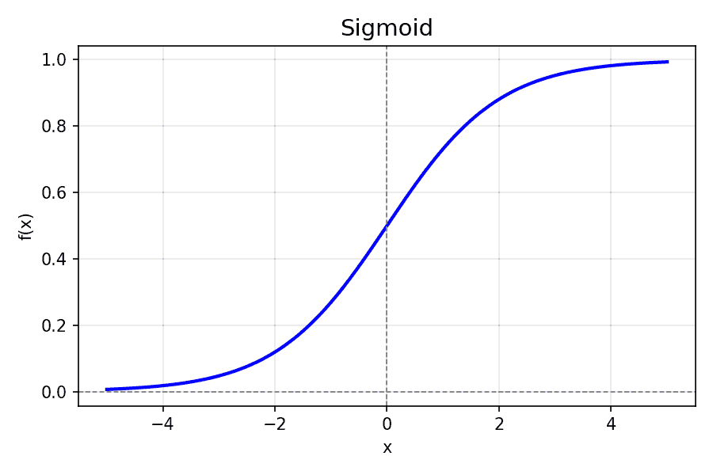
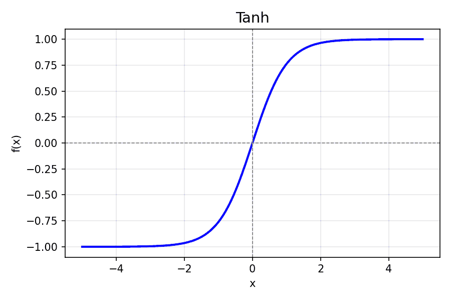
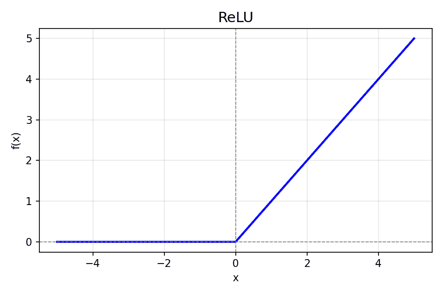
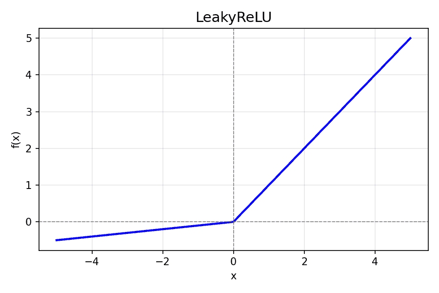
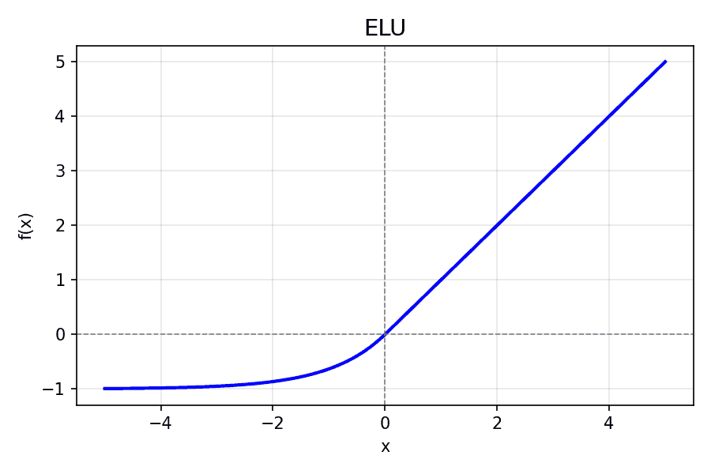
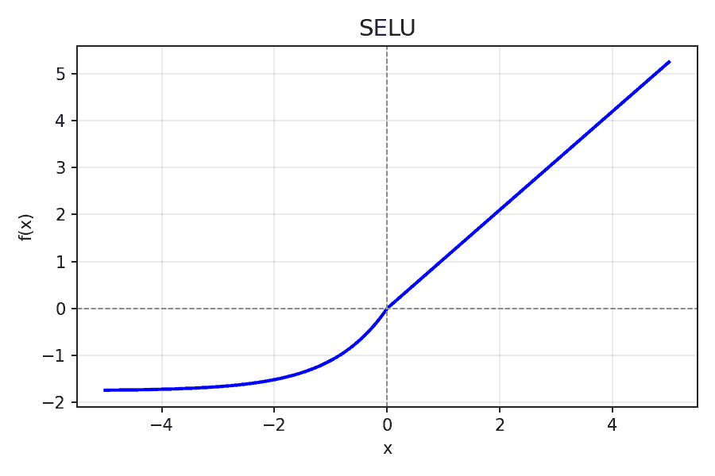
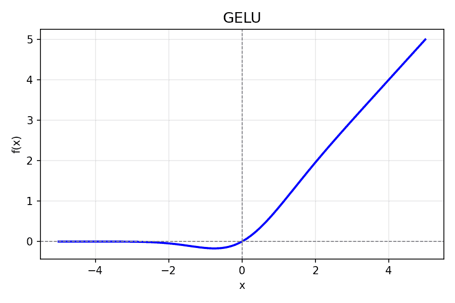
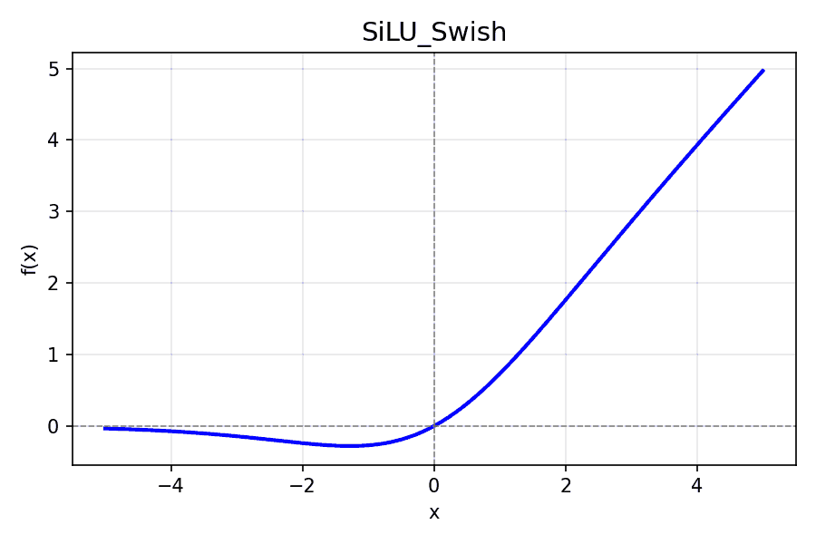
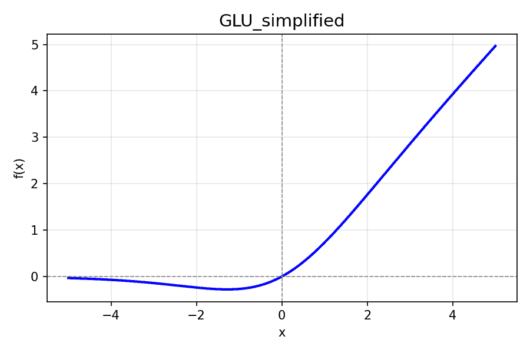
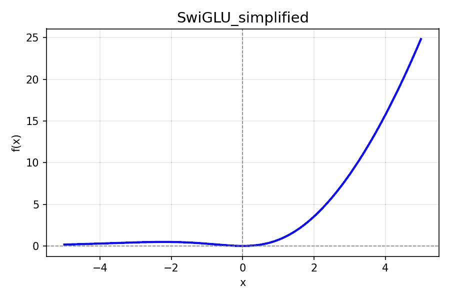

# 激活函数
在深度学习中，激活函数（Activation Function）是神经网络的灵魂。它不仅赋予网络非线性能力，还决定了训练的稳定性和模型性能。那么，激活函数到底是什么？为什么我们非用不可？有哪些经典函数？又该如何选择？

## 什么是激活函数，为什么需要激活函数
激活函数的核心作用就是为神经网络引入非线性。
- 为什么需要非线性？
想象一下，如果网络里每一层都是线性的（比如 $$y = Wx + b$$），无论堆叠多少层，最终网络都只是一条线性映射。深度堆叠就没有意义了，网络的表达能力非常有限。
- 激活函数的作用
激活函数在每个神经元输出前进行非线性变换，让网络可以拟合复杂的函数关系，从而解决分类、回归等非线性问题。

直观理解一下，激活函数就像神经网络里的开关或滤镜，它决定了每个神经元应该多大程度地激活，从而使网络具备强大的表达能力。
## 经典的激活函数
在深度学习中，有几类经典激活函数，每种都有自己的优缺点：
### Sigmoid
公式：
$$f(x) = \frac{1}{1 + e^{-x}}$$

- 优点：输出范围在 $$(0,1)$$，可以表示概率
- 缺点：容易饱和（输入过大或过小时梯度接近0，导致梯度消失）
- 应用场景：二分类输出层
### Tanh（双曲正切）
公式：
$$f(x) = \tanh(x) = \frac{e^{x} - e^{-x}}{e^{x} + e^{-x}}$$

- 优点：输出在 $$(-1,1)$$  ，比 sigmoid 居中，对梯度更友好
- 缺点：仍可能梯度消失
- 应用场景：RNN 隐层
### ReLU（Rectified Linear Unit）   
公式：
$$f(x) = \max(0, x)$$

- 优点：计算简单，导数恒为1（正区间），缓解梯度消失
- 缺点：负区间可能“死亡”，即神经元永远不激活
- 应用场景：隐藏层主流激活函数
### Leaky ReLU / Parametric ReLU（PReLU）
公式：

$$f(x) =\begin{cases}x, & x > 0 \\ \alpha x, & x \le 0 \end{cases} \quad (\alpha \approx 0.01)$$

   
- Leaky ReLU: 对负区间引入一个小斜率，避免神经元死亡
- PReLU: 斜率可学习，更灵活
### Softmax
公式：
$$\text{Softmax}(x_i) = \frac{e^{x_i}}{\sum_j e^{x_j}}$$
Softmax 输出的是一组归一化的概率，在图中使用 柱状图 (bar chart) 展示每个输入元素对应的概率值。

- 作用：多分类输出概率分布
- 应用场景：分类任务输出层
### ELU（Exponential Linear Unit）
公式：
$$f(x) = \begin{cases} x & \text{if } x>0  \\ \alpha(e^x - 1) & \text{if } x \le 0 \end{cases}$$

- 特点：负区间平滑非零，避免 ReLU 死区问题。
- 优点： 输出均值更接近 0，梯度更稳定。
- 常用于： 深层 CNN、MLP。
### SELU（Scaled Exponential Linear Unit）
公式：
$$f(x) = \lambda \cdot \text{ELU}(\alpha, x)$$

其中 $$\lambda$$ ≈1.05，$$\alpha$$ ≈1.67。

- 特点：在特定初始化下能实现自归一化，保持激活均值和方差稳定。
- 优点： 无需 BatchNorm。
- 常用于： 自归一化神经网络（Self-Normalizing NN）。
### GELU（Gaussian Error Linear Unit）
公式：
$$f(x) = x \cdot \Phi(x) \approx 0.5x(1+\tanh[\sqrt{2/\pi}(x+0.044715x^3)])$$

其中 $$\Phi(x)$$ 是标准正态分布 CDF。

- 特点：在 ReLU 的基础上引入概率思想，让激活与输入大小平滑相关。
- 优点： 更平滑、更稳定，效果普遍优于 ReLU。
- 常用于： Transformer（BERT、GPT、ViT）。
### SiLU（Swish）
公式：
$$f(x) = x \cdot \sigma(x)$$

- 特点：与 GELU 类似，是一种平滑版 ReLU。
- 优点： 梯度连续，优化更稳定。
- 常用于： EfficientNet、Transformer。
### GLU（Gated Linear Unit）    
 GLU/SwiGLU 在实际中是门控形式（two linear branches），是向量上的逐元素操作；为了在一维上可视化，我用简化的标量形式来画图 —— 把两条分支都用相同的输入值（即把 $$a=x$$, $$b=x$$），因此 $$GLU(x) = x * sigmoid(x)$$，$$SwiGLU(x) = x * SiLU(x)$$。这能直观展示门控机制的形状差异。 

公式：

$$f(x) = (xW_1) \odot \sigma(xW_2)$$

其中第二个分支作为门控信号。

特点：通过门控机制控制信息流，增强非线性表达。
优点： 适合序列建模、控制性强。
常用于： Transformer FFN、语言模型。
### SwiGLU（Swish-Gated Linear Unit）
公式：
$$f(x_1, x_2) = x_1 \cdot \text{Swish}(x_2) = x_1 \cdot (x_2 \cdot \sigma(x_2))$$

- 特点：GLU 的改进版，把 Sigmoid 门换成 Swish 门。
- 优点： 表达力更强、梯度更平滑，性能优于 ReLU/GELU。
- 常用于： LLaMA、PaLM、GPT-NeoX 等现代 LLM。

## 怎么选择激活函数
选择激活函数时，可以根据以下几个原则：

**1. 隐藏层**
  - 优先使用 ReLU 或其变种（Leaky ReLU, ELU, PReLU）
  - 优点：计算快、缓解梯度消失

**2. 输出层**
  - 二分类：Sigmoid
  - 多分类：Softmax
  - 回归：线性或无激活函数

**3. 网络结构和任务需求**
  - RNN 中常用 tanh 或 ReLU
  - 深层网络推荐使用残差连接 + ReLU
  - 如果担心 ReLU 死神经元，可尝试 Leaky ReLU 或 ELU

小技巧：

如果不确定用哪个激活函数，隐藏层可以先用 ReLU，输出层按任务选择；训练中注意梯度情况，如果梯度消失或爆炸，再考虑替换或调整激活函数。

激活函数虽然只是神经元里的一小步，但却是深度学习的一大步。没有它，深度学习就不会有今天的辉煌。它让神经网络从“线性堆叠”变成了真正的“非线性智能体”，能够处理复杂的视觉、语言和跨模态任务。

所以，学习神经网络，一定要对激活函数有清晰的理解。它不仅是数学符号上的非线性，更是模型智慧的来源。

最新的文章都在公众号更新，别忘记关注哦！！！如果想要加入技术群聊，扫描下方二维码回复【加群】即可。
