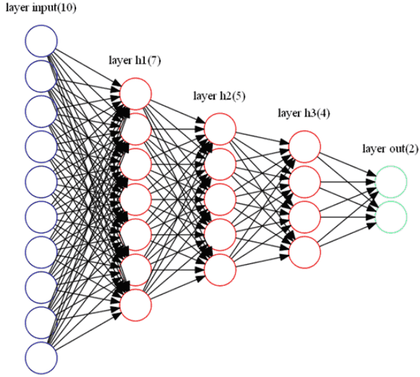

# 全连接网络结构
在神经网络的世界里，最经典、最基础的一种结构就是全连接网络（Fully Connected Network, FCN）。它的核心思想非常直白：上一层的每一个神经元，都会和下一层的每一个神经元相连。这种全连接的设计，使得网络在理论上具备了极强的表达能力，可以逼近任意复杂的函数。

## 全连接网络的结构
一个标准的全连接层（Fully Connected Layer, FC Layer），也叫线性层（Linear Layer），其计算可以用一个公式概括：$$z = W \cdot x + b$$

其中：
- $x$ 表示输入向量
- $W$ 表示权重矩阵
- $b$ 表示偏置
- $z$ 是加权和的结果，通常会接一个激活函数
如果在输入层有 $n$ 个神经元，输出层有 $m$ 个神经元，那么这个全连接层的权重矩阵就是一个 $m \times n$ 的矩阵。换句话说，每一个输出神经元，都会考虑所有输入神经元的加权组合。

## 全连接网络的工作流程

全连接网络一般包含三类层次：
1. 输入层：负责接收原始数据，比如图像像素、文本向量等。
2. 隐藏层：由多个全连接层堆叠而成，每一层都会经过线性变换 + 激活函数的处理。
3. 输出层：根据任务不同选择输出形式，比如分类问题用 Softmax，回归问题直接输出实数。

在训练过程中，数据会从输入层一路传播到输出层，这个过程叫前向传播。然后根据预测值和真实值的误差，网络会通过反向传播 + 梯度下降的方式更新权重和偏置，不断让模型变得更聪明。

全连接网络表达能力强，可以拟合任意非线性函数（通用逼近定理）。由于每个神经元都和下一层相连，所以全连接网络的参数数量往往非常庞大，容易导致过拟合。相比卷积层、注意力机制，全连接层的计算和存储开销更大。同时全连接神经网络的可解释性也比较差，虽然能学到复杂的模式，但不容易直观理解每个神经元在学什么。

全连接网络通常作为基础结构存在，在 多层感知机（MLP） 中，所有层都是全连接层，在 卷积神经网络（CNN） 里，卷积层提取特征后，通常会在最后接一两个全连接层进行分类；在 Transformer 中，注意力机制之后的前馈网络（Feed-Forward Network, FFN）本质上也是全连接层。

换句话说，全连接网络虽然简单，但几乎无处不在，是所有复杂深度学习模型的底层砖瓦。

全连接网络是神经网络里最基础的结构，看似朴素，实则奠定了深度学习的根基。它教会我们如何用矩阵乘法 + 激活函数来处理数据，并通过训练让模型逐步拟合复杂任务。虽然在大规模视觉、语言任务中，CNN 和 Transformer 已经成为主流，但全连接层依旧是必不可少的组成部分。

最新的文章都在公众号更新，别忘记关注哦！！！如果想要加入技术群聊，扫描下方二维码回复【加群】即可。
