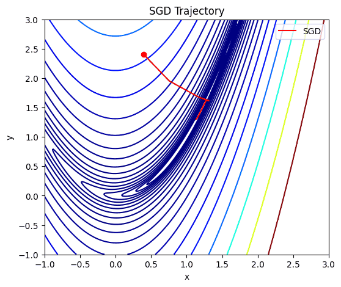
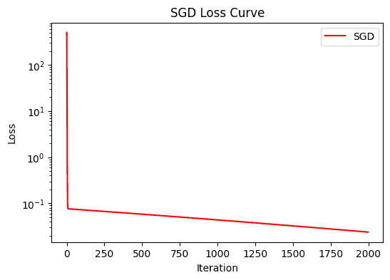
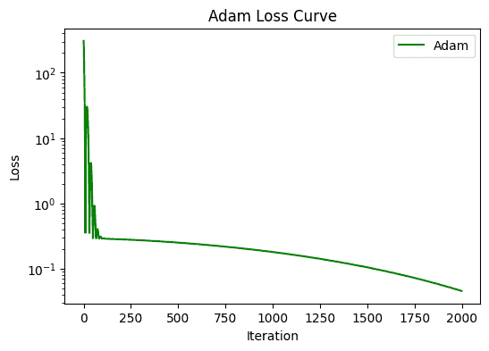
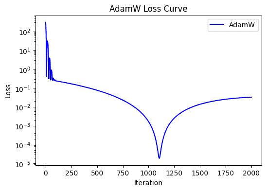

# 优化算法
在神经网络的训练过程中，优化算法（Optimizer） 是决定参数如何更新的关键工具。

它就像是模型学习过程中的导航仪，告诉我们在损失函数的山谷里该往哪个方向走、走多远。

不同的优化算法对应着不同的更新策略，直接影响模型的收敛速度和最终效果。
## 梯度下降的基本思想
训练神经网络的核心目标是最小化损失函数 $$L(\theta)$$，其中 $$\theta$$ 表示模型参数。最常见的更新公式是：
$$\theta \leftarrow \theta - \eta \cdot \nabla_\theta L(\theta)$$
- $$\theta$$：模型参数（权重、偏置）
- $$\eta$$：学习率（Learning Rate）
- $$\nabla_\theta L(\theta)$$：损失函数关于参数的梯度

也就是每次迭代都沿着梯度下降的方向走一小步，逐渐逼近最优解。
## 常见优化算法
### SGD（随机梯度下降）
$$\theta \leftarrow \theta - \eta \cdot \nabla_\theta L(\theta; x_i, y_i)$$

- 特点：每次只用一个样本（或小批量样本）的梯度更新。
- 优点：计算效率高，能跳出局部最优。
- 缺点：收敛不稳定，容易震荡。

SGD 是所有优化算法的鼻祖，至今依然被广泛应用，尤其在大规模训练里常搭配 动量（Momentum） 使用，加速收敛并减少震荡。

### Adam
Adam（Adaptive Moment Estimation）可以看作是 Momentum + RMSProp 的结合体，它同时考虑了梯度的一阶动量（均值）和二阶动量（方差），实现了对学习率的自适应调整。

更新公式核心如下：

$$m_t = \beta_1 m_{t-1} + (1 - \beta_1)g_t$$

$$v_t = \beta_2 v_{t-1} + (1 - \beta_2) g_t^2$$

$$\hat{m}_t = \frac{m_t}{1 - \beta_1^t}, \quad \hat{v}_t = \frac{v_t}{1 - \beta_2^t}$$

$$\theta \leftarrow\theta - \eta \cdot \frac{\hat{m}_t}{\sqrt{\hat{v}_t} + \epsilon}$$

其中：
- $$g_t$$：当前梯度
- $$m_t$$：梯度一阶动量，类似“滑动平均”
- $$v_t$$：梯度二阶动量，反映梯度波动大小
- $$\hat{m}_t, \hat{v}_t$$：经过偏差校正后的估计值
- $$\beta_1, \beta_2$$：衰减系数，常用值分别是 0.9 和 0.999
- $$\epsilon$$：防止除零的小常数
- $$\eta$$：学习率

Adam 会让每个参数都拥有一个自适应的学习率，通常比纯 SGD 收敛更快、更稳。缺点是有时会导致泛化性能不如 SGD，容易学得太快，最后停在次优解。

### AdamW
AdamW（Adam with Weight Decay） 是对 Adam 的重要改进，区别主要体现在 正则化方式。
- 在 Adam 里，如果你加 L2 正则化，它并不是严格意义上的“权重衰减”，而是把正则项混进了梯度更新里，导致效果不稳定。
- 在 AdamW 里，权重衰减（Weight Decay）被独立出来，更新方式如下：

$$\theta \leftarrow \theta - \eta \cdot \left( \frac{\hat{m}_t}{\sqrt{\hat{v}_t} + \epsilon} + \lambda \theta \right)$$

其中：
- $$\lambda$$：权重衰减系数
- 其他符号与 Adam 相同

AdamW 保证了真正意义上的权重衰减，从而显著提升泛化性能。特别是在 Transformer、大模型训练中，AdamW 已经成为标配。

可以说，现在只要是用 Adam，大部分场景下都会直接用 AdamW 替代。

### LAMB
LAMB （Layer-wise Adaptive Moments for Batch training）是在 Adam 基础上的进一步升级，专门为 超大规模 batch 训练 设计。它的关键创新点是 Layer-wise 自适应学习率缩放。
在 Adam 中，不同参数的更新幅度可能差异很大，这在大 batch 下会导致训练不稳定。而 LAMB 会对每一层参数的更新做归一化：

$$r_t = \frac{\| \theta_t \|}{\| \Delta_t \|} \cdot \Delta_t$$

其中：
- $$\theta_t$$：当前层的参数向量
- $$\Delta_t$$：Adam 更新得到的梯度方向
- $$\| \cdot \|$$：向量范数
- $$r_t$$：缩放后的更新量

这样，每一层的参数更新大小会和该层参数的规模匹配，避免了**大参数小更新，小参数大更新**的问题。

LAMB 能让 batch size 成千上万依然稳定训练，非常适合 BERT、GPT 等大规模预训练场景。比如 Google 在训练 BERT-Large 时，用 LAMB 把 batch size 提升到 32K，训练只需 76 分钟就能收敛，而原本用 Adam 要花好几天。

优化算法可以说是深度学习训练中的发动机。从最基础的 SGD，到改进的 Adam、AdamW，再到为大模型量身定制的 LAMB，每一次演进都在解决**如何更快更稳地到达最优解**这个核心问题。可以说，损失函数决定了目标，而优化算法决定了到达目标的路径。

最新的文章都在公众号更新，别忘记关注哦！！！如果想要加入技术群聊，扫描下方二维码回复【加群】即可。
