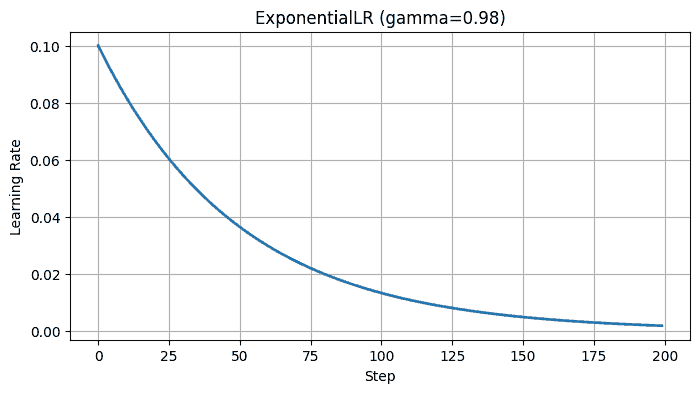
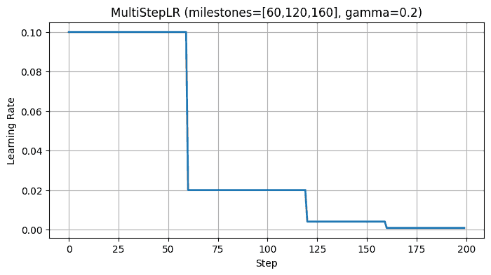
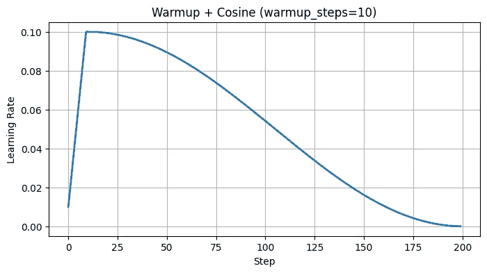

# 学习率策略
在训练神经网络时，学习率（Learning Rate, LR） 是最关键的超参数之一。学习率控制了每次参数更新的**步子大小**，学习率太大，可能导致震荡甚至发散，模型根本学不下去；学习率太小，训练过程会非常慢，还可能卡在局部最优点。

为了在不同阶段取得更好的训练效果，人们设计了各种 学习率调度策略（Learning Rate Scheduling），它们的目标是让学习率在训练过程中动态变化，而不是固定不变。
## 固定学习率
最简单的方式就是设置一个固定的学习率。固定学习率实现简单，不需要额外的调度逻辑。但是在复杂模型训练中往往效果不好，因为模型在训练初期需要更快收敛，而在后期需要更稳的更新。
## Step Decay
$$\eta_t = \eta_0 \cdot \gamma^{\lfloor t / s \rfloor}$$

- $$\eta_t$$：第 t 次迭代的学习率
- $$\eta_0$$：初始学习率
- $$\gamma$$：衰减因子（如 0.1）
- $$s$$：衰减步长

Step Decay 在训练到一定阶段后，将学习率整体降低一个档次。虽然简单粗暴，但在图像分类等任务中依旧常见。

代码示例：
```python
scheduler = torch.optim.lr_scheduler.StepLR(optimizer, step_size=30, gamma=0.1)
```


学习率变化曲线是阶梯状的，看起来像台阶。
优点是简单易用，缺点是变化太生硬，有时候不够平滑。
## 指数衰减
相比 StepLR，指数衰减更加平滑。

公式：
$$\eta_t = \eta_0 \times e^{-\lambda t}$$

代码示例：
```python
scheduler = torch.optim.lr_scheduler.ExponentialLR(optimizer, gamma=0.95)
```


每个 epoch 学习率都会乘上一个常数系数（比如 0.95），逐步下降。

常用于中小规模训练任务，稳定但缺乏灵活性。
## 多步衰减
有时候你希望学习率只在特定几个时间点下降，而不是固定周期。

比如：
```python
scheduler = torch.optim.lr_scheduler.MultiStepLR(optimizer, milestones=[60, 120, 160], gamma=0.2)
```

意思是当训练到第 60、120、160 轮时，学习率衰减为原来的 0.2。

这种方式常见于图像分类任务（如 ResNet 论文原设）。

## Warm-up（预热策略）
Warm-up 的思想是不要一开始就用很大的学习率，而是从小学习率慢慢升上去。

原因是在训练初期，参数随机初始化，梯度方向可能非常不稳定，如果学习率过大，很容易发散。方法就是前几轮训练让学习率线性增加，达到设定的峰值，再切换到正常调度策略。

Warm-up 几乎是 Transformer、大模型训练的标配，因为它能极大地缓解训练初期的不稳定。

常见组合：
- Warmup + Cosine Decay
- Warmup + Linear Decay
- Warmup + Exponential Decay
示例（以 HuggingFace 为例）：
```python
from transformers import get_cosine_schedule_with_warmup

scheduler = get_cosine_schedule_with_warmup(
    optimizer,
    num_warmup_steps=1000,
    num_training_steps=10000
)
```
这种方式几乎成为 Transformer 时代的默认配置。
## Cosine Annealing
$$\eta_t = \eta_{min} + \frac{1}{2} (\eta_{max} - \eta_{min}) \left( 1 + \cos\left(\frac{T_{cur}}{T_{max}} \pi\right) \right)$$
- $$\eta_{max}$$：最大学习率
- $$\eta_{min}$$：最小学习率
- $$T_{cur}$$：当前迭代数
- $$T_{max}$$：总迭代数


Cosine Annealing 会让学习率按照余弦函数曲线逐渐下降，更新越来越小，更利于模型在训练后期收敛到更优的点。有时还会配合 重启机制（Cosine Annealing with Restarts, SGDR） 使用，让学习率周期性恢复，从而跳出局部最优。

代码示例：
```python
scheduler = torch.optim.lr_scheduler.CosineAnnealingLR(optimizer, T_max=50)
```
如果结合 Warm Restarts（周期性重启），可以让学习率周期性上升再下降，从而跳出局部最优。

## OneCycle Policy
OneCycle 是近年来非常流行的一种学习率策略。它的核心思想是前半程学习率从一个较小值线性升高到最大学习率；后半程学习率再逐渐下降到比初始值还小的水平。
同时，OneCycle 还会配合动量调整，学习率高时动量低，学习率低时动量高。

代码示例：
```python
scheduler = torch.optim.lr_scheduler.OneCycleLR(
    optimizer, 
    max_lr=0.1, 
    total_steps=1000
)
```
OneCycle 可以让模型在训练过程中更快收敛，并且往往提升泛化性能。PyTorch 已经内置了这个调度器，很多人把它作为默认选择。

现在你想一下优化器和学习率策略有什么关系，是不是优化器决定了怎么走，学习率策略决定了走多快、何时加速、何时刹车。合理的学习率调度，往往比盲目调大模型、更换优化器带来的提升还要显著。

最新的文章都在公众号更新，别忘记关注哦！！！如果想要加入技术群聊，扫描下方二维码回复【加群】即可。
