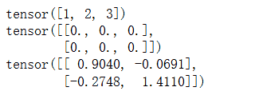
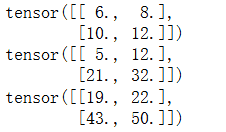
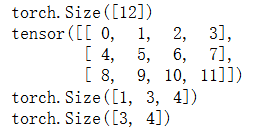
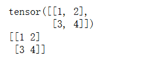

# 张量与自动微分
要玩转深度学习，首先得搞懂两个老朋友——张量（Tensor）和自动微分（Autograd）。这俩基本上是深度学习框架的底层发动机，没它们模型根本跑不起来。

先说张量。

 在传统机器学习里，我们处理的数据一般就是向量（一维）和矩阵（二维），顶多再推点概率分布。
 
 但深度学习场景复杂得多，图像是三维（高、宽、通道），视频直接四维（加上时间），一到大模型训练，那就是成千上万个样本批量堆叠起来——这时候你就需要一个更通用的数学对象来表示，那就是张量。简单粗暴理解：张量就是“高维矩阵”，它能优雅地承载不同模态的数据。

再说自动微分。

 传统机器学习里，我们写个损失函数，想算梯度，手推一推就能搞定；可深度神经网络呢？成百上千层，参数动辄几千万甚至上亿，你让人类手工算导数，估计推到一半就崩溃了。
 
 这时候就得靠自动微分：框架在前向计算时顺便记录计算图，等要更新参数时，直接反向一遍，把梯度都算出来，这就是著名的 反向传播（Backpropagation）。所以说，自动微分就是深度学习的梯度工厂，没有它，训练根本玩不转。

一句话总结就是张量是数据的载体，自动微分是训练的引擎。这两样东西打底，神经网络才能在大规模数据上跑起来，不然就只能停留在纸面推公式的阶段了。

## 张量运算

深度学习里，张量（Tensor）就是数据的容器。不管是图像、文本还是语音，最后都会转成张量的形式丢进网络里。你可以把张量理解成一个高维数组：
- 向量是一维张量
- 矩阵是二维张量
- 彩色图片（高 × 宽 × 通道）就是三维张量
- 一批彩色图片（批量 × 高 × 宽 × 通道）那就是四维张量

所以，掌握张量运算，基本等于掌握了深度学习的数据操作能力。
### 创建张量
在 PyTorch 里，最常见的就是用 torch.tensor() 或者直接用 torch 的方法：
```python
import torch

# 从列表创建
a = torch.tensor([1, 2, 3])
print(a)  # tensor([1, 2, 3])

# 创建全零张量
b = torch.zeros((2, 3))
print(b)

# 创建随机张量
c = torch.randn((2, 2))  # 服从标准正态分布
print(c)
```
输出如下：

这几行代码就能看出：张量不光能存数据，还能直接初始化为特殊形式（全零、全一、随机）。
### 张量的基本运算
张量能做的操作其实和矩阵差不多，但更灵活：
```python
x = torch.tensor([[1., 2.], [3., 4.]])
y = torch.tensor([[5., 6.], [7., 8.]])

# 加法
print(x + y)

# 逐元素相乘
print(x * y)

# 矩阵乘法
print(torch.matmul(x, y))
```
输出为

这里要注意，$$*$$ 是逐元素乘法，而 matmul（或者 @ 符号）才是矩阵乘法。这点经常会坑新手。
### 张量的维度操作  
在深度学习里，经常要把张量的形状（shape）改来改去，比如卷积层的输入输出必须是 $$[batch, channel, height, width]$$。

PyTorch 提供了很多方便的方法来操作张量的维度：
```python
t = torch.arange(12)  # [0,1,2,...,11]
print(t.shape)  # torch.Size([12])

# reshape
t2 = t.reshape(3, 4)
print(t2)

# unsqueeze (增加一个维度)
t3 = t2.unsqueeze(0)  # 在最前面加一个batch维度
print(t3.shape)  # torch.Size([1, 3, 4])

# squeeze (去掉维度为1的维度)
t4 = t3.squeeze(0)
print(t4.shape)  # torch.Size([3, 4])
```
输出为

这些操作非常常用，特别是在处理批量数据的时候。
### 与 NumPy 的转换
张量和 NumPy 的数组几乎是双胞胎，PyTorch 也支持直接互转：
```python
import numpy as np

arr = np.array([[1, 2], [3, 4]])
tensor_from_np = torch.from_numpy(arr)
print(tensor_from_np)

back_to_np = tensor_from_np.numpy()
print(back_to_np)
```
输出为

这意味着我们可以在 NumPy 和 PyTorch 之间随意切换，数据预处理用 NumPy，模型训练用 PyTorch，很方便。

可以说张量就是深度学习世界里的基本货币，所有的数据都要换算成张量，所有的操作都是张量运算。

搞懂张量的创建、运算、维度操作，就等于拿到了深度学习的入场券。

## 自动微分
要说深度学习为什么能训练起来，答案其实就四个字：会算梯度。

神经网络本质上就是一个复杂函数，参数上千万甚至上亿，如果没有一个高效的梯度计算方法，那训练根本没法进行。

先复习下数学：

 如果我们有一个函数 $$y = f(g(x))$$，那它的导数就是 $$\frac{dy}{dx} = \frac{dy}{dg} \cdot \frac{dg}{dx}$$


这就是链式法则（Chain Rule）。神经网络其实就是把很多个函数一层层套起来，比如：

$$x \rightarrow h_1(x) \rightarrow h_2(h_1(x)) \rightarrow \cdots \rightarrow h_n(\cdots)$$

那么反向传播就是在输出层先算梯度，再一层一层往前传，把每一层的梯度都算出来。

但是问题来了：
- 网络这么深，手工写公式几乎不可能；
- 运算量巨大，必须要有一种高效又不出错的方法。

于是就有了 计算图（Computational Graph）：前向传播时，框架会悄悄搭建一张图，把每一步运算记录下来；反向传播时，系统沿着图反过来走，自动套用链式法则算梯度。这就是所谓的 自动微分（Autograd）。

PyTorch 最大的爽点就是它的动态图机制：你写什么操作，它就帮你即时搭建计算图。然后只要调用 .backward()，梯度就全给你算好了。

看个简单例子：
```python
import torch

# 创建一个需要计算梯度的张量
x = torch.tensor(2.0, requires_grad=True)

# 定义一个函数 y = x^2 + 3x + 1
y = x**2 + 3*x + 1

# 自动求导
y.backward()

# 查看 dy/dx
print(x.grad)  # tensor(7.)
这里我们定义了一个一元二次函数，理论上导数是 dy/dx = 2x + 3，代入 x=2 就是 7。PyTorch 的 autograd 自动帮我们算出来了。
再看一个稍微复杂点的：
x = torch.randn(3, requires_grad=True)  # 向量
y = x * 2
z = y.mean()  # 先乘法，再取均值

z.backward()  # 自动反向传播

print(x.grad)
```
这里 PyTorch 会沿着计算图：
- 先算 $$\frac{dz}{dy}$$，再算 $$\frac{dy}{dx}$$
- 最后套用链式法则，把梯度传回给 $$x$$

整个过程我们根本不用手推，全自动。

Pytorch框架只会保存需要的中间变量，不会重复计算，梯度一遍就算出来，就不用再去推复杂的导数公式，哪怕模型有几百层，.backward() 依旧能帮你搞定。

因为是动态图，你甚至可以在循环、条件分支里构建模型，autograd 也能照样工作。

传统机器学习的梯度，多数情况能写成显式公式，比如逻辑回归的梯度、SVM 的优化问题，推导出来一次就行。

 但深度学习不一样：网络层数深、运算复杂，手工推导几乎不现实，所以才需要计算图 + 自动微分这套机制。可以说，没有自动微分，深度学习就是空中楼阁。

自动微分就是深度学习的发动机，它把算梯度这件枯燥又复杂的活儿完全交给了框架，让我们能专注在网络结构和训练策略上。

如果说张量是深度学习的数据基石，那自动微分就是让整个网络动起来的核心动力。

最新的文章都在公众号更新，别忘记关注哦！！！如果想要加入技术群聊，扫描下方二维码回复【加群】即可。
