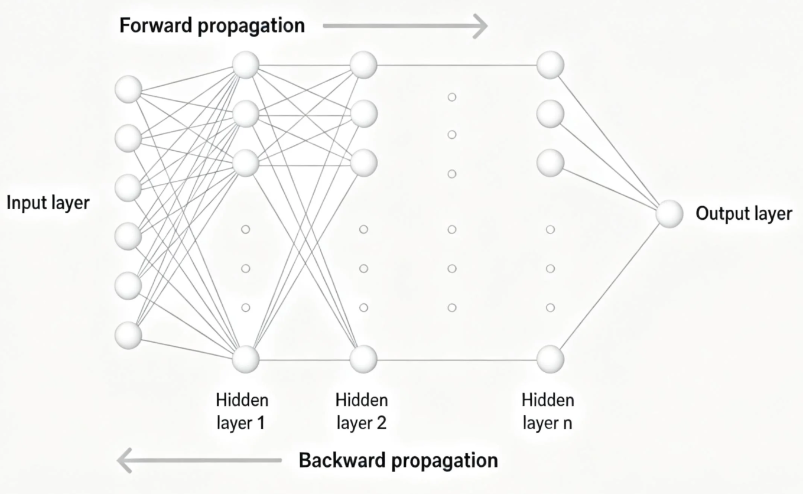
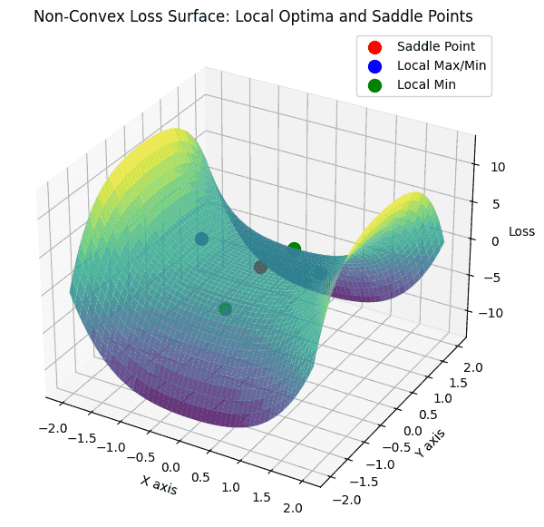

# 反向传播与优化理论
在深度学习中，反向传播（Backpropagation）是网络训练的核心机制，它的本质就是通过链式法则将损失函数对各层参数的梯度高效计算出来，从而指导权重更新。简单来说，网络前向传播得到预测值，计算损失，再沿着网络反向传播梯度，最后用优化算法更新参数。这个过程看似简单，但背后涉及的非凸优化问题非常复杂——深度网络的损失空间充满了局部极小值、鞍点和高维平坦区域，因此传统的梯度下降往往需要结合动量、学习率调度等技巧才能收敛到一个比较理想的解。

优化算法在这里起到了至关重要的作用。从最基础的梯度下降，到带动量的 SGD，再到自适应优化方法如 Adam、AdamW，它们各有特点：有的收敛快，有的更稳定，还有的在面对稀疏梯度或者非平滑损失时表现更好。在实际训练中，我们往往需要结合网络结构、数据规模、计算资源来选择合适的优化策略。可以说，掌握反向传播和优化理论，不只是理解算法背后的数学，更是深度学习实践中提升模型性能的关键。

## 反向传播算法
在深度学习里，Backpropagation（反向传播）几乎是每个神经网络训练的必修课。

前面我们讲过，它的核心就是通过链式法则计算损失函数对各层参数的梯度，然后用这些梯度去更新权重。



但很多人听到链式法则就头大，其实原理很直观，我来给你详细拆开讲。
### 为什么需要反向传播
假设我们有一个简单的多层感知机（MLP）：$$x \rightarrow h_1 \rightarrow h_2 \rightarrow \cdots \rightarrow \hat{y}$$

网络输出预测值 $$\hat{y}$$ 后，我们计算损失函数 $$L(\hat{y}, y)$$。目标就是最小化损失，也就是不断调整权重 $$W$$ 和偏置 $$b$$：

$$W \gets W - \eta \frac{\partial L}{\partial W}, \quad b \gets b - \eta \frac{\partial L}{\partial b}$$

问题是，网络可能有几十层、上百万参数，直接求每个参数对损失的偏导太复杂，这时候就用到了反向传播。
### 链式法则的核心思想
反向传播的原理可以总结一句话：损失函数对上一层的梯度 = 当前层梯度 × 当前层输入对上一层输出的导数。

举个例子，假设一层神经网络输出为：$$z = W x + b, \quad a = f(z)$$

其中 $$f$$ 是激活函数。损失 $$L$$ 对 $$W$$ 的梯度可以写成：

$$\frac{\partial L}{\partial W} = \frac{\partial L}{\partial a} \cdot \frac{\partial a}{\partial z} \cdot \frac{\partial z}{\partial W}$$

这里每一部分都很清楚：
- $$\frac{\partial L}{\partial a}$$ 是来自下一层的误差信号
- $$\frac{\partial a}{\partial z}$$ 是激活函数的导数
- $$\frac{\partial z}{\partial W} = x$$就是输入信号

这就是链式法则在神经网络中的应用。逐层向前，我们可以把复杂的网络梯度拆成简单的可计算块。
### 多层网络的反向传播推导
为了更直观，我们看两层网络：$$\text{输入层 } x \rightarrow \text{隐藏层 } h = f(W_1 x + b_1) \rightarrow \text{输出层 } \hat{y} = g(W_2 h + b_2)$$

损失函数 $$L(\hat{y}, y)$$ 对参数的梯度可以这样推导：

**1. 输出层梯度**

$$\delta_2 = \frac{\partial L}{\partial \hat{y}} \odot g'(z_2)$$

$$\frac{\partial L}{\partial W_2} = \delta_2 h^T, \quad \frac{\partial L}{\partial b_2} = \delta_2$$

**2. 隐藏层梯度**

$$\delta_1 = (W_2^T \delta_2) \odot f'(z_1)$$

$$\frac{\partial L}{\partial W_1} = \delta_1 x^T, \quad \frac{\partial L}{\partial b_1} = \delta_1$$

可以看到，梯度是从输出层逐层反向传播回去的，这就是反向传播的名字来源。

反向传播的核心公式就是 $$\delta^{[l]} = (\text{下一层误差} \cdot W^{[l+1]^T}) \odot f'(z^{[l]})$$，也就是误差信号从输出向输入层逐层传递。

使用矩阵运算可以一次性计算一整层的梯度，比逐个神经元计算快很多，同时激活函数导数是关键，比如ReLU 在正区间梯度恒为 1，反向传播效率很高，现代框架（PyTorch, TensorFlow）自动帮我们做了计算图和反向传播，但理解原理可以更好调参。

可以说，反向传播就是深度学习中把复杂梯度拆成可控块的东西，理解它，你才能真正掌握网络训练的本质。


## 非凸优化特性
在深度学习中，优化问题往往是非凸的。什么是非凸？简单来说，非凸函数的损失曲面不像凸函数那样碗状，而是起伏复杂、峰谷交错。

这也正是深度学习训练比线性模型复杂得多的原因。理解非凸优化的特性，有助于我们选择合适的优化方法，避免训练卡住。
### 局部最优
**局部最优**是指在某个小邻域内损失最小，但并不一定是全局最小值。想象一下爬山，你在一座小山顶上停下，但远处还有更高的山峰，这就是局部最优的直观比喻。

在深度网络中，局部最优不再像以前想象的那么可怕。研究表明，大规模深度网络的非凸损失表面，绝大部分局部极小值的损失值其实和全局最小值差别不大。也就是说，即使梯度下降落在了局部最优，网络性能通常仍然足够好，这也是深度学习能成功的一个秘密。
### 鞍点
另一个非凸优化特性是鞍点。鞍点是在某些方向上是极大值，而在另一些方向上是极小值的点。你站在马鞍的顶端，前后可能下坡，左右可能上坡，这就是鞍点。

在高维空间中，鞍点比局部最优更常见。深度网络通常包含上百万个参数，梯度下降在训练过程中更容易被鞍点拖慢，因为在鞍点附近梯度很小，优化速度变慢，但如果算法带有动量或者噪声（如 SGD），通常可以摆脱鞍点，继续下降。

我们用一段代码来看一下 局部最优、全局最优和鞍点。
```python
import numpy as np
import matplotlib.pyplot as plt
from mpl_toolkits.mplot3d import Axes3D

# -------------------------------
# 构造一个简单的非凸函数
# f(x, y) = x^2 - y^2 + 0.5 * x^4 - 0.5 * y^4
# -------------------------------
def f(x, y):
    return x**2 - y**2 + 0.5*x**4 - 0.5*y**4

# 创建网格数据
x = np.linspace(-2, 2, 200)
y = np.linspace(-2, 2, 200)
X, Y = np.meshgrid(x, y)
Z = f(X, Y)

# 绘制3D曲面
fig = plt.figure(figsize=(10,7))
ax = fig.add_subplot(111, projection='3d')
ax.plot_surface(X, Y, Z, cmap='viridis', alpha=0.8)

# 标注关键点
# 全局最优 (大约)
ax.scatter(0, 0, f(0, 0), color='red', s=100, label='鞍点')
# 局部最优 (示意)
ax.scatter(1, 0, f(1, 0), color='blue', s=100, label='局部最优')
ax.scatter(-1, 0, f(-1, 0), color='blue', s=100)
# 局部最小（全局极小值示意）
ax.scatter(0, 1, f(0, 1), color='green', s=100, label='局部最小值')
ax.scatter(0, -1, f(0, -1), color='green', s=100)

# 设置标签
ax.set_xlabel('X轴')
ax.set_ylabel('Y轴')
ax.set_zlabel('Loss')
ax.set_title('非凸损失曲面示意：局部最优与鞍点')
ax.legend()

plt.show()
```
结果如下图，其中
1. 红色点：鞍点（在某些方向上是极大值，另一些方向是极小值）
2. 蓝色点：局部最优（在小邻域内损失最低，但不是全局最低）
3. 绿色点：局部最小值（可以看作全局或近似全局最小值）



面对非凸损失，我们通常用一些策略避免训练陷入困境：
1. 动量（Momentum）：通过保留过去梯度信息，加速梯度下降，帮助网络摆脱鞍点。
2. 自适应优化算法（Adam、AdamW）：在各个维度上调整步长，改善非凸曲面上的收敛速度。
3. 学习率调度（Learning Rate Schedule）：先大步探索，再小步精调，可以避免早期停在局部极小值或鞍点。
4. 初始化策略：好的权重初始化减少网络训练早期掉入低质量极小值的概率。
5. 正则化与噪声注入：适当的噪声可以帮助网络跳出鞍点。

最新的文章都在公众号更新，别忘记关注哦！！！如果想要加入技术群聊，扫描下方二维码回复【加群】即可。
