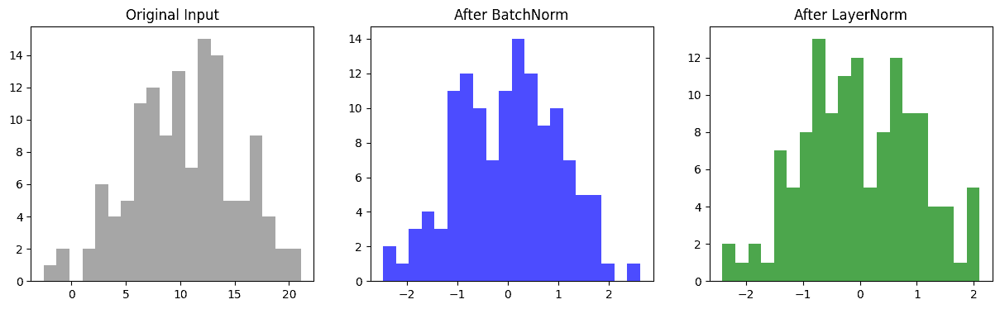

# 归一化（Normalization） 
我们知道，神经网络在训练过程中会不断调整权重，使每一层的输出作为下一层的输入。

但问题是如果每一层的输入分布都在不断变化，训练过程就会非常不稳定。这种现象叫做 Internal Covariate Shift（内部协变量偏移）。

归一化的核心思想就是：把输入数据或中间激活值拉回到一个合理的分布，比如均值为 0、方差为 1，这样每一层都能在相对稳定的范围内学习。

在深度神经网络训练中，Normalization（归一化） 是一种重要的技术，它能加速训练、稳定模型、提高泛化能力。其核心思想是：将神经元的输入信号（或激活值）调整到一定的分布范围，从而避免训练过程中的梯度消失或梯度爆炸问题，同时减少不同特征尺度带来的训练不稳定。

深度学习中最常用的归一化方法包括 Batch Normalization (BN) 和 Layer Normalization (LN)。

下面我们详细介绍它们的原理、公式和应用场景。

## Batch Normalization（批归一化）
### 背景与动机
随着网络加深，神经元的输入分布会随着训练逐层变化，这种现象称为 Internal Covariate Shift。BN 的目标就是减轻这种分布变化，使训练更稳定，加速收敛。
### 核心公式
对于某一层的输入 $$x = [x_1, x_2, \dots, x_m]$$（一个 mini-batch 共 m 个样本），BN 的操作步骤如下：
1. 计算批内均值：$$\mu_B = \frac{1}{m} \sum_{i=1}^{m} x_i$$
2. 计算批内方差： $$\sigma_B^2 = \frac{1}{m} \sum_{i=1}^{m} (x_i - \mu_B)^2$$
3. 标准化：$$\hat{x}_i = \frac{x_i - \mu_B}{\sqrt{\sigma_B^2 + \epsilon}}$$，其中 $$\epsilon$$ 是防止除零的小常数。
4. 缩放和平移： $$y_i = \gamma \hat{x}_i + \beta$$，其中 $$\gamma$$ 和 $$\beta$$是可学习参数，用于恢复模型表达能力。

BN 依赖 mini-batch，在小 batch 或在线推理时可能不稳定，BN可以显著加快收敛速度，减轻梯度消失，常用于 CNN 和全连接网络中。

可以把 BN 想象成每一层神经元在自我调节，将激活值缩放到零均值、单位方差的状态，使网络每一层的输入分布更加统一，训练过程更平滑。
## Layer Normalization（层归一化）
### 背景与动机
BN 在 RNN 等序列模型中效果不佳，因为序列长度可能变化且 batch size 较小，这时 Layer Normalization (LN) 更适用。LN 的归一化是沿 特征维度 而非 batch 维度进行。
### 核心公式
对于某一层的激活向量 $$\mathbf{h} = [h_1, h_2, \dots, h_d]$$（d 为特征维度）：
1. 计算均值和方差： $$\mu = \frac{1}{d} \sum_{i=1}^{d} h_i, \quad
 \sigma^2 = \frac{1}{d} \sum_{i=1}^{d} (h_i - \mu)^2$$
2. 标准化：$$\hat{h}_i = \frac{h_i - \mu}{\sqrt{\sigma^2 + \epsilon}}$$
3. 缩放和平移：$$y_i = \gamma \hat{h}_i + \beta$$

LN 独立于 batch，适合 RNN、Transformer 等序列模型，对 batch size 不敏感，可以小 batch 或单样本训练，保持层内部的特征分布稳定，提升模型训练稳定性。
## Batch Normalization 与 Layer Normalization 对比
|特性	|Batch Normalization	|Layer Normalization|
|---|---|---|
|归一化维度	|Batch 维度	|特征维度|
|对 batch size 敏感	|是	|否|
|适用网络	|CNN, MLP	|RNN, Transformer|
|训练加速	|快	|较快|
|推理阶段	|使用移动平均	|同训练一致|
### 代码示例
```python
import torch
import torch.nn as nn
import matplotlib.pyplot as plt

# 设置随机种子
torch.manual_seed(42)

# 模拟一个 batch 的输入数据
# batch_size=16, 特征维度=8
x = torch.randn(16, 8) * 5 + 10  # 随机数据，均值=10, 方差=5

# 定义 BatchNorm 和 LayerNorm
bn = nn.BatchNorm1d(8)
ln = nn.LayerNorm(8)

# 将输入经过 BN 和 LN
y_bn = bn(x)
y_ln = ln(x)

# 可视化输入和归一化后的分布
fig, axes = plt.subplots(1, 3, figsize=(15, 4))

axes[0].hist(x.flatten().numpy(), bins=20, color='gray', alpha=0.7)
axes[0].set_title("Original Input")

axes[1].hist(y_bn.flatten().detach().numpy(), bins=20, color='blue', alpha=0.7)
axes[1].set_title("After BatchNorm")

axes[2].hist(y_ln.flatten().detach().numpy(), bins=20, color='green', alpha=0.7)
axes[2].set_title("After LayerNorm")

plt.show()
```
输出如下：


可以看到原始数据分布杂乱；BN 后每个特征的 batch 内分布接近均值 0，方差 1；LN 后每个样本内部的特征分布接近均值 0，方差 1。

直观地看，BN 更像跨样本的统一标准，LN 更像每个样本的自我调节。
  
归一化技术是深度学习训练中不可或缺的工具,Batch Normalization 通过批内标准化缓解内部协变量偏移，加速训练，常用于卷积网络和全连接网络。Layer Normalization 沿特征维度归一化，更适合序列模型和小 batch 场景。两者都通过可学习的缩放和平移参数 $$\gamma$$和 $$\beta$$保留网络的表达能力。

使用归一化可以让深度网络训练更加稳定、收敛更快，并提高模型的泛化能力，是现代深度学习模型设计的标准做法。

最新的文章都在公众号更新，别忘记关注哦！！！如果想要加入技术群聊，扫描下方二维码回复【加群】即可。
