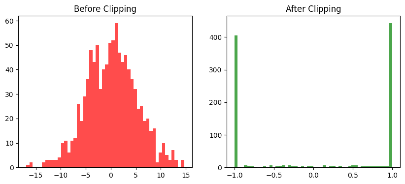

# 梯度裁剪（Gradient Clipping）
深度学习训练中，有一种常见的噩梦——Loss 一会儿飞天，一会儿归零，模型权重乱成一锅粥。这时候，多半是梯度爆炸（Gradient Explosion）在作祟。

为了防止这种梯度失控，我们需要给它套个安全阀，这就是Gradient Clipping（梯度裁剪）。
## 什么是梯度爆炸？
在反向传播过程中，梯度是通过链式法则层层传递的：

$$\frac{\partial L}{\partial w_i} = \frac{\partial L}{\partial a_n}\cdot \frac{\partial a_n}{\partial a_{n-1}} \cdots \frac{\partial a_2}{\partial a_1}\cdot \frac{\partial a_1}{\partial w_i}$$

当网络层数很深，或者循环神经网络（RNN）中时间展开步数很长时，如果每层的梯度幅值都略大于 1，那么乘起来就可能指数级增长。

结果就是参数更新步伐过大，Loss 突然爆炸，模型彻底崩坏。

这就是梯度爆炸问题。
## 核心思想
Gradient Clipping 的思路非常直接：
当梯度太大时，把它剪短一点。就像风筝线放太长会断，我们提前拉住，防止失控。

设参数的梯度为 $$g$$ ，其范数为： $$|| g ||_2 = \sqrt{\sum_i g_i^2}$$

如果这个范数超过了一个阈值  $$\theta$$ ，我们就对它进行缩放： $$g' = g \times \frac{\theta}{|| g ||_2} \quad \text{当 } || g ||_2 > \theta$$，否则就保持原样。

这样，所有梯度的最大范数不会超过 $$\theta$$ ，从而避免模型在一次更新中冲得太猛。
## 常见的两种梯度裁剪方式
### 按整体范数裁剪
把整个网络中所有参数的梯度视为一个整体，计算全局范数：$$|| g_{global} || = \sqrt{\sum_l \sum_i g_{l,i}^2}$$

若超过阈值，则按比例缩放所有层的梯度。

这个常用于 RNN / Transformer。

### 按单个参数裁剪
每个参数张量单独计算范数、单独裁剪。适合在某些小网络或特殊优化任务中更细粒度。
## 代码示例
PyTorch 已经内置了梯度裁剪方法，非常方便。我们来看一个例子:
```python
import torch
import torch.nn as nn
import torch.optim as optim

# 定义一个简单的网络
model = nn.Sequential(
    nn.Linear(10, 128),
    nn.ReLU(),
    nn.Linear(128, 1)
)

optimizer = optim.Adam(model.parameters(), lr=1e-3)

# 模拟训练
for step in range(5):
    x = torch.randn(16, 10)
    y = torch.randn(16, 1)

    pred = model(x)
    loss = ((pred - y) ** 2).mean()
    loss.backward()

    # 核心：梯度裁剪
    torch.nn.utils.clip_grad_norm_(model.parameters(), max_norm=1.0)

    optimizer.step()
    optimizer.zero_grad()

    print(f"Step {step+1} | Loss: {loss.item():.4f}")
```
其中
- $$clip\_grad\_norm\_(model.parameters(), max\_norm=1.0)$$：按照全局范数进行裁剪；
- $$max\_norm=1.0$$：最大梯度范数阈值；
- 每次反向传播后调用即可；
- 裁剪后梯度会被直接修改（in-place）。

PyTorch 还提供另一种方式：
```python
torch.nn.utils.clip_grad_value_(model.parameters(), clip_value=0.5)
```
它直接限制每个梯度值的绝对大小，不计算范数。

下面我们可视化一下梯度裁剪前后分布对比：
```python
import matplotlib.pyplot as plt

# 模拟一组随机梯度
grads = torch.randn(1000) * 5  # 有些值特别大
clipped = torch.clamp(grads, -1, 1)  # 简单的值裁剪

plt.figure(figsize=(10,4))
plt.subplot(1,2,1)
plt.hist(grads.numpy(), bins=50, color='red', alpha=0.7)
plt.title("Before Clipping")

plt.subplot(1,2,2)
plt.hist(clipped.numpy(), bins=50, color='green', alpha=0.7)
plt.title("After Clipping")
plt.show()
```

可以看到，裁剪后极端的大梯度被压制住，整体分布更加稳定。

可以看到，Gradient Clipping = 限速器（Speed Limiter），它不让模型在更新时一脚油门踩到底，而是控制在安全区间内稳步优化。有点归一化的意思在，但是不完全相同。

在深度或循环网络中，它是必不可少的安全机制，很多经典模型（如 LSTM、Transformer）训练脚本中几乎都能看到它的身影。

在 混合精度训练（FP16）中，梯度容易不稳定，此时梯度裁剪尤为重要；有研究表明，合理的裁剪还能提高模型鲁棒性，减少梯度震荡；一些自适应版本（如 Adaptive Gradient Clipping，AGC）还会根据参数大小动态调整阈值，在大模型训练中越来越常见。

最新的文章都在公众号更新，别忘记关注哦！！！如果想要加入技术群聊，扫描下方二维码回复【加群】即可。
