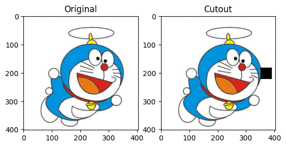
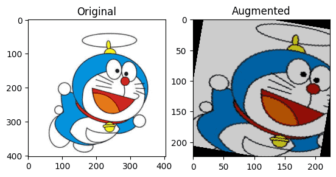
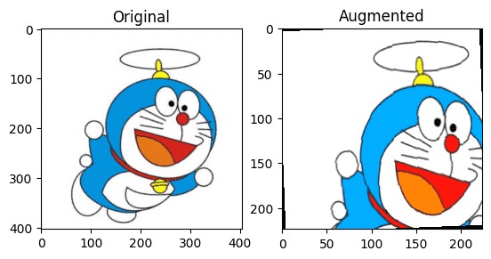

# 数据增强
深度学习的世界里，数据是燃料。模型的能力再强，如果喂进去的数据太少、太单一，它依然学不会通用的规律。而数据增强（Data Augmentation）就是给模型变着花样喂饭的艺术。

在训练过程中，我们并不是简单地一遍又一遍地重复喂相同的样本，而是通过一系列 随机变换（如旋转、裁剪、翻转、加噪声、颜色扰动等），人为扩充训练集的多样性。

这样做有两个显著的好处：

1.防止过拟合：模型不再记住固定的样本模式，而是学会对输入的变化保持鲁棒性。

2.提升泛化能力：即便在真实世界中遇到光照、角度、尺度不同的样本，也能保持稳定表现。

数据增强的核心思想是**让模型在训练中见过更多的世界**，即便这些世界都是我们伪造出来的。

在不同领域中，数据增强的实现形式也不尽相同：
- 对于图像任务，我们常用旋转、翻转、随机裁剪、Mixup、CutMix 等；
- 对于文本任务，可能用同义词替换、随机删除、掩码建模；
- 对于语音任务，则会用时间拉伸、频率遮挡等方法。

在深度学习工程实践中，数据增强不仅仅是调参小技巧，而是一个系统性的设计问题：我们到底希望模型对哪些变化保持不变，对哪些变化保持敏感。如果说正则化让模型别太复杂，那数据增强的作用就是让模型别太死板。

## 图像增强
深度学习中，模型的聪明程度往往取决于它见过多少种情况。而图像增强（Image Augmentation），就是一种让模型见多识广的方法。它不靠增加真实数据，而是通过随机变换的方式，让有限的数据呈现出无限的变化。

### 为什么要进行图像增强？
在真实场景中，图像存在各种各样的不确定性：光照变化、视角不同、遮挡、模糊、噪声……

如果模型只在干净、居中的图片上训练，它在真实世界中往往一上场就懵。

图像增强的目标就是在训练阶段人为制造多样性，让模型学会对各种扰动保持鲁棒性（robustness）。

举个例子，如果你训练一个口罩检测模型，数据增强会让模型学会：
- 无论人脸是正面、侧面还是略微倾斜；
- 无论光线强弱、颜色差异；
- 甚至图片被遮挡或压缩；

模型都能正确识别是否戴了口罩。
### 图像增强的基本类型
图像增强方法可以分为三类：几何变换、颜色变换、随机扰动。

**1.几何变换（Geometric Transformations）**

这些操作改变图像的空间结构，但不改变语义：
- 翻转（Flip）：水平或垂直翻转；
- 旋转（Rotation）：随机旋转一定角度；
- 裁剪（Crop）：随机裁掉部分区域；
- 平移与缩放（Translation & Scaling）：模拟摄像机位移或距离变化；
- 仿射/透视变换（Affine/Projective）：模拟拍摄角度变化。

几何变换的目的是增强模型对方向、位置、比例的鲁棒性。

**2.颜色变换（Color Transformations）**

模拟不同光照或拍摄条件：
- 亮度调整（Brightness）
- 对比度与饱和度调整（Contrast / Saturation）
- 色相偏移（Hue）
- 灰度转换或通道交换

颜色变换可以增强模型对光线与颜色条件变化的适应性。

**3.随机扰动与噪声（Noise & Blur）**
- 高斯噪声（Gaussian Noise）
- 模糊（Blur）、运动模糊（Motion Blur）
- 遮挡（Occlusion）：随机抹去部分像素（如 Cutout）
- JPEG 压缩噪声、像素下采样

随机扰动与噪声让模型不再依赖于细微纹理特征，而学会关注更高层语义。
### 高级增强策略
**1. Cutout**

Cutout 是一种简单但非常有效的增强策略。它会在图片上随机抹掉一块矩形区域（像贴了个补丁），让模型学会在部分缺失的情况下仍能识别目标。
```python
import torchvision.transforms as transforms
from PIL import Image
import matplotlib.pyplot as plt
import numpy as np

def cutout(image, size=40):
    h, w = image.size
    x = np.random.randint(w)
    y = np.random.randint(h)
    x1 = np.clip(x - size // 2, 0, w)
    y1 = np.clip(y - size // 2, 0, h)
    x2 = np.clip(x + size // 2, 0, w)
    y2 = np.clip(y + size // 2, 0, h)
    image = np.array(image)
    image[y1:y2, x1:x2, :] = 0
    return Image.fromarray(image)

img = Image.open("example.jpg")
plt.subplot(1,2,1)
plt.imshow(img)
plt.title("Original")

plt.subplot(1,2,2)
plt.imshow(cutout(img))
plt.title("Cutout")
plt.show()
```
输出如下：


Cutout可以防止模型过度依赖局部特征。


**2. Mixup**

Mixup 的核心思想是在输入和标签上同时进行线性混合：

 $$\tilde{x} = \lambda x_i + (1 - \lambda) x_j$$

 $$\tilde{y} = \lambda y_i + (1 - \lambda) y_j$$

其中 $$\lambda \sim \text{Beta}(\alpha, \alpha)$$。

```python
import torch

def mixup(x1, y1, x2, y2, alpha=0.4):
    lam = np.random.beta(alpha, alpha)
    x_mix = lam * x1 + (1 - lam) * x2
    y_mix = lam * y1 + (1 - lam) * y2
    return x_mix, y_mix
```
Mixup可以平滑决策边界，减少过拟合，提高鲁棒性与泛化能力。

**3. CutMix**

CutMix 是 Mixup 的改进版。它不是整张线性混合，而是在空间上切块混合。

 $$\tilde{x} = M \odot x_A + (1 - M) \odot x_B$$
 $$\tilde{y} = \lambda y_A + (1 - \lambda) y_B$$

其中 $$M$$ 是一个随机矩形 mask。

CutMix既有局部遮挡（像 Cutout），又有类别混合（像 Mixup）， 是增强版的数据融合。

### 自动化增强方法
随着数据增强的重要性提升，研究者开始探索自动搜索增强策略的方式：
- AutoAugment (Google, 2019)：通过强化学习自动搜索增强策略；
- RandAugment：简化版，不用搜索，随机挑增强组合；
- TrivialAugment, AugMix：综合多种增强策略提高鲁棒性。

这些方法在 ImageNet 等数据集上显著提升了精度，也成为现代视觉模型（ResNet、ViT）训练的标配。

```python
from torchvision import transforms
from PIL import Image
import matplotlib.pyplot as plt

transform = transforms.Compose([
    transforms.RandomResizedCrop(224),
    transforms.RandomHorizontalFlip(),
    transforms.ColorJitter(brightness=0.3, contrast=0.3, saturation=0.3),
    transforms.RandomRotation(15),
    transforms.ToTensor()
])

img = Image.open("example.jpg")
aug_img = transform(img)

plt.subplot(1,2,1)
plt.imshow(img)
plt.title("Original")

plt.subplot(1,2,2)
plt.imshow(aug_img.permute(1,2,0))
plt.title("Augmented")
plt.show()
```
运行后可以看到，每次执行时，输出图像都略有不同——这正是随机增强带来的多样性。



图像增强不是修图，而是造世界。它让模型在有限的数据中，体验无限的变化；它让算法从死记硬背，变成真正的理解图像。这，就是图像增强的价值。

## 文本增强
对图像来说，增强很容易：旋转、翻转、加噪，但对于文本（Text），就没那么直接了。

下面我们就来系统看看文本增强是什么、有哪些主流方法、该怎么落地实现。
### 为什么要做文本增强？
文本增强（Text Augmentation）是一种在 不改变语义标签的前提下，通过修改、扩充原始文本来增加训练样本多样性的方法。

核心目标：
- 提高模型泛化能力；
- 缓解数据不足；
- 对抗过拟合；
- 改善类别不平衡。

想象一下：如果你在做情感分析，训练集中“好评”句子只有 1000 条，而“差评”有 5000 条，那模型很容易偏向负面情绪。通过增强，“好评”类可以被扩展成 3000 条，数据分布就更平衡了。
### 文本增强的常见方法
文本增强大致分为两类：
|类别	|方法类型	|举例|
|--|--|--|
|基于规则（Rule-based）	|同义替换、随机插入、删除、交换	|EDA、WordNet|
|基于模型（Model-based）	|掩码建模、回译、生成式增强	|BERT、T5、ChatGPT 等|

下面我们具体拆解来看一下：

**1. 同义词替换（Synonym Replacement）**

同义词替换是最经典也最容易实现的方法。随机选取句子中的若干词，用它们的同义词替换。

例如：

> 原句：这家餐厅的菜非常好吃。
>
> 增强：这家饭店的菜特别美味。

同义词替换简单有效，但是同义词不总是精准，有时会破坏语义或语气。

下面是一个使用 nlpaug 库实现同义词替换的示例：
```python
import nlpaug.augmenter.word as naw

# 使用WordNet同义词增强
aug = naw.SynonymAug(aug_src='wordnet')
text = "这家餐厅的菜非常好吃。"
aug_text = aug.augment(text)
print(aug_text)
```

**2. 随机删除 / 插入 / 交换（Random Deletion / Insertion / Swap）**

来自论文 EDA (Easy Data Augmentation)，核心思想是“乱中有序”——让模型学会对噪声更鲁棒。
- 删除：随机删掉句子中的某些词。
- 插入：随机选取一个词，在附近插入它的同义词。
- 交换：随机交换句子中两个词的位置。

例如：

> 原句：我今天心情很好。
>
> 删除增强：我今天心情。
>
> 插入增强：我今天心情特别好。
>
> 交换增强：今天我心情很好。
 
这个方法实现简单，不依赖模型，但是太多随机操作可能破坏语义。

**3. 掩码建模（Masked Language Modeling）**

利用预训练语言模型（如 BERT）的强大语义理解能力。我们可以随机遮住一句话的部分单词，然后让模型去预测被遮住的部分，从而生成变体句。

> 原句：这部电影真不错。
>
> 掩码输入：这部 [MASK] 真不错。
>
> BERT 输出：这部影片真不错。
```python
from transformers import pipeline

augmenter = pipeline("fill-mask", model="bert-base-chinese")
text = "这部[MASK]真不错。"
results = augmenter(text)
for r in results[:3]:
    print(r["sequence"])
```
掩码建模语义流畅，自然度高，但是缺点是生成效率较低，且不易完全控制输出语义。

**4. 回译（Back Translation）**

回译是一种非常经典的增强方式：把一句话翻译成另一种语言，再翻译回来。

比如：

> 原句：我非常喜欢这款手机。
> 
> 英译：I really like this phone.
> 
> 再译：我真的喜欢这部手机。

结果句子语义相同，但表达方式变化了。

在 Hugging Face 中可以这样做
```python
from transformers import pipeline

en_translator = pipeline("translation", model="Helsinki-NLP/opus-mt-zh-en")
zh_translator = pipeline("translation", model="Helsinki-NLP/opus-mt-en-zh")

text = "我非常喜欢这款手机。"
en_text = en_translator(text)[0]['translation_text']
back_text = zh_translator(en_text)[0]['translation_text']

print("英译:", en_text)
print("回译:", back_text)
```
这种方法增强语义丰富度，不破坏标签，缺点就是需要翻译模型，速度较慢。

**5. 生成式增强（Generative Augmentation）**

进入大模型时代后，我们可以直接用生成模型（如 T5、ChatGPT、GLM 等）来生成风格相似的新句子。

Prompt 示例

> 输入：“请改写下面这句话，但保持原意：这家餐厅的服务特别好。”
> 
> 输出：
> 
>  “这家饭店的服务让人印象深刻。”
> 
>  “这家餐馆的服务态度非常棒。”

这种增强的多样性和自然度几乎可以媲美人工标注，非常适合在样本较少的情况下使用。

### 如何选择增强方法？
|目标场景	|推荐方法	|原因|
|--|--|--|
小数据集	|同义替换 + EDA	|简单快速，样本扩充明显|
NLP 任务（情感分析、分类）	|掩码建模、回译	|语义一致性高|
大模型任务	|生成式增强	|可控制性强，多样性好|
实时推理系统	|少用或预生成	|避免在线生成延迟|

图像增强改变像素，文本增强改变表达。它让模型在同一个意思的不同说法中学会更稳健地理解语言。

无论是分类、情感分析、对话，还是大模型微调，文本增强都是让数据更聪明、模型更强大的利器。

最新的文章都在公众号更新，别忘记关注哦！！！如果想要加入技术群聊，扫描下方二维码回复【加群】即可。

