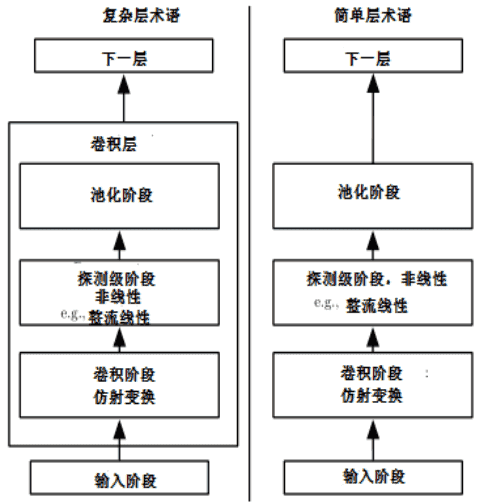

# 卷积神经网络
卷积神经网络（Convolutional Neural Network, CNN）是深度学习中最具代表性和影响力的模型之一。它通过局部感受野、权值共享和多层卷积的方式，高效地提取数据的层次化特征，特别适合处理图像、语音以及具有空间结构的数据。CNN 的提出与成功，使得计算机视觉领域从传统的手工特征提取，迈入了端到端的特征自动学习阶段。
## 核心思想
CNN 的核心在于模仿人类视觉系统的处理方式，通过局部卷积操作提取低级特征（如边缘、角点），并在更深层逐步组合成高级语义特征（如物体的形状、类别）。与传统全连接网络相比，CNN 利用了图像的空间局部性和统计规律，大幅降低了模型参数量和计算复杂度。

- 局部感受野：每个神经元只与输入的一小部分区域相连，避免全连接带来的参数爆炸。
- 权值共享：同一卷积核在不同位置滑动时使用相同的参数，提升了泛化能力。
- 层次化特征表示：浅层卷积提取低级特征，深层卷积提取高级抽象特征，形成分层的语义表达。

## 基本组成模块

**1. 卷积层（Convolution Layer）**
  - 使用卷积核对输入进行特征提取。
  - 卷积操作能够捕捉局部模式，并且多通道卷积可以学习到多种特征。

**2. 激活函数（Activation Function）**
  - 常用 ReLU、Leaky ReLU、GELU 等，增强网络的非线性表示能力。

**3. 池化层（Pooling Layer）**
  - 通过最大池化或平均池化进行下采样，减小特征图的尺寸，提升计算效率并具备一定平移不变性。

**4. 全连接层（Fully Connected Layer）**
  - 在分类或回归任务中，将卷积提取的高维特征映射到输出空间。

**5. 归一化与正则化**
  - Batch Normalization、Dropout 等方法有助于稳定训练和防止过拟合。
## 经典网络架构
- LeNet (1998)：最早的 CNN，用于手写数字识别。
- AlexNet (2012)：首次在 ImageNet 上取得突破，掀起深度学习浪潮。
- VGG (2014)：提出了“深而简单”的网络结构，使用大量小卷积核。
- ResNet (2015)：引入残差连接，成功训练超深网络，成为 CNN 的里程碑。
- DenseNet、EfficientNet：进一步提升特征复用和参数效率，推动 CNN 的应用边界。

后面我会一一介绍这些经典架构。

CNN能够高效捕捉局部空间特征，通过参数共享大幅减少训练难度，在视觉任务中表现优异，但是CNN需要大量标注数据才能训练出强大模型，同时对长程依赖建模能力不足（在 NLP 中逐渐被 Transformer 替代），并且对于非欧几里得结构数据（如图、知识图谱）处理能力有限。

总结来看，CNN 是深度学习发展历程中的关键里程碑。它奠定了现代视觉智能的基础，并在多个领域得到广泛应用。虽然如今 Transformer 在 NLP 和 CV 中逐渐崛起，但 CNN 依然是计算机视觉和相关任务的重要工具。

最新的文章都在公众号更新，别忘记关注哦！！！如果想要加入技术群聊，扫描下方二维码回复【加群】即可。
