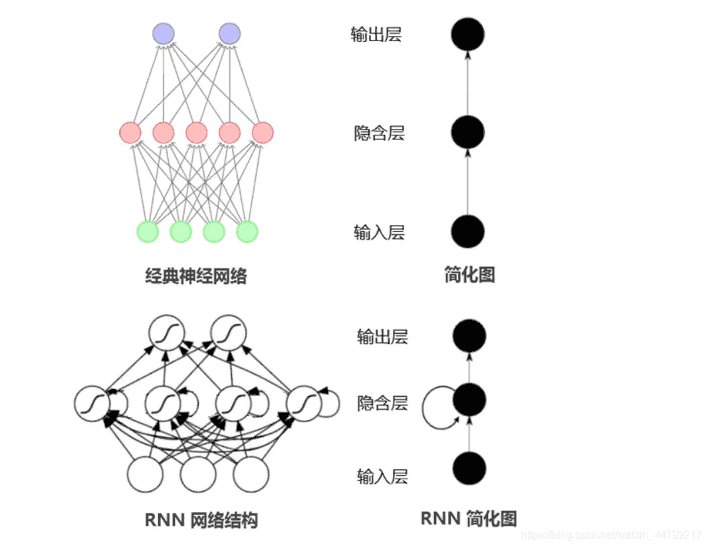
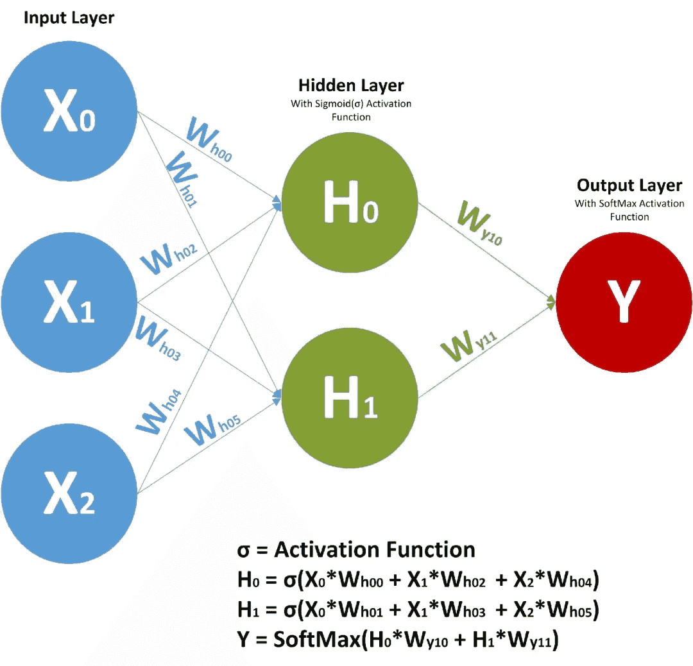
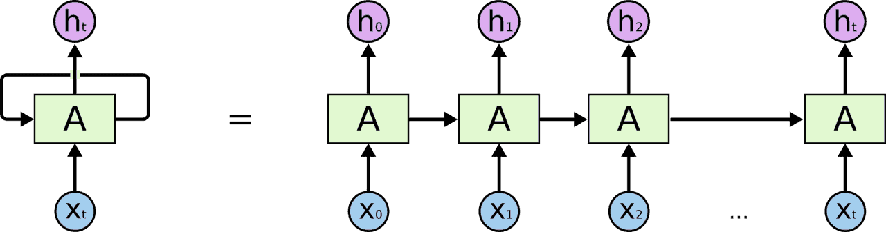

# 标准RNN
在深度学习的发展历程中，循环神经网络（Recurrent Neural Network, RNN） 是处理序列数据的重要模型。

与前馈神经网络（如 MLP、CNN）不同，RNN 在网络结构中引入了循环连接（Recurrent Connection），从而能够处理具有时间依赖性的数据。这种能力使 RNN 在 自然语言处理、语音识别、时间序列预测 等领域得到了广泛应用。

## RNN 的基本结构

在传统的前馈神经网络中，每个输入样本都是独立的；而在 RNN 中，模型会将历史信息通过隐藏状态（Hidden State）传递给后续计算。其核心思想是：当前时刻的输出不仅依赖于当前输入，还依赖于之前的状态。

设输入序列为： $$X = (x_1, x_2, \dots, x_T)$$



RNN 在每个时间步 t 的更新公式为：
- 隐藏状态更新 $$h_t = \tanh(W_{xh} x_t + W_{hh} h_{t-1} + b_h)$$
- 输出层计算$$y_t = W_{hy} h_t + b_y$$

其中：
- $$x_t$$：当前时刻输入向量
- $$h_{t-1}$$：上一时刻的隐藏状态
- $$h_t$$：当前隐藏状态（记忆信息）
- $$y_t$$：当前输出
- $$W_{xh}, W_{hh}, W_{hy}$$：权重矩阵
- $$b_h, b_y$$：偏置项

可以看到，RNN 通过循环的方式使隐藏状态能够携带历史信息，从而实现对序列的建模。
## RNN 的计算过程


以一个简单的序列 $$(x_1, x_2, x_3)$$为例，RNN 的计算流程如下：
1. 输入 $$x_1$$，结合初始状态 $$h_0$$，得到隐藏状态 $$h_1$$，再计算输出 $$y_1$$。
2. 输入 $$x_2$$，结合  $$h_1$$，得到  $$h_2$$，再计算输出 $$y_2$$。
3. 输入 $$x_3$$，结合 $$h_2$$，得到 $$h_3$$，再计算输出 $$y_3$$。

这个过程体现了 时间依赖性：每一步的输出和隐藏状态都与之前的历史信息相关。

尽管标准 RNN 在理论上能够建模任意长的依赖关系，但在实际训练中会遇到 梯度消失（Gradient Vanishing） 和 梯度爆炸（Gradient Exploding） 问题。这导致模型在处理长序列时，往往只能捕捉短期依赖，而难以记住长期信息。

解决这一问题的改进方法包括：
- 梯度裁剪（Gradient Clipping）：防止梯度爆炸。
- 门控机制：如 LSTM（Long Short-Term Memory）和 GRU（Gated Recurrent Unit），能够缓解梯度消失并捕捉长期依赖。

## 示例代码
下面给出一个 标准 RNN 的 PyTorch 实现，帮助理解其具体计算过程：
```python
import torch
import torch.nn as nn

# 定义一个标准 RNN 模型
class RNNModel(nn.Module):
    def __init__(self, input_size, hidden_size, output_size):
        super(RNNModel, self).__init__()
        self.hidden_size = hidden_size
        # RNN 层
        self.rnn = nn.RNN(input_size, hidden_size, batch_first=True)
        # 全连接输出层
        self.fc = nn.Linear(hidden_size, output_size)

    def forward(self, x):
        # 初始化隐藏状态 h0 (batch_size, num_layers, hidden_size)
        h0 = torch.zeros(1, x.size(0), self.hidden_size)
        # RNN 前向传播
        out, _ = self.rnn(x, h0)
        # 取最后时间步的隐藏状态作为输出
        out = self.fc(out[:, -1, :])
        return out

# 示例：输入大小=10，隐藏层=20，输出大小=2
model = RNNModel(input_size=10, hidden_size=20, output_size=2)
x = torch.randn(5, 7, 10)  # (batch=5, seq_len=7, input_size=10)
y = model(x)
print(y.shape)  # 输出: (5, 2)
```
标准 RNN 是深度学习处理序列数据的基础模型，它通过循环结构实现了对时间依赖的建模。但由于梯度消失/爆炸问题，RNN 在长序列任务中表现有限，促使了 LSTM、GRU 等改进结构的出现。

尽管如此，RNN 仍然是理解序列建模与深度学习演化的重要起点。

最新的文章都在公众号更新，别忘记关注哦！！！如果想要加入技术群聊，扫描下方二维码回复【加群】即可。
