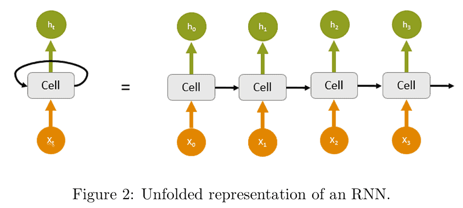
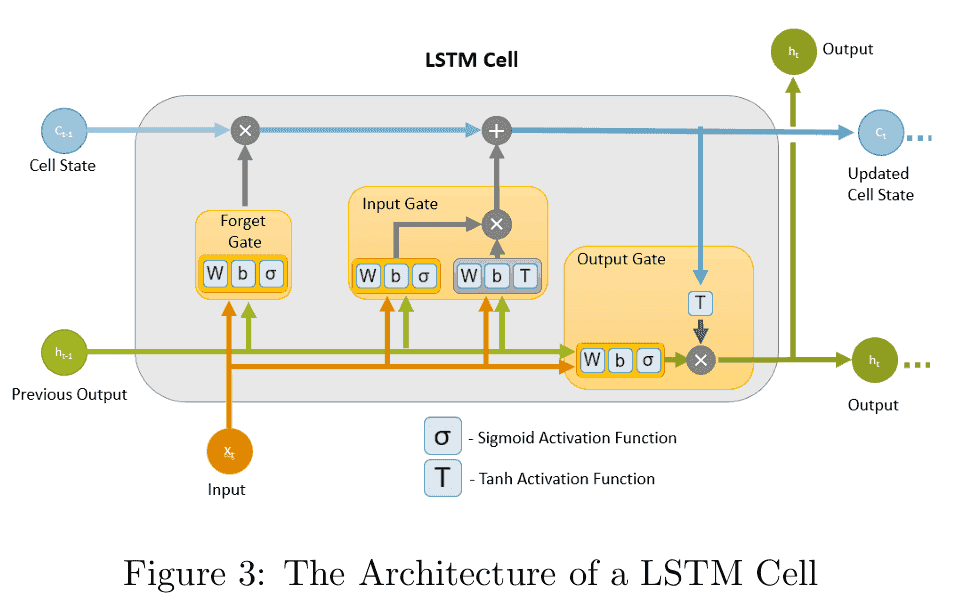

# LSTM
在深度学习中，循环神经网络（RNN） 是序列建模的重要工具，但标准 RNN 在处理长序列时会遭遇 梯度消失与梯度爆炸 问题，导致模型难以学习长期依赖关系。

为了解决这一问题，长短期记忆网络（Long Short-Term Memory, LSTM） 被提出。它通过 门控机制（Gating Mechanism） 对信息流进行控制，有效地捕捉长期依赖，被广泛应用于 自然语言处理、语音识别、时间序列预测 等领域。
## LSTM 的核心思想
LSTM 在结构上与标准 RNN 类似，也由输入层、隐藏状态和输出层构成，但不同的是，它在每个时间步引入了 细胞状态（Cell State, $$C_t$$），作为信息的记忆通道。细胞状态可以看作一条贯穿时间的高速通道，能够在较长的时间范围内传递信息。



为了灵活地控制信息的保留与遗忘，LSTM 设计了 三个门（输入门、遗忘门、输出门），用来决定哪些信息应该更新、保留或输出。

## LSTM 的数学公式


在时间步 t，给定输入 $$x_t$$、上一时刻的隐藏状态 $$h_{t-1}$$ 和细胞状态 $$C_{t-1}$$，LSTM 的计算流程如下：
1. 遗忘门（Forget Gate）
 控制上一个细胞状态中有多少信息需要被遗忘： $$f_t = \sigma(W_f [h_{t-1}, x_t] + b_f)$$
2. 输入门（Input Gate）
 决定当前输入有多少信息需要写入记忆： $$i_t = \sigma(W_i [h_{t-1}, x_t] + b_i)$$
生成候选信息： $$\tilde{C}_t = \tanh(W_c [h_{t-1}, x_t] + b_c)$$
3. 更新细胞状态
 将旧的细胞状态和新的候选信息结合： $$C_t = f_t \odot C_{t-1} + i_t \odot \tilde{C}_t$$
4. 输出门（Output Gate）
 决定最终的隐藏状态输出： $$o_t = \sigma(W_o [h_{t-1}, x_t] + b_o)$$ $$h_t = o_t \odot \tanh(C_t)$$

其中：
- $$\sigma$$ 表示 Sigmoid 激活函数；
- tanh 表示双曲正切函数；
- $$\odot$$ 表示逐元素相乘。

直观点理解：
- 遗忘门：决定过去的信息是否保留，例如在文本处理中，某些上下文可能已经无关，可以丢弃。
- 输入门：决定当前输入是否被记住，例如在句子中遇到一个关键词时，应当存入记忆。
- 细胞状态：贯穿整个时间序列的“记忆管道”，允许信息长期流动。
- 输出门：决定当前的隐藏状态能输出多少信息。

这种机制使得 LSTM 能够在较长的序列上保持信息，从而克服标准 RNN 的局限性。

## 代码示例
下面给出一个 LSTM 在 PyTorch 中的实现：
```python
import torch
import torch.nn as nn

# 定义 LSTM 模型
class LSTMModel(nn.Module):
    def __init__(self, input_size, hidden_size, output_size, num_layers=1):
        super(LSTMModel, self).__init__()
        self.hidden_size = hidden_size
        self.num_layers = num_layers
        # LSTM 层
        self.lstm = nn.LSTM(input_size, hidden_size, num_layers, batch_first=True)
        # 全连接输出层
        self.fc = nn.Linear(hidden_size, output_size)

    def forward(self, x):
        # 初始化隐藏状态 (h0, c0)
        h0 = torch.zeros(self.num_layers, x.size(0), self.hidden_size)
        c0 = torch.zeros(self.num_layers, x.size(0), self.hidden_size)
        # LSTM 前向传播
        out, _ = self.lstm(x, (h0, c0))
        # 取最后时间步的输出
        out = self.fc(out[:, -1, :])
        return out

# 示例：输入大小=10，隐藏层=20，输出大小=2
model = LSTMModel(input_size=10, hidden_size=20, output_size=2)
x = torch.randn(5, 7, 10)  # (batch=5, seq_len=7, input_size=10)
y = model(x)
print(y.shape)  # 输出: (5, 2)
```
LSTM 通过 门控机制 成功解决了标准 RNN 的长期依赖问题，能够更有效地建模长序列数据。在深度学习的发展史上，LSTM 是序列建模的重要里程碑，为后续的 Seq2Seq、Attention 和 Transformer 等模型奠定了基础。

最新的文章都在公众号更新，别忘记关注哦！！！如果想要加入技术群聊，扫描下方二维码回复【加群】即可。
