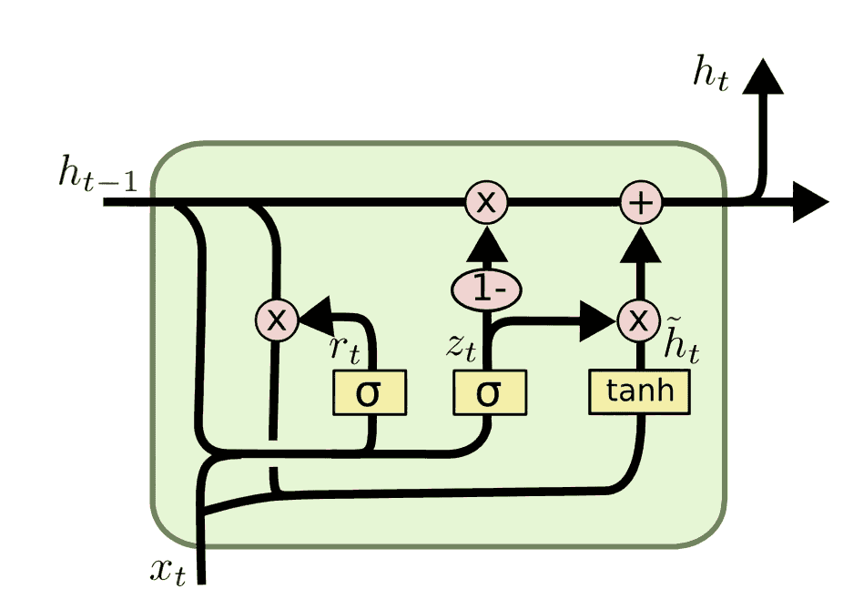

# GRU
在序列建模中，循环神经网络（RNN） 能够处理时间依赖的数据，但存在 梯度消失与梯度爆炸 的问题。

为此，研究者提出了 长短期记忆网络（LSTM），通过门控机制有效缓解了长期依赖问题。

然而，LSTM 结构相对复杂，参数较多，计算开销较大。为了在保持性能的同时简化结构，门控循环单元（Gated Recurrent Unit, GRU） 于 2014 年被提出。

GRU 是 LSTM 的一种简化变体，参数更少、计算更高效，同时在许多任务上表现与 LSTM 相当甚至更优。
## GRU 的核心思想
与 LSTM 相比，GRU 去掉了 细胞状态（Cell State） 的概念，直接用隐藏状态 $$h_t$$ 来传递信息，并通过 更新门（Update Gate） 和 重置门（Reset Gate） 来控制信息的保留和遗忘。

这种结构使得 GRU 能够兼顾长期依赖建模能力和计算效率，成为序列建模中的常用模型。
## GRU 的数学公式

在时间步 $t$，输入为 $$x_t$$，上一时刻隐藏状态为 $$h_{t-1}$$，GRU 的计算流程如下：
1. 更新门（Update Gate）
 决定前一时刻的状态有多少被保留到当前： $$z_t = \sigma(W_z [h_{t-1}, x_t] + b_z)$$
2. 重置门（Reset Gate）
 控制前一时刻的状态有多少被遗忘： $$r_t = \sigma(W_r [h_{t-1}, x_t] + b_r)$$
3. 候选隐藏状态（Candidate State）
 根据当前输入和重置后的历史信息生成新的候选状态： $$\tilde{h}_t = \tanh(W_h [r_t \odot h_{t-1}, x_t] + b_h)$$
4. 更新隐藏状态
 融合历史信息与候选状态，得到新的隐藏状态： $$h_t = (1 - z_t) \odot h_{t-1} + z_t \odot \tilde{h}_t$$

其中：
- $$z_t$$：更新门，控制记忆的保留比例；
- $$r_t$$：重置门，决定遗忘多少历史信息；
- $$\tilde{h}_t$$：候选隐藏状态；
- $$h_t$$：当前隐藏状态，即输出；
- $$\sigma$$：Sigmoid 激活函数；
- $$tanh$$：双曲正切函数；
- $$\odot$$：逐元素相乘。

用一个表格简单对比一下GRU 与 LSTM ：
| 特性 | LSTM | GRU |
| --- | --- | --- |
| 门的数量 | 3 个（输入门、遗忘门、输出门） | 2 个（更新门、重置门） |
| 记忆单元 | 有细胞状态 $$C_t$$ 和隐藏状态 $$h_t$$ | 只有隐藏状态 $$h_t$$ |
| 参数量 | 更多（计算复杂） | 更少（计算高效） |
| 表现 | 擅长长依赖建模 | 在多数任务中表现接近甚至优于 LSTM |
| 应用场景 | NLP、语音、长序列预测 | 轻量级任务、实时应用 |

可以理解为：GRU 是一种精简版的 LSTM，在保持建模能力的同时减少了复杂度。

## 代码示例
下面给出一个 GRU 在 PyTorch 中的实现：
```python
import torch
import torch.nn as nn

# 定义 GRU 模型
class GRUModel(nn.Module):
    def __init__(self, input_size, hidden_size, output_size, num_layers=1):
        super(GRUModel, self).__init__()
        self.hidden_size = hidden_size
        self.num_layers = num_layers
        # GRU 层
        self.gru = nn.GRU(input_size, hidden_size, num_layers, batch_first=True)
        # 全连接输出层
        self.fc = nn.Linear(hidden_size, output_size)

    def forward(self, x):
        # 初始化隐藏状态 h0
        h0 = torch.zeros(self.num_layers, x.size(0), self.hidden_size)
        # GRU 前向传播
        out, _ = self.gru(x, h0)
        # 取最后时间步的输出
        out = self.fc(out[:, -1, :])
        return out

# 示例：输入大小=10，隐藏层=20，输出大小=2
model = GRUModel(input_size=10, hidden_size=20, output_size=2)
x = torch.randn(5, 7, 10)  # (batch=5, seq_len=7, input_size=10)
y = model(x)
print(y.shape)  # 输出: (5, 2)
```
GRU 作为 LSTM 的简化版本，利用 更新门和重置门 控制信息流动，既能捕捉长期依赖，又具有更高的计算效率。在深度学习中，GRU 与 LSTM 一样是序列建模的重要工具，尤其适合在计算资源有限或需要实时处理的任务中使用。

最新的文章都在公众号更新，别忘记关注哦！！！如果想要加入技术群聊，扫描下方二维码回复【加群】即可。

