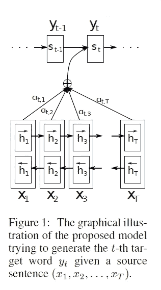

# Attention
在深度学习的发展历程中，注意力机制（Attention Mechanism） 是连接 Seq2Seq 与 Transformer 的关键环节。它最早由 Bahdanau 等人在 2014 年提出，用于改进机器翻译任务。Attention 的灵感来自人类的视觉注意力：我们在理解信息时不会平均关注所有内容，而是选择性地聚焦在与当前任务最相关的部分。

在序列建模中，Attention 允许模型在生成输出的某个时间步时，不仅依赖于最后的隐藏状态，而是能够动态地“关注”输入序列中的不同位置，从而有效解决了 Seq2Seq 的信息瓶颈问题。

## Attention 的核心思想
在标准 Seq2Seq 中，编码器最终将整个输入序列压缩成一个固定向量（通常是最后的隐藏状态），传递给解码器。但这种方式在处理长序列时会丢失大量信息。

Attention 的关键在于解码器在生成每个输出时，可以根据需要对输入序列中的各个位置分配不同的权重，从而有选择性地提取信息。



在时间步 $t$，解码器需要根据输入序列的隐藏状态 $$(h_1, h_2, \dots, h_T)$$生成输出。Attention 的计算过程如下：

**1. 计算注意力权重**

 根据解码器的当前状态 $$s_t$$ 与编码器的隐藏状态 $$h_i$$，计算相似度（对齐分数，Alignment Score）： $$e_{t,i} = \text{score}(s_t, h_i)$$

**2. 常见的打分函数（Score Function）**：

  - Bahdanau Attention（Additive Attention）： $$e_{t,i} = v^\top \tanh(W_s s_t + W_h h_i)$$
  - Luong Attention（Multiplicative Attention）： $$e_{t,i} = s_t^\top W h_i$$

**3. 归一化权重（Softmax）**

 将对齐分数转化为概率分布： $$\alpha_{t,i} = \frac{\exp(e_{t,i})}{\sum_j \exp(e_{t,j})}$$

**4. 上下文向量（Context Vector）**

 使用注意力权重对编码器的隐藏状态加权求和： $$c_t = \sum_i \alpha_{t,i} h_i$$

**5. 结合上下文生成输出**

 解码器在生成输出时，结合自身状态$$s_t$$ 和上下文向量$$c_t$$： $$\tilde{s}_t = \tanh(W_c [s_t; c_t])$$

这样，解码器在每个时间步都能动态选择性地关注输入序列的不同部分。

可以将 Attention 理解为 加权平均：
- 如果输入是一个英文句子，模型在生成法语句子的某个词时，可以自动关注与之对应的英文单词。
- 注意力权重 $$\alpha_{t,i}$$可以看作 解码第 $t$ 个词时，输入序列第 $i$ 个词的重要性。


这种机制解决了 Seq2Seq 的信息瓶颈，使模型能够处理更长的序列，并显著提升了翻译质量。

更重要的是，Attention 发展出了 Self-Attention（自注意力），并最终演变成 Transformer 架构，成为大规模预训练模型（BERT, GPT 等）的核心。

## 代码示例
下面给出一个 Luong Attention 的简化实现：
```python
import torch
import torch.nn as nn
import torch.nn.functional as F

class Attention(nn.Module):
    def __init__(self, hidden_size):
        super(Attention, self).__init__()
        self.attn = nn.Linear(hidden_size, hidden_size)

    def forward(self, hidden, encoder_outputs):
        # hidden: (batch, hidden_size)
        # encoder_outputs: (batch, seq_len, hidden_size)
        # 计算对齐分数
        scores = torch.bmm(encoder_outputs, hidden.unsqueeze(2)).squeeze(2)  # (batch, seq_len)
        attn_weights = F.softmax(scores, dim=1)  # 注意力权重
        # 计算上下文向量
        context = torch.bmm(attn_weights.unsqueeze(1), encoder_outputs)  # (batch, 1, hidden_size)
        context = context.squeeze(1)  # (batch, hidden_size)
        return context, attn_weights

# 示例
batch_size, seq_len, hidden_size = 5, 7, 20
encoder_outputs = torch.randn(batch_size, seq_len, hidden_size)
hidden = torch.randn(batch_size, hidden_size)

attn = Attention(hidden_size)
context, weights = attn(hidden, encoder_outputs)
print(context.shape)  # (5, 20)
print(weights.shape)  # (5, 7)
```
Attention 机制通过为输入序列的不同部分分配权重，解决了 Seq2Seq 的信息瓶颈问题，大幅提升了长序列任务的建模能力。

它不仅成为 机器翻译、摘要生成 等任务的关键组件，还进一步发展为 自注意力机制（Self-Attention），并孕育出 Transformer 架构。可以说，Attention 是现代深度学习中最重要的突破之一。

最新的文章都在公众号更新，别忘记关注哦！！！如果想要加入技术群聊，扫描下方二维码回复【加群】即可。
