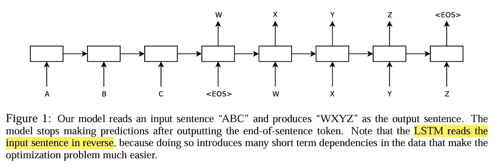

# Encoder-Decoder架构
在深度学习的发展历程中，Encoder-Decoder 架构（编码器-解码器）可以说是最经典、最通用的一种模型设计范式。

无论是早期的机器翻译、图像描述生成，还是如今的大规模预训练模型，Encoder-Decoder 都扮演着核心角色。

它的思想简洁而优雅：先将输入信息压缩成抽象表示（编码），再将其逐步展开为目标输出（解码）。这种框架能够自然地处理输入与输出长度不同的问题，非常适合序列到序列（Seq2Seq）建模。

## 基本思想
Encoder-Decoder 架构由两部分组成：

**1. Encoder（编码器）**
  - 负责接收输入数据（文本、图像、语音等），并逐步提取其中的特征。
  - 编码器的输出通常是一个向量或一组上下文表示，包含了输入的关键信息。

**2. Decoder（解码器）**
  - 以编码器的输出为条件，逐步生成目标序列。
  - 在序列生成任务中，解码器往往是自回归的：每一步预测的结果都会作为下一步的输入。

一句话总结就是Encoder 提炼信息，Decoder 生成信息。
## 模型演化历程
### RNN Seq2Seq


最早由 Sutskever 等人提出的 RNN-based Seq2Seq 模型，将输入序列压缩为一个固定长度的向量，然后再由解码器逐步生成输出。
- 优点：结构简单，直观。
- 缺点：长序列时会出现信息瓶颈，梯度消失问题严重。
### Attention + Seq2Seq
Bahdanau 提出的 Attention 机制极大改善了 Seq2Seq。解码器不再依赖单一向量，而是可以动态地访问编码器的所有隐状态，从而解决了长序列难以捕捉的问题。

 这一步几乎是 Encoder-Decoder 框架走向主流的关键。
### Transformer
Transformer 直接抛弃了 RNN，采用 Self-Attention 来实现 Encoder-Decoder：

- Encoder 堆叠多层 Self-Attention 层，捕捉输入的全局依赖。
- Decoder 既有 Self-Attention，又有 Encoder-Decoder Attention，能够动态融合输入信息。
 如今，大部分 NLP 和多模态任务的核心模型都是基于 Transformer 的 Encoder-Decoder。
## 架构细节
### Encoder
- 输入表示：通常先经过 Embedding 层，将离散的输入（单词 ID、像素块、声学特征）映射到向量空间。
- 特征提取：通过多层神经网络（RNN/CNN/Transformer），逐层提取上下文信息。
- 输出表示：最终得到一组向量（或一个全局向量），供解码器使用。
### Decoder
- 条件生成：解码器的每一步都依赖于 Encoder 的表示 + 上一步的输出。
- 机制：
  - RNN Decoder：输入是前一步生成的 token。
  - Transformer Decoder：有 Masked Self-Attention，确保只能看到前面的信息。
- 输出层：通常是一个 softmax 层，用于预测下一个 token 的概率分布。
## 应用场景
**1. 机器翻译**
  - 典型任务，输入是源语言序列，输出是目标语言序列。
  - Transformer 的成功就是从翻译任务开始的。

**2. 图像描述（Image Captioning）**
  - Encoder：CNN 提取图像特征。
  - Decoder：RNN/Transformer 生成自然语言描述。

**3. 语音识别与合成**
  - Encoder：处理声学特征。
  - Decoder：输出文本或语音信号。

**4. 大模型范式**
  - BERT 是纯 Encoder 模型，适合理解任务。
  - GPT 是纯 Decoder 模型，适合生成任务。
  - T5、BART 等采用 Encoder-Decoder 结构，兼顾理解与生成。
## 优缺点
编解码结构的优点很明显：
- 能够处理输入输出不等长的问题。
- 架构通用，几乎适用于所有模态。
- 与 Attention 结合后性能显著提升。

但是也存在着很多挑战。
- RNN Seq2Seq 容易遗忘长程依赖。
- Transformer 虽然解决了这个问题，但计算复杂度较高。
- 在极大规模数据和参数下，训练成本非常昂贵。
当前已经有相当多的技术来解决这些问题。
## 代码示例
这里我们来看一个最简化的RNN的 Encoder-Decoder Demo
```python
import torch
import torch.nn as nn

# Encoder
class Encoder(nn.Module):
    def __init__(self, vocab_size, emb_dim, hidden_dim):
        super().__init__()
        self.embedding = nn.Embedding(vocab_size, emb_dim)
        self.rnn = nn.GRU(emb_dim, hidden_dim, batch_first=True)
    def forward(self, x):
        x = self.embedding(x)
        outputs, hidden = self.rnn(x)
        return hidden

# Decoder
class Decoder(nn.Module):
    def __init__(self, vocab_size, emb_dim, hidden_dim):
        super().__init__()
        self.embedding = nn.Embedding(vocab_size, emb_dim)
        self.rnn = nn.GRU(emb_dim, hidden_dim, batch_first=True)
        self.fc = nn.Linear(hidden_dim, vocab_size)
    def forward(self, x, hidden):
        x = self.embedding(x)
        outputs, hidden = self.rnn(x, hidden)
        logits = self.fc(outputs)
        return logits, hidden

# 整体模型
class Seq2Seq(nn.Module):
    def __init__(self, encoder, decoder):
        super().__init__()
        self.encoder = encoder
        self.decoder = decoder
    def forward(self, src, trg):
        hidden = self.encoder(src)
        logits, _ = self.decoder(trg, hidden)
        return logits
```
这个例子展示了最基础的 Seq2Seq 架构，而 Transformer 版则会复杂许多，我后面会从0开始带大家编写Transformer的代码。

Encoder-Decoder 架构 是深度学习中最重要的框架之一，它统一了输入-输出不同模态的处理方式，通过 Attention 和 Transformer，解决了长程依赖和表示能力的问题，发展到今天，已经成为 NLP、CV、语音以及多模态任务的核心。

最新的文章都在公众号更新，别忘记关注哦！！！如果想要加入技术群聊，扫描下方二维码回复【加群】即可。
