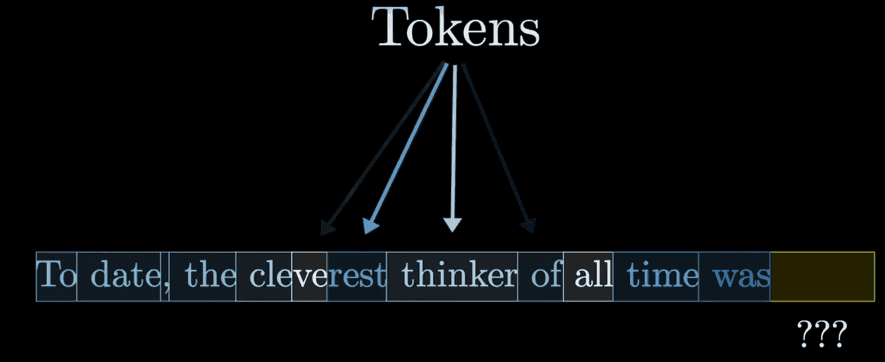

# Transformer 整体架构
研究人工智能的人应该都知道Transformer，Transformer可以说是人工智能的基石，无论是自然语言处理经典模型Bert，还是现在火的一塌糊涂的GPT，他们的核心正是Transformer。

Transformer是2017年Google提出的模型架构，最开始论文中的任务是翻译任务，之后扩展到文本预测、图像、语音等各个研究领域。

## tokenize

首先，输入序列会被分解为一堆小片段，这些片段被称为token，在文本中，他们通常是单词、单词的小片段或者其他的组合，如果涉及图像或者声音，那么token可以是图像的小块或者声音的片段。

每个token都会被编码成一个embbedding向量，这些向量是在高维空间下的坐标，具有相似含义的单词往往会落在这个空间中靠近的向量上，这些步骤是在数据进入Transformer中之前的预处理步骤。

## Position Embedding
在我们得到embedding之后，每个向量只包含了每个token的含义，但是没有考虑到词向量的顺序，也就会丢失原来文本的顺序信息。为了保留原始输入的顺序关系，我们需要加入位置编码，Transformer原文中位置编码的计算方式如下：

其中$pos$为位置序号，$d_{model}$为特征的维度，$i$表示特征的第$i$维。

## Encoder
Transformer有编码器和解码器两个部分，编码器的输入是固定一次性的，而解码器输入是自回归累加的。他们之间的区别是Decoder可以选择masking，并且Decoder中的注意力是交叉注意力机制，将Encoder的输入作为Key和Value，其余部分都相同。但是他们的核心都是Attention，一个叫注意力机制的东西。

Encoder的作用是处理输入的向量，目标是得到不仅包含原输入单词的embedding，并且希望将和原输入单词相关性高的单词的信息融合。

实现融合信息的核心就是注意力（Attention）模块，在这里他们相互通信根据上下文进行更新，例如，“我爱你”中的爱和“i love you”里面的love相关性很高，注意力模块负责弄清楚上下文中哪些单词的含义之间的相关性更高，以及这些单词的含义应该如何更新。

在注意力模块之后，这些向量通过多层感知机或者前馈网络，增强网络的非线性表达能力，这里向量彼此之间不进行通信，他们并行执行相同的操作，这也是Transformer能够很好的并行训练的原因。从计算上讲，两个块中所有运算都是矩阵乘法。
## Decoder
Decoder中的模块和Encoder中的模块类似，都是注意力模块和前馈神经网络以及融合归一化层。不同的是，Decoder是自回归，多了mask机制和交叉注意力机制。

Decoder每一次预测得到一个词，预测下一个单词所需要的信息都需要编码到序列的最后一个向量中，这个向量再经过一次运算产生下一个可能出现的文本的概率分布。预测出来的这个词和Decoder原始输入合在一起再次输入到Decoder，这也就是所谓的自回归。重复这个过程不断生成直至完毕。

以上就是Transformer整体的结构。

最新的文章都在公众号更新，别忘记关注哦！！！如果想要加入技术群聊，扫描下方二维码回复【加群】即可。
