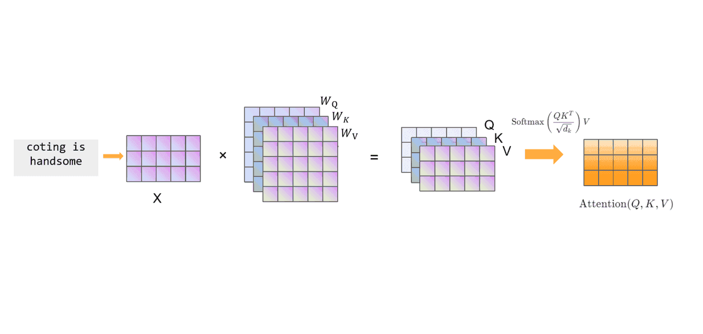

# 自注意力机制
在深度学习中，注意力机制（Attention） 的引入解决了 Seq2Seq 的信息瓶颈问题。但传统 Attention 更多用于 编码器-解码器（Encoder-Decoder） 框架，解码器在生成目标序列时才使用注意力来选择性关注输入序列的不同部分。

随着研究的深入，Vaswani 等人在 2017 年提出了 自注意力机制（Self-Attention），其核心思想是：序列中的每个位置都可以直接与其他位置建立依赖关系，从而捕捉全局信息。

这一机制成为 Transformer 模型的核心，推动了大规模预训练模型（如 BERT、GPT）的发展。

## Self-Attention 的核心思想
在自然语言中，一个词的含义往往依赖于上下文。例如，在句子 “The bank is near the river” 中，单词 “bank” 的意思是“河岸”而不是“银行”。要正确理解“bank”，模型需要结合上下文信息。

Self-Attention 的目标就是：在处理序列时，允许序列中的每个位置与其他位置进行信息交互，根据上下文动态生成表示。
## Self-Attention 的数学公式
给定输入序列表示为矩阵：$$X = [x_1, x_2, \dots, x_T] \in \mathbb{R}^{T \times d}$$
其中 $T$ 是序列长度，$d$ 是特征维度。


1. 线性映射到 Q, K, V
将输入 X 通过不同的线性变换映射为 查询（Query）、键（Key） 和 值（Value）：
$$Q = XW_Q, \quad K = XW_K, \quad V = XW_V$$，其中 $$W_Q, W_K, W_V \in \mathbb{R}^{d \times d_k}$$
2. 计算注意力分数
使用查询与键的点积来衡量相似度： $$\text{score}(Q,K) = \frac{QK^\top}{\sqrt{d_k}}$$，除以 $$\sqrt{d_k}$$ 是为了缓解数值过大导致梯度不稳定的问题。
3. Softmax 归一化
 将分数转化为权重分布： $$\alpha = \text{softmax}\left(\frac{QK^\top}{\sqrt{d_k}}\right)$$
4. 加权求和得到输出
 使用注意力权重加权值向量： $$\text{Attention}(Q,K,V) = \alpha V$$

最终得到的输出是序列中每个位置的上下文表示。
## Multi-Head Self-Attention
为了提升模型的表达能力，Transformer 并不是只使用一组 $Q$、$K$、$V$，而是使用 多头注意力（Multi-Head Attention）：
- 将输入分为多个子空间，分别计算 Self-Attention；
- 将结果拼接后再做一次线性变换： $$\text{MultiHead}(Q,K,V) = \text{Concat}(\text{head}_1, \dots, \text{head}_h)W^O$$

这种机制使模型能够在不同的子空间中学习不同的语义关系，例如“句法结构”、“语义依赖”等。

## Self-Attention 的优势
与 RNN、CNN 等传统序列建模方法相比，Self-Attention 具有显著优势：

**1. 全局依赖建模**
  - RNN 需要逐步传递信息，难以捕捉长距离依赖；
  - Self-Attention 允许任意两个位置直接交互，捕捉全局关系。

**2. 并行计算**
  - RNN 计算是序列依赖的，难以并行；
  - Self-Attention 将序列表示为矩阵运算，可以完全并行化。

**3. 灵活性强**
  - 可应用于文本、图像、语音等多种模态。

##  PyTorch 实现示例
下面给出一个简化版 Self-Attention 的实现：
```python
import torch
import torch.nn as nn
import torch.nn.functional as F

class SelfAttention(nn.Module):
    def __init__(self, embed_size, heads):
        super(SelfAttention, self).__init__()
        self.embed_size = embed_size
        self.heads = heads
        self.head_dim = embed_size // heads

        assert embed_size % heads == 0, "Embedding size must be divisible by heads"

        self.W_Q = nn.Linear(embed_size, embed_size, bias=False)
        self.W_K = nn.Linear(embed_size, embed_size, bias=False)
        self.W_V = nn.Linear(embed_size, embed_size, bias=False)
        self.fc_out = nn.Linear(embed_size, embed_size)

    def forward(self, x):
        N, seq_len, embed_size = x.shape
        Q = self.W_Q(x).view(N, seq_len, self.heads, self.head_dim)
        K = self.W_K(x).view(N, seq_len, self.heads, self.head_dim)
        V = self.W_V(x).view(N, seq_len, self.heads, self.head_dim)

        Q, K, V = Q.transpose(1,2), K.transpose(1,2), V.transpose(1,2)  # (N, heads, seq_len, head_dim)

        energy = torch.matmul(Q, K.transpose(-2, -1)) / (self.head_dim ** 0.5)  # (N, heads, seq_len, seq_len)
        attention = F.softmax(energy, dim=-1)

        out = torch.matmul(attention, V)  # (N, heads, seq_len, head_dim)
        out = out.transpose(1,2).contiguous().view(N, seq_len, embed_size)
        return self.fc_out(out)

# 示例
x = torch.randn(5, 7, 32)  # (batch=5, seq_len=7, embed_size=32)
self_attn = SelfAttention(embed_size=32, heads=4)
out = self_attn(x)
print(out.shape)  # (5, 7, 32)
```
Self-Attention 通过 查询-键-值（Q-K-V）机制 实现了序列中任意位置之间的依赖建模，不仅解决了 RNN 的长距离依赖问题，还带来了并行化计算的优势。

作为 Transformer 的核心组件，它直接推动了深度学习进入 大模型时代，成为 NLP、CV、语音和多模态任务中的基础模块。

最新的文章都在公众号更新，别忘记关注哦！！！如果想要加入技术群聊，扫描下方二维码回复【加群】即可。
