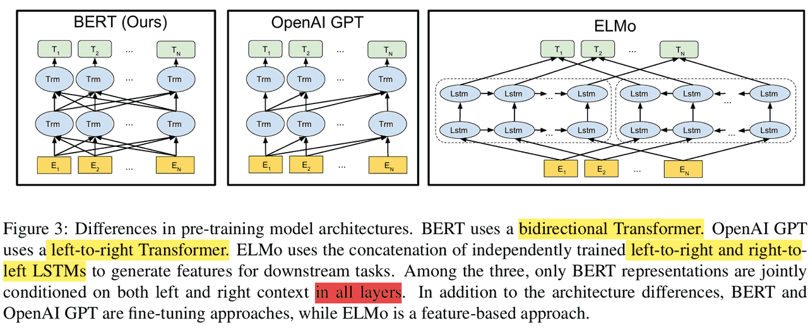
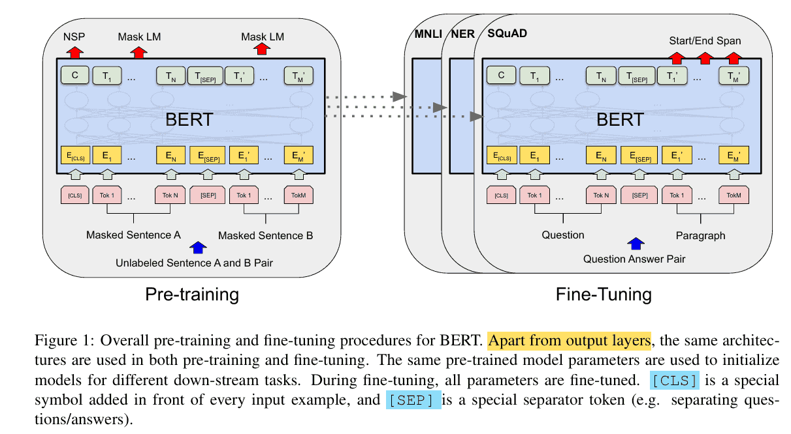
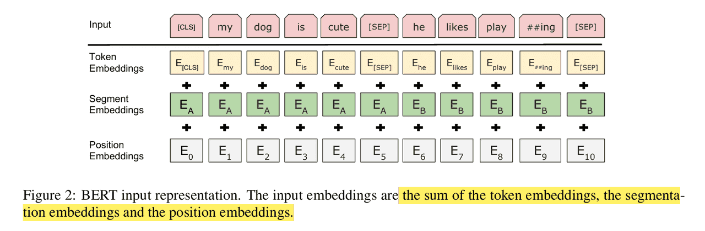
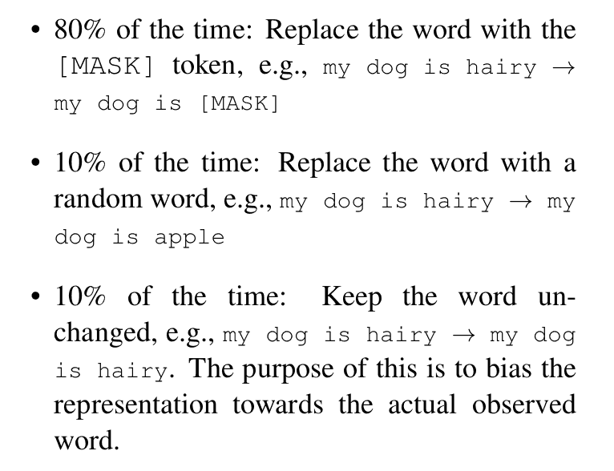
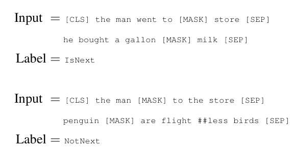
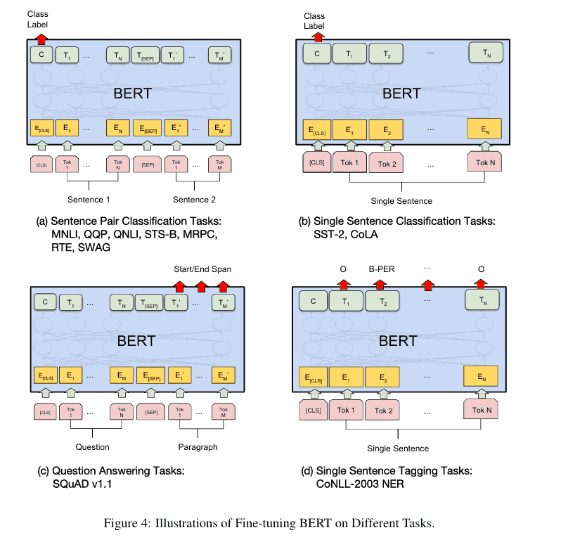

# Bert
在深度学习与自然语言处理（NLP）的发展历程中，BERT 可以说是划时代的里程碑。它首次将双向 Transformer 表示学习与大规模无监督预训练结合起来，不仅显著提升了各类 NLP 任务的效果，还直接推动了大模型时代的到来。

BERT 的出现，让**预训练 + 微调**成为主流范式，也为之后的 GPT、T5、RoBERTa 等模型奠定了基础。
## BERT 的核心思想
BERT 的全称是 Bidirectional Encoder Representations from Transformers，顾名思义，它基于 Transformer 的 Encoder 结构，利用 **双向上下文信息** 来学习文本表示。


传统语言模型往往是单向的：
- 左到右（如 GPT），或右到左。
- 这种方式限制了模型只能利用一侧的上下文。

而 BERT 通过 Masked Language Model (MLM) 的设计，实现了同时建模左右语境，从而获得了更强大的表示能力。

BERT 不是生成模型，而是深度的双向语言理解模型。它通过预训练，学习到了丰富的语言表示，能够理解上下文的语义信息。

## BERT 的网络架构


BERT 完全基于 Transformer Encoder 堆叠，其主要组成部分包括：

**1. 输入表示**

- 由三部分向量相加得到：
  - Token Embedding：词向量。
  - Segment Embedding：区分句子 A 和句子 B。
  - Position Embedding：位置编码。
- 输入序列通常以 [CLS] 开头，用于分类任务，以 [SEP] 分隔句子。

**2. 多层 Transformer Encoder**
  - 每层包括 Multi-Head Self-Attention 和 前馈神经网络（Feed-Forward Network）。
  - Self-Attention 能够捕捉任意位置之间的依赖关系。

**3. 输出表示**
  - [CLS] 的输出向量通常用来做分类任务。
  - 其他 token 的向量可用于序列标注、问答、翻译等下游任务。

## 预训练任务
BERT 的关键创新在于其 预训练目标，主要包括两类：
### Masked Language Model (MLM)

- 随机掩盖 15% 的词，让模型根据上下文预测它们。
- 不同于传统 LM 单向预测，MLM 可以利用完整的双向上下文。
### Next Sentence Prediction (NSP)  

- 输入句子对 (A, B)，判断 B 是否是 A 的下一句。
- 旨在增强句子级别的关系建模能力，对问答和自然语言推理任务尤为有帮助。

## 微调范式
BERT 的最大贡献之一，是提出了 “预训练 + 微调” 的范式：
- 预训练：在大规模无标注语料（Wiki, BookCorpus）上学习通用语言表示。
- 微调：在具体任务（如情感分析、命名实体识别、阅读理解）上，用少量标注数据进行训练。


这种模式极大降低了下游任务的标注需求，也让学术界和工业界快速享受到预训练模型的红利。

## 代码示例
下面我们用 PyTorch 从零搭建核心模块，帮助更好的理解 BERT 的内部机制。
```python
import torch
import torch.nn as nn
import math

# ----------------------
# 1. Multi-Head Self Attention
# ----------------------
class MultiHeadSelfAttention(nn.Module):
    def __init__(self, hidden_dim, num_heads):
        super().__init__()
        assert hidden_dim % num_heads == 0, "hidden_dim 必须能被 num_heads 整除"
        self.num_heads = num_heads
        self.head_dim = hidden_dim // num_heads
        
        self.query = nn.Linear(hidden_dim, hidden_dim)
        self.key   = nn.Linear(hidden_dim, hidden_dim)
        self.value = nn.Linear(hidden_dim, hidden_dim)
        self.out   = nn.Linear(hidden_dim, hidden_dim)
    
    def forward(self, x, mask=None):
        B, L, D = x.size()  # batch_size, seq_len, hidden_dim
        
        # 线性映射
        Q = self.query(x).view(B, L, self.num_heads, self.head_dim).transpose(1, 2)  # [B, heads, L, head_dim]
        K = self.key(x).view(B, L, self.num_heads, self.head_dim).transpose(1, 2)
        V = self.value(x).view(B, L, self.num_heads, self.head_dim).transpose(1, 2)
        
        # Scaled Dot-Product Attention
        scores = torch.matmul(Q, K.transpose(-2, -1)) / math.sqrt(self.head_dim)  # [B, heads, L, L]
        if mask is not None:
            scores = scores.masked_fill(mask == 0, -1e9)
        attn = torch.softmax(scores, dim=-1)
        
        out = torch.matmul(attn, V)  # [B, heads, L, head_dim]
        out = out.transpose(1, 2).contiguous().view(B, L, D)  # [B, L, hidden_dim]
        return self.out(out)

# ----------------------
# 2. Transformer Encoder Block
# ----------------------
class TransformerBlock(nn.Module):
    def __init__(self, hidden_dim, num_heads, ff_dim, dropout=0.1):
        super().__init__()
        self.attn = MultiHeadSelfAttention(hidden_dim, num_heads)
        self.norm1 = nn.LayerNorm(hidden_dim)
        self.norm2 = nn.LayerNorm(hidden_dim)
        
        self.ff = nn.Sequential(
            nn.Linear(hidden_dim, ff_dim),
            nn.ReLU(),
            nn.Linear(ff_dim, hidden_dim)
        )
        self.dropout = nn.Dropout(dropout)
    
    def forward(self, x, mask=None):
        # Self-Attention + 残差
        attn_out = self.attn(x, mask)
        x = self.norm1(x + self.dropout(attn_out))
        
        # Feed Forward + 残差
        ff_out = self.ff(x)
        x = self.norm2(x + self.dropout(ff_out))
        return x

# ----------------------
# 3. BERT Embeddings
# ----------------------
class BERTEmbedding(nn.Module):
    def __init__(self, vocab_size, hidden_dim, max_len=512, dropout=0.1):
        super().__init__()
        self.token_emb = nn.Embedding(vocab_size, hidden_dim)
        self.pos_emb   = nn.Embedding(max_len, hidden_dim)
        self.seg_emb   = nn.Embedding(2, hidden_dim)  # segment A / B
        self.norm = nn.LayerNorm(hidden_dim)
        self.dropout = nn.Dropout(dropout)
    
    def forward(self, input_ids, segment_ids):
        B, L = input_ids.size()
        pos_ids = torch.arange(L, device=input_ids.device).unsqueeze(0).expand(B, L)
        
        x = self.token_emb(input_ids) + self.pos_emb(pos_ids) + self.seg_emb(segment_ids)
        return self.dropout(self.norm(x))

# ----------------------
# 4. BERT Model
# ----------------------
class BERT(nn.Module):
    def __init__(self, vocab_size, hidden_dim=768, num_heads=12, ff_dim=3072, num_layers=12, max_len=512):
        super().__init__()
        self.embedding = BERTEmbedding(vocab_size, hidden_dim, max_len)
        self.layers = nn.ModuleList([
            TransformerBlock(hidden_dim, num_heads, ff_dim) for _ in range(num_layers)
        ])
        self.cls_head = nn.Linear(hidden_dim, vocab_size)  # 用于 MLM
    
    def forward(self, input_ids, segment_ids, mask=None):
        x = self.embedding(input_ids, segment_ids)
        for layer in self.layers:
            x = layer(x, mask)
        logits = self.cls_head(x)  # MLM 任务输出
        return logits

# 模拟输入
vocab_size = 30522  # 与 BERT 一致
model = BERT(vocab_size)

input_ids = torch.randint(0, vocab_size, (2, 10))  # batch_size=2, seq_len=10
segment_ids = torch.zeros_like(input_ids)  # 全部属于句子 A

logits = model(input_ids, segment_ids)
print(logits.shape)  # [2, 10, vocab_size]
```
输出的 logits 可用于 Masked Language Model (MLM) 任务，即预测被 [MASK] 掩盖的词。

BERT 的提出，最大的三大贡献可以总结成下面三个部分：
1. 双向 Transformer 表示学习 —— 捕捉更全面的上下文信息。
2. 预训练 + 微调范式 —— 让通用语言模型成为 NLP 的基础设施。
3. 广泛适用性 —— 覆盖了几乎所有 NLP 任务。

最新的文章都在公众号更新，别忘记关注哦！！！如果想要加入技术群聊，扫描下方二维码回复【加群】即可。
