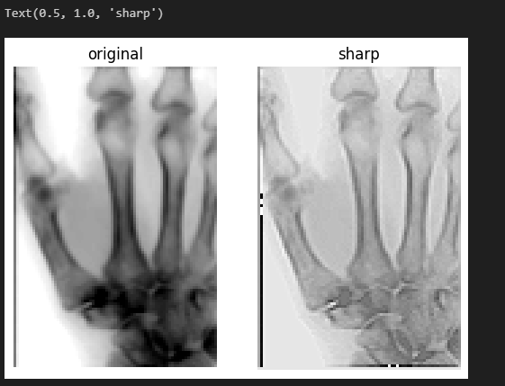

# 卷积
卷积（Convolution）是深度学习中最核心、最常用的运算之一，尤其在图像处理、语音识别和自然语言处理中扮演着关键角色。它通过滑动窗口的方式提取局部特征，能够有效捕捉数据中的空间或时间结构，是卷积神经网络（CNN）的基础。

## 卷积的数学定义
在数学上，卷积是一种积分或求和运算，用于衡量一个函数在另一个函数上的重叠程度。

- 连续形式：$$(f * g)(t) = \int_{-\infty}^{+\infty} f(\tau) g(t - \tau) \, d\tau$$
- 离散形式（用于深度学习中的数值计算）：$$(f * g)[n] = \sum_{m=-\infty}^{+\infty} f[m] \, g[n-m]$$

其中，$$f$$ 表示输入信号，$$g$$ 表示卷积核（或滤波器），$$n$$ 表示位置。

在图像处理中，卷积一般是二维的：$$(F * K)(i,j) = \sum_m \sum_n F(i+m, j+n) \, K(m,n)$$

其中 $$F$$ 是输入图像，$$K$$ 是卷积核。

## 卷积的核心思想
1. 局部感受野：卷积核只关注输入数据的一小部分区域（例如图像的一个小块），类似人眼视觉系统的局部观察。
2. 权值共享：同一个卷积核在不同位置滑动时使用相同的参数，极大减少了模型参数数量。
3. 平移不变性：卷积能在不同位置检测相同的模式，例如边缘、角点、纹理等特征。
## 卷积在图像中的操作
- 卷积核 (Kernel/Filter)：一个小矩阵，例如 $$3\times3$$ 或 $$5\times5$$，用来提取特定特征。
- 步幅 (Stride)：卷积核每次移动的步长。步幅越大，输出特征图越小。
- 填充 (Padding)：为了不丢失边界信息，可以在输入周围补零。

例如，一个 $$5\times5$$ 的图像与一个 $$3\times3$$ 卷积核做卷积，如果步幅为 1 且无填充，输出结果是一个 $$3\times3$$ 特征图。
## 卷积的作用
- 低级特征提取：浅层卷积层通常检测边缘、纹理等简单特征。
- 高级特征组合：深层卷积层将低级特征组合成复杂模式，如物体的局部结构甚至完整物体。
- 降维与压缩：通过池化层结合卷积，可逐步减少数据维度，保留重要信息。
## 卷积的应用举例
### 边缘检测（Sobel 卷积核）
 用于提取图像中的边缘：
  - 水平边缘检测核：$$K_x = \begin{bmatrix} -1 & 0 & 1 \\ -2 & 0 & 2 \\ -1 & 0 & 1 \end{bmatrix}$$
  - 垂直边缘检测核：$$K_y = \begin{bmatrix} -1 & -2 & -1 \\ 0 & 0 & 0 \\ 1 & 2 & 1 \end{bmatrix}$$

把这些卷积核应用到图像上，就能突出水平或垂直方向的边缘。
### 模糊（均值卷积核）
$$K = \frac{1}{9} \begin{bmatrix} 1 & 1 & 1 \\ 1 & 1 & 1 \\ 1 & 1 & 1 \end{bmatrix}$$

对每个像素取邻域的平均值，实现平滑效果。
### 锐化（高通滤波器）
$$K = \begin{bmatrix} 0 & -1 & 0 \\ -1 & 5 & -1 \\ 0 & -1 & 0 \end{bmatrix}$$

能增强图像细节，使边缘更加清晰。

下面我们用 PyTorch 实现卷积操作：
```python
I_xray = imread('image/xray_image.png')[::4,::4]
# make sure to copy, otherwise they reference the same memory (same variable)
I_xray_sharp = I_xray.copy()

im_size = I_xray.shape

#### your code starts ####
## step 1. create the kernel matrix
# kernel = np.array([[-1, -1, -1],
#                    [-1, 7, -1],
#                    [-1, -1, -1]])
kernel = np.array([[0, -1, 0],
                   [-1, 5, -1],
                   [0, -1, 0]])
## step 2 & 3. modify the median filter code for filtering
# 卷积核大小
psz_h = 1

# 使用块级操作进行锐化滤波
for row in range(psz_h, im_size[0] - psz_h):
    for col in range(psz_h, im_size[1] - psz_h):
        # 提取 3x3 的图像块
        patch = I_xray[row - psz_h: row + psz_h + 1, col - psz_h: col + psz_h + 1]
        # 进行卷积操作：元素乘积并求和
        I_xray_sharp[row, col] = np.sum(patch * kernel)

# 将值限制在 0 到 255 之间，防止溢出
I_xray_sharp = np.clip(I_xray_sharp, 0, 255).astype(np.uint8)

#### your code starts ####

plt.subplot(121)
plt.imshow(I_xray, cmap='gray');plt.axis('off');plt.title('original')
plt.subplot(122)
plt.imshow(I_xray_sharp, cmap='gray');plt.axis('off');plt.title('sharp')
```
运行结果如下，可以看到锐化效果还是很明显的


卷积的优势在于参数量远小于全连接网络，自然具备特征提取能力，适合处理高维数据（如图像、视频），但是卷积对全局依赖建模较弱，并且卷积核大小和设计需要人工选择，所以在 NLP 等任务中逐渐被 Transformer 替代。

卷积作为深度学习的基石，极大推动了神经网络在计算机视觉、语音识别和 NLP 中的成功。它以局部感知、权值共享和平移不变性为特征，使得神经网络能够高效处理高维结构化数据。虽然新的架构（如 Transformer）在部分领域崛起，但卷积依然是深度学习的重要基础算子。

最新的文章都在公众号更新，别忘记关注哦！！！如果想要加入技术群聊，扫描下方二维码回复【加群】即可。
