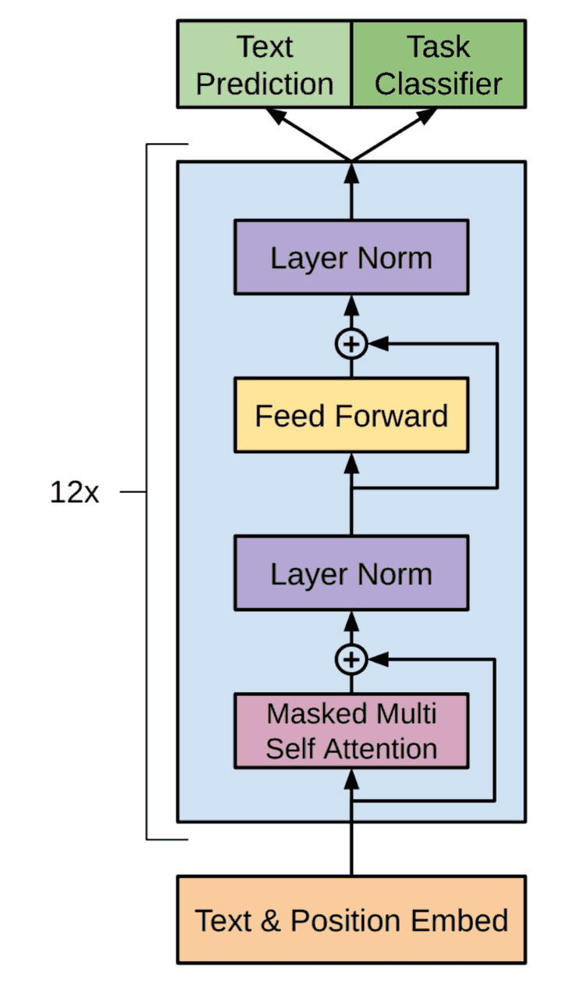

# GPT
在自然语言处理（NLP）的大模型发展史上，GPT（Generative Pre-trained Transformer） 是另一个里程碑。它与 BERT 一样源自 Transformer 架构，但采用了完全不同的思路：单向自回归建模。

GPT 证明了大规模预训练语言模型不仅能理解语言，更能强大地生成语言，为 ChatGPT、GPT-4 等通用人工智能应用奠定了基础。
## 核心思想
GPT 的名字就揭示了它的关键设计：
- Generative（生成式）：GPT 不是只做理解，而是能从左到右逐步生成自然语言。
- Pre-trained（预训练）：在大规模无监督文本语料上预训练语言模型。
- Transformer（转换器）：采用 Transformer 的 Decoder 堆叠结构，特别是带 Mask 的 Self-Attention，确保生成时只能依赖历史信息。

也就是GPT 是基于 Transformer Decoder 的自回归语言模型，通过预训练获得强大的生成能力。
## 网络架构
GPT 完全基于 Transformer Decoder 堆叠，其核心组成部分包括：
### 输入表示
  - Token Embedding：将词或子词（BPE, SentencePiece）映射到向量。
  - Position Embedding：绝对位置编码或后来的旋转位置编码（RoPE）。
  - GPT 不使用 Segment Embedding，因为它主要是单文本流建模。
### Decoder 堆叠

- Masked Multi-Head Self-Attention：限制只能看到当前位置之前的 token，确保自回归生成。
- 前馈网络（Feed-Forward Network）：增强非线性建模能力。
- LayerNorm + 残差连接：稳定训练，避免梯度消失。
### 输出层
  - 一个共享的词表线性层 + softmax，用于预测下一个 token 的概率分布。
## 训练范式
GPT 的训练目标非常直接：语言建模目标（Language Modeling Objective）。

- 给定一个文本序列 $$x_1, x_2, \dots, x_T$$，GPT 学习最大化下一个词的概率：

$$P(xt∣x1,…,xt−1)P(x_1, x_2, \dots, x_T) = \prod_{t=1}^{T} P(x_t \mid x_1, \dots, x_{t-1})$$

换句话说，GPT 是 自回归预测，通过预测下一个词不断生成文本。

这种简单而强大的目标，使 GPT 能够在大规模数据上高效学习语言规律，并自然具备生成能力。
## GPT 系列的发展
**1. GPT (2018)**
  - OpenAI 提出的第一版，12 层 Transformer Decoder，1.1 亿参数。
  - 证明了“预训练 + 微调”的可行性（对比 BERT）。

**2. GPT-2 (2019)**
  - 参数规模扩大到 15 亿。
  - 采用单一预训练目标（语言建模），不再区分 NSP/MLM。
  - 展示了惊人的长文本生成能力（甚至被 OpenAI 一度限制公开）。

**3. GPT-3 (2020)**
  - 1750 亿参数，使用海量语料训练。
  - 引入 In-Context Learning（上下文学习）：无需微调，仅凭提示（prompt）即可完成任务。
  - 成为 Few-Shot / Zero-Shot 学习的典型代表。

**4. GPT-4 (2023)**
  - 规模进一步扩大（未公布确切参数）。
  - 多模态能力：支持图像 + 文本输入。
  - 安全性与对齐性显著提升，是 ChatGPT 产品的核心模型。

**5. GPT-4 Turbo (2023.11)**
  - 上下文长度提升至 128 K，相当于 300 页文本。
  - 知识截止时间更新至 2023 年 4 月，价格较 GPT-4 降低 2/3。
  - 函数调用、指令遵循、JSON 模式全面优化，为开发者提供更稳定接口。

**6. GPT-4o (2024.5)**
  - “o”代表 omni（全能）：原生支持文本、图像、音频、视频任意组合输入输出。
  - 首次实现毫秒级语音对话，端到端训练跨模态语义。
  - 在 MMLU、HumanEval 等基准上首次突破 90+ 平均分，免费用户亦可用。

**7. GPT-4o mini (2024.7)**
  - 轻量级版本，参数大幅缩减但保留 128 K 上下文。
  - 成本比 GPT-3.5 Turbo 再降 60%，成为替代 3.5 的默认模型。
  - 支持链式工具调用、批处理 API，适合高并发边缘场景。

**8. o1 系列（原草莓，2024.9）**
  - 引入慢思考机制：内部思维链（CoT）长度可动态扩展至百万级 token。
  - 在数学、代码、科学推理任务上超越 GPT-4o，AIME 数学竞赛得分提升 6 倍。
  - 分 o1-preview（深度推理）与 o1-mini（速度优先）两款，逐步替代传统 GPT 编号。

**9. GPT-5 （2025 及以后）**
  - GPT-5 整合 o1 的推理能力与 GPT-4o 的多模态，实现统一模型。
  - 支持更长一致性窗口（1 M+ token）、个性化记忆、实时检索与工具生态。
  - 安全层面引入超级对齐框架，通过可解释性与红队测试确保 AGI 级风险可控。

  
## Bert VS GPT
用一个表格对比一下GPT和Bert：
|模型	|架构	|训练目标	|适合任务
|--|--|--|--|
|BERT	|Transformer Encoder	|MLM + NSP	|语言理解（分类、抽取、推理）|
|GPT	|Transformer Decoder	|自回归 LM	|语言生成（对话、写作、翻译）|


可以看到，BERT 偏向于理解，而 GPT 偏向于生成。二者互补，共同推动了 NLP 的发展。
##  PyTorch 简单示例
下面给一个简化版 GPT 的 PyTorch 实现示例：
```python
import torch
import torch.nn as nn
import math

class GPTBlock(nn.Module):
    def __init__(self, hidden_dim, num_heads, ff_dim, dropout=0.1):
        super().__init__()
        self.attn = nn.MultiheadAttention(hidden_dim, num_heads, dropout=dropout, batch_first=True)
        self.ff = nn.Sequential(
            nn.Linear(hidden_dim, ff_dim),
            nn.ReLU(),
            nn.Linear(ff_dim, hidden_dim)
        )
        self.norm1 = nn.LayerNorm(hidden_dim)
        self.norm2 = nn.LayerNorm(hidden_dim)
        self.dropout = nn.Dropout(dropout)
    
    def forward(self, x, mask=None):
        attn_out, _ = self.attn(x, x, x, attn_mask=mask)
        x = self.norm1(x + self.dropout(attn_out))
        ff_out = self.ff(x)
        x = self.norm2(x + self.dropout(ff_out))
        return x

class GPT(nn.Module):
    def __init__(self, vocab_size, hidden_dim=256, num_heads=4, ff_dim=512, num_layers=4, max_len=128):
        super().__init__()
        self.token_emb = nn.Embedding(vocab_size, hidden_dim)
        self.pos_emb = nn.Embedding(max_len, hidden_dim)
        self.layers = nn.ModuleList([GPTBlock(hidden_dim, num_heads, ff_dim) for _ in range(num_layers)])
        self.ln_f = nn.LayerNorm(hidden_dim)
        self.head = nn.Linear(hidden_dim, vocab_size)
    
    def forward(self, x):
        B, L = x.size()
        pos = torch.arange(L, device=x.device).unsqueeze(0).expand(B, L)
        x = self.token_emb(x) + self.pos_emb(pos)
        
        # Mask：防止看到未来的 token
        mask = torch.triu(torch.ones(L, L, device=x.device), diagonal=1).bool()
        
        for layer in self.layers:
            x = layer(x, mask)
        x = self.ln_f(x)
        return self.head(x)

# 测试
vocab_size = 5000
model = GPT(vocab_size)
input_ids = torch.randint(0, vocab_size, (2, 10))
logits = model(input_ids)
print(logits.shape)  # [2, 10, vocab_size]
```
这个简化版 GPT 展示了 Decoder 堆叠 + Masked Attention 的基本结构，可以用于下一个词预测。

GPT 提出自回归预训练范式，让语言模型具备强大的生成能力。并且具有规模驱动效应，证明了参数规模与性能的强相关，开创了少样本学习的新范式。最重要的是推动大模型应用落地，成为对话系统、写作助手、智能体的核心。

最新的文章都在公众号更新，别忘记关注哦！！！如果想要加入技术群聊，扫描下方二维码回复【加群】即可。
