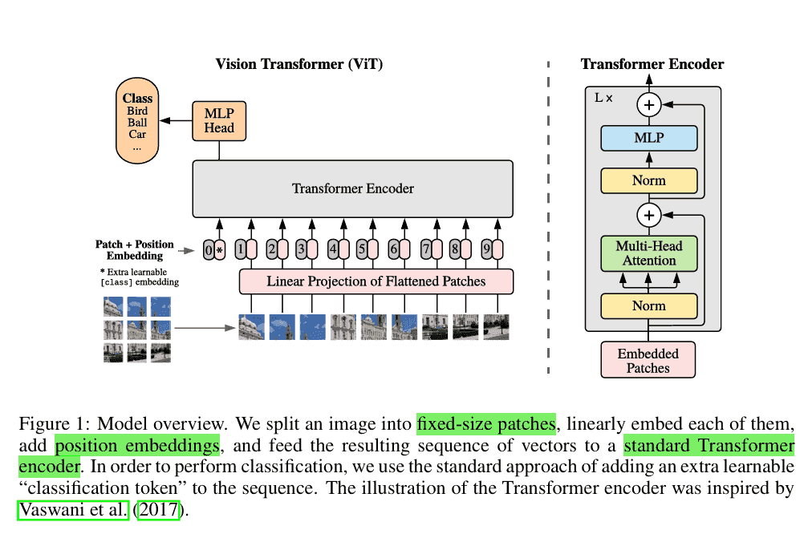

# Vision Transformer
Transformer 最初在自然语言处理（NLP）中取得了突破性成功，而 Vision Transformer (ViT) 的提出，则标志着 Transformer 架构在计算机视觉（CV）领域的全面登场。ViT 证明了只要数据量足够大，Transformer 不需要卷积操作，也能在图像识别上超越 CNN。这使得Transformer 统一架构成为深度学习的重要趋势。
## 核心思想
传统的计算机视觉模型，如 CNN（卷积神经网络），依赖卷积操作提取局部特征。而 ViT 的核心思想是：
1. 把图像看作序列 —— 将一张图像切分成若干固定大小的 patch（图块），再展平为向量。
2. 输入 Transformer —— 将这些 patch embedding 加上位置编码，作为 Transformer Encoder 的输入。
3. 利用 Self-Attention —— 模型能够捕捉图像 patch 之间的全局依赖关系，而不仅限于局部卷积感受野。

也就是ViT 用 NLP 的方式处理图像，把图像理解成**视觉句子**。
## 网络结构

Vision Transformer 的整体结构与 BERT 类似，主要分为以下几个部分：

**1. Patch Embedding**
  - 将输入图像（如 224×224×3）划分为固定大小的 patch（如 16×16×3）。
  - 每个 patch 展平成向量，并通过线性映射得到 Patch Embedding。

**2. 位置编码（Position Embedding）**
  - Transformer 无法感知序列的位置信息，因此需要为每个 patch 加上位置向量。
  - 常见的是 可学习的位置编码。

**3. [CLS] Token**
  - 类似 BERT 的 [CLS]，在 patch 序列前加一个可学习向量，作为整个图像的全局表示。
  - 最终分类任务就是基于这个 [CLS] 表示。

**4. Transformer Encoder 堆叠**
  - 每层由 Multi-Head Self-Attention 和 前馈网络（FFN） 组成。
  - Self-Attention 可以捕捉图像不同区域之间的依赖关系。

**5. 分类头（MLP Head）**
  - 取 [CLS] Token 的输出，经过 MLP 层，得到最终分类结果。
## ViT 的训练范式
ViT 的一大特点是：需要大规模数据训练。
- 在小数据集（如 CIFAR-10、ImageNet-1k）上，CNN 更具优势。
- 在大数据集（如 JFT-300M）上，ViT 能超越 ResNet 等 CNN 架构。

这说明 ViT 对数据量和预训练依赖很强。后来的一些改进（如 DeiT）通过 知识蒸馏、数据增强 等方式缓解了这一问题。
## 代码示例
下面我们来看一个简化版 Vision Transformer 的实现。
```python
import torch
import torch.nn as nn

class PatchEmbedding(nn.Module):
    def __init__(self, img_size=224, patch_size=16, in_ch=3, emb_dim=768):
        super().__init__()
        self.patch_embed = nn.Conv2d(in_ch, emb_dim, kernel_size=patch_size, stride=patch_size)
        self.num_patches = (img_size // patch_size) ** 2
    
    def forward(self, x):
        x = self.patch_embed(x)  # [B, emb_dim, H/patch, W/patch]
        x = x.flatten(2).transpose(1, 2)  # [B, num_patches, emb_dim]
        return x

class TransformerEncoder(nn.Module):
    def __init__(self, emb_dim=768, num_heads=12, ff_dim=3072, dropout=0.1):
        super().__init__()
        self.attn = nn.MultiheadAttention(emb_dim, num_heads, dropout=dropout, batch_first=True)
        self.ff = nn.Sequential(
            nn.Linear(emb_dim, ff_dim),
            nn.GELU(),
            nn.Linear(ff_dim, emb_dim)
        )
        self.norm1 = nn.LayerNorm(emb_dim)
        self.norm2 = nn.LayerNorm(emb_dim)
        self.dropout = nn.Dropout(dropout)
    
    def forward(self, x):
        attn_out, _ = self.attn(x, x, x)
        x = self.norm1(x + self.dropout(attn_out))
        ff_out = self.ff(x)
        x = self.norm2(x + self.dropout(ff_out))
        return x

class VisionTransformer(nn.Module):
    def __init__(self, img_size=224, patch_size=16, in_ch=3, emb_dim=768, num_heads=12, ff_dim=3072, num_layers=12, num_classes=1000):
        super().__init__()
        self.patch_embedding = PatchEmbedding(img_size, patch_size, in_ch, emb_dim)
        self.cls_token = nn.Parameter(torch.zeros(1, 1, emb_dim))
        self.pos_emb = nn.Parameter(torch.zeros(1, 1 + self.patch_embedding.num_patches, emb_dim))
        
        self.layers = nn.ModuleList([TransformerEncoder(emb_dim, num_heads, ff_dim) for _ in range(num_layers)])
        self.norm = nn.LayerNorm(emb_dim)
        self.head = nn.Linear(emb_dim, num_classes)
    
    def forward(self, x):
        B = x.size(0)
        x = self.patch_embedding(x)
        cls_tokens = self.cls_token.expand(B, -1, -1)
        x = torch.cat((cls_tokens, x), dim=1) + self.pos_emb
        
        for layer in self.layers:
            x = layer(x)
        
        x = self.norm(x)
        cls_out = x[:, 0]  # [CLS] Token
        return self.head(cls_out)

# 测试
model = VisionTransformer()
dummy = torch.randn(2, 3, 224, 224)
logits = model(dummy)
print(logits.shape)  # [2, 1000]
```

Vision Transformer 实现了跨模态统一 ，证明了 Transformer 架构不仅适用于语言，也适用于视觉。并且突破 CNN 的局部限制，利用自注意力机制能够捕捉远程依赖的能力实现了全局建模能力。同时推动了大规模视觉模型 的发展。

最新的文章都在公众号更新，别忘记关注哦！！！如果想要加入技术群聊，扫描下方二维码回复【加群】即可。
