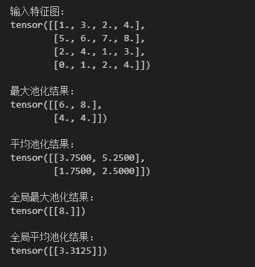

# 池化
在卷积神经网络（CNN）中，卷积层用于提取图像或特征图的局部模式，而池化（Pooling）是卷积之后常用的一种下采样操作。池化可以降低特征图尺寸、减少计算量，并增强模型对位置和噪声的鲁棒性。

下面从几个关键方面来介绍池化。

## 池化的原理与作用
池化的核心思想是对局部区域内的特征进行统计汇总，得到该区域的代表性数值。

通过这种方式，池化可以：
- 保留关键特征：最大池化保留最显著的局部特征。
- 平滑特征图：平均池化保留整体趋势。
- 降低计算量：减少特征图尺寸，减轻后续网络的计算压力。
- 增强鲁棒性：对小幅度平移或噪声不敏感，提高泛化能力。


例如，对于一个 $$4\times4$$ 的特征图：$$X = \begin{bmatrix} 1 & 3 & 2 & 4 \\ 5 & 6 & 7 & 8 \\ 2 & 4 & 1 & 3 \\ 0 & 1 & 2 & 4 \end{bmatrix}$$

使用 $$2\times2$$ 最大池化，步幅为 2，输出为：$$Y_{\text{max}} = \begin{bmatrix} 6 & 8 \\ 4 & 4 \end{bmatrix}$$

同样的 $$2\times2$$ 平均池化 输出为：$$Y_{\text{avg}} = \begin{bmatrix} 3.75 & 5.25 \\ 1.75 & 2.5 \end{bmatrix}$$

## 池化类型
**最大池化**（Max Pooling）：在窗口内取最大值，保留最显著特征，广泛应用于卷积神经网络。

**平均池化**（Average Pooling）：在窗口内取平均值，平滑特征图，保留整体信息。

**全局池化**（Global Pooling）：对整个特征图进行池化操作，例如 Global Max Pooling 取最大值，Global Average Pooling 取平均值。全局池化常用于替代全连接层，显著减少参数量。

在上面的矩阵例子中，Global Max Pooling 的结果是 8，Global Average Pooling 的结果是 3.25。

## 代码示例
下面我们用 PyTorch 演示最大池化、平均池化和全局池化的操作。
```python
import torch
import torch.nn.functional as F

# 构造 1x1x4x4 特征图
feature_map = torch.tensor([[[[1, 3, 2, 4],
                              [5, 6, 7, 8],
                              [2, 4, 1, 3],
                              [0, 1, 2, 4]]]], dtype=torch.float32)

print("输入特征图：")
print(feature_map[0,0])

# 1. 最大池化（2x2，stride=2）
max_pooled = F.max_pool2d(feature_map, kernel_size=2, stride=2)
print("\n最大池化结果：")
print(max_pooled[0,0])

# 2. 平均池化（2x2，stride=2）
avg_pooled = F.avg_pool2d(feature_map, kernel_size=2, stride=2)
print("\n平均池化结果：")
print(avg_pooled[0,0])

# 3. 全局最大池化（整个特征图）
global_max = F.adaptive_max_pool2d(feature_map, output_size=1)
print("\n全局最大池化结果：")
print(global_max[0,0])

# 4. 全局平均池化（整个特征图）
global_avg = F.adaptive_avg_pool2d(feature_map, output_size=1)
print("\n全局平均池化结果：")
print(global_avg[0,0])
```
运行结果为：


从结果可以看出最大池化保留了局部最显著特征，平均池化平滑了局部特征，全局池化提取了整体的代表值。

池化不仅降低了特征图尺寸，还帮助 CNN 形成分层特征表示：浅层池化保留低级特征，深层池化聚合高级语义。结合卷积操作，池化使网络能够学习到稳定、抽象的特征表示，并在图像、语音、文本等任务中表现出色。

总的来说，池化是卷积神经网络中不可或缺的一步，通过下采样、特征汇总和平移不变性提升了网络的效率与鲁棒性，是 CNN 构建层次化特征表示的重要手段。

最新的文章都在公众号更新，别忘记关注哦！！！如果想要加入技术群聊，扫描下方二维码回复【加群】即可。
