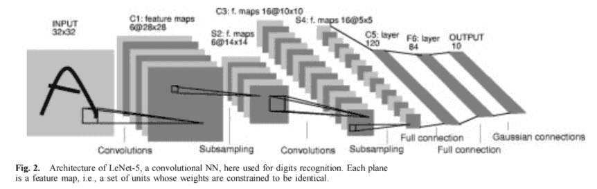

# CNN经典架构-LeNet
LeNet 是卷积神经网络（CNN）的早期代表，由 Yann LeCun 等人在 1989 年提出，最初用于手写数字识别（MNIST 数据集）。

作为最早成功应用于实际任务的卷积网络，LeNet 不仅奠定了卷积网络的基础结构，也开创了深度学习在计算机视觉中的广泛应用。
## 网络设计思想
LeNet 的设计核心是局部感受野、权值共享和下采样（池化）。网络通过多层卷积和池化逐步提取图像的层次化特征，然后通过全连接层进行分类。这一设计理念解决了全连接网络在图像处理中的参数爆炸问题，同时保持了对局部空间特征的敏感性。

LeNet 的网络结构通常表示为 C1 → S2 → C3 → S4 → C5 → F6 → 输出层：


- C1 卷积层：接收原始图像，提取低级特征（如边缘和纹理），使用 6 个 5×5 卷积核，输出 6 个特征图。
- S2 池化层（下采样层）：通常采用平均池化，对每个特征图做 2x2 下采样，减小特征图尺寸，同时保留主要信息。
- C3 卷积层：进一步提取更高层次特征，使用 16 个卷积核与上一层特征图组合，输出 16 个特征图。
- S4 池化层：再次下采样，进一步压缩特征图。
- C5 卷积层：卷积输出直接与全连接层相连（相当于一个 5×5 的卷积核覆盖整个输入特征图），提取全局特征。
- F6 全连接层：将卷积提取的特征映射到更高维表示空间。
- 输出层：使用 Softmax 激活函数，输出分类结果（如数字 0–9 的概率分布）。

## 数学原理
在 LeNet 中，每个卷积层的输出可以表示为：$$y_{i,j}^{(l)} = f\Big(\sum_{m}\sum_{n} W_{m,n}^{(l)} \cdot x_{i+m,j+n}^{(l-1)} + b^{(l)}\Big)$$

其中， $$x^{(l-1)}$$ 是上一层输入， $$W^{(l)}$$ 是卷积核权重， $$b^{(l)}$$ 是偏置，f 通常是 Sigmoid 或 Tanh 激活函数。

池化层则通过取平均值或最大值实现下采样：$$y_{i,j}^{(pool)} = \frac{1}{k^2} \sum_{p=0}^{k-1} \sum_{q=0}^{k-1} x_{s i + p, s j + q}$$

其中 $k$ 是池化窗口大小，$s$ 是步幅。

通过卷积和池化的交替组合，LeNet 能够提取从局部低级特征到全局高级特征的层次化表示。

## 特点与优势
1. 参数共享：卷积核在整个图像上滑动，极大减少参数数量。
2. 局部感受野：每个卷积神经元只关注输入图像的一小块区域，增强对局部特征的敏感性。
3. 层次化特征表示：通过卷积和池化组合，逐层抽象图像特征。
4. 端到端训练：可以通过反向传播（Backpropagation）直接训练所有参数，无需手工设计特征。
## 代码示例
下面给出一个 LeNet 的 PyTorch 实现，包括模型结构定义和在 MNIST 数据集上的训练流程。
```python
import torch
import torch.nn as nn
import torch.nn.functional as F
import torch.optim as optim
from torchvision import datasets, transforms

# 定义 LeNet 模型
class LeNet(nn.Module):
    def __init__(self):
        super(LeNet, self).__init__()
        # C1: 输入 1 通道 (28x28)，输出 6 个特征图 (24x24)
        self.conv1 = nn.Conv2d(1, 6, kernel_size=5)
        # S2: 平均池化 (12x12)
        self.pool = nn.AvgPool2d(2, 2)
        # C3: 输入 6 通道，输出 16 个特征图 (8x8)
        self.conv2 = nn.Conv2d(6, 16, kernel_size=5)
        # C5: 全连接层，相当于卷积到 (1x1)，输入 16*4*4=256
        self.fc1 = nn.Linear(16 * 4 * 4, 120)
        self.fc2 = nn.Linear(120, 84)
        self.fc3 = nn.Linear(84, 10)  # 输出 10 类（数字 0-9）

    def forward(self, x):
        x = F.tanh(self.conv1(x))      # 卷积 + 激活
        x = self.pool(x)               # 池化
        x = F.tanh(self.conv2(x))      # 卷积 + 激活
        x = self.pool(x)               # 池化
        x = x.view(-1, 16 * 4 * 4)     # 展平
        x = F.tanh(self.fc1(x))        # 全连接 + 激活
        x = F.tanh(self.fc2(x))        # 全连接 + 激活
        x = self.fc3(x)                # 输出层（未激活，交给 Softmax/损失函数）
        return x

# 数据预处理（MNIST 手写数字）
transform = transforms.Compose([
    transforms.ToTensor(),
    transforms.Normalize((0.5,), (0.5,))
])

train_dataset = datasets.MNIST(root='./data', train=True, transform=transform, download=True)
train_loader = torch.utils.data.DataLoader(train_dataset, batch_size=64, shuffle=True)

# 初始化模型、损失函数和优化器
device = torch.device("cuda" if torch.cuda.is_available() else "cpu")
model = LeNet().to(device)
criterion = nn.CrossEntropyLoss()
optimizer = optim.SGD(model.parameters(), lr=0.01, momentum=0.9)

# 简单的训练循环
for epoch in range(1):
    for batch_idx, (data, target) in enumerate(train_loader):
        data, target = data.to(device), target.to(device)

        # 前向传播
        outputs = model(data)
        loss = criterion(outputs, target)

        # 反向传播与优化
        optimizer.zero_grad()
        loss.backward()
        optimizer.step()

        if batch_idx % 100 == 0:
            print(f"Epoch [{epoch+1}], Step [{batch_idx}], Loss: {loss.item():.4f}")
```
这段代码实现了经典的 LeNet-5 网络，并在 MNIST 数据集上进行了简单的训练。可以看到，虽然 LeNet 的结构相对简单，但它奠定了现代卷积神经网络的核心框架：卷积 + 池化 + 全连接。加一句，现在的代码看着这么简单，是因为pytorch这些框架的存在，在当时LeNet提出的时候这些卷积操作都是手搓的，代码量也是比较庞大的。

LeNet 主要用于手写数字识别（如 MNIST 数据集），也适用于其他小型灰度图像分类任务。在现代深度学习发展中，LeNet 虽然相对浅层，但它的设计思想为后续深层 CNN（如 AlexNet、VGG、ResNet）奠定了基础。

LeNet 是卷积神经网络历史上的开山之作，它通过卷积、池化和全连接层组合，提出了现代 CNN 的核心思想：局部感受野、权值共享和层次化特征表示。虽然在深度和规模上无法与现代网络相比，但其理念仍然指导着计算机视觉中卷积网络的设计与训练。LeNet 的成功不仅在于模型本身，更在于开启了深度学习端到端特征学习的新时代。

最新的文章都在公众号更新，别忘记关注哦！！！如果想要加入技术群聊，扫描下方二维码回复【加群】即可。
