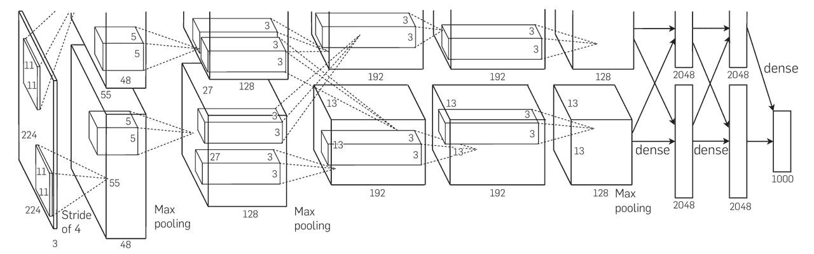

# CNN经典架构-AlexNet
2012 年，深度学习在计算机视觉领域迎来了决定性时刻。Alex Krizhevsky、Ilya Sutskever 和 Geoffrey Hinton 提出了 AlexNet，并在 ImageNet 大规模视觉识别挑战赛（ILSVRC 2012）中取得了空前的成功。AlexNet 的错误率比第二名低了近 10 个百分点，直接引爆了深度学习浪潮，使卷积神经网络（CNN）成为计算机视觉的主流方法。
## 网络结构
AlexNet 的整体结构与 LeNet 相似，但更深更宽，并结合了多项创新技术。其输入为 224×224×3 的彩色图像，最终输出 1000 个类别的预测结果。


典型的网络层次为：
- Conv1：96 个 11×11 卷积核，步幅 4，输出 55×55×96 特征图。
- MaxPool1：3×3 池化，步幅 2，输出 27×27×96。
- Conv2：256 个 5×5 卷积核，输出 27×27×256。
- MaxPool2：3×3 池化，步幅 2，输出 13×13×256。
- Conv3：384 个 3×3 卷积核，输出 13×13×384。
- Conv4：384 个 3×3 卷积核，输出 13×13×384。
- Conv5：256 个 3×3 卷积核，输出 13×13×256。
- MaxPool3：3×3 池化，步幅 2，输出 6×6×256。
- FC6：全连接层，输出 4096 维。
- FC7：全连接层，输出 4096 维。
- FC8：全连接层，输出 1000 类。
## 关键创新点
1. 更深更宽的卷积结构：相比 LeNet，AlexNet 使用更多卷积核和更深的层次，显著提升了特征表达能力。
2. ReLU 激活函数：首次大规模使用 ReLU 替代 Sigmoid/Tanh，加快了收敛速度并缓解梯度消失问题。
3. Dropout 正则化：在全连接层中使用 Dropout，有效防止过拟合。
4. 数据增强：通过平移、翻转和颜色扰动等方式扩充训练数据，提升模型泛化能力。
5. GPU 并行训练：利用两块 GPU 分担计算任务，大幅加快训练速度，为后续大规模模型训练奠定了基础。

AlexNet 的成功标志着深度学习时代的到来。它不仅在图像分类任务中取得突破，还推动了目标检测、图像分割、人脸识别等任务的快速发展。之后的 VGG、GoogLeNet、ResNet 等经典网络，几乎都是在 AlexNet 的基础上进一步改进和扩展的。
## 代码示例
下面给出一个 AlexNet 的 PyTorch 实现，基于官方 torchvision.models.alexnet 结构。注意 CIFAR-10 图片大小为 32×32，我们需要先缩放到 224×224 才能适配 AlexNet。
```python
import torch
import torch.nn as nn
import torch.optim as optim
from torchvision import datasets, transforms
from torch.utils.data import DataLoader

# 定义 AlexNet 模型
class AlexNet(nn.Module):
    def __init__(self, num_classes=1000):
        super(AlexNet, self).__init__()
        self.features = nn.Sequential(
            nn.Conv2d(3, 96, kernel_size=11, stride=4, padding=2),  # Conv1
            nn.ReLU(inplace=True),
            nn.MaxPool2d(kernel_size=3, stride=2),
            
            nn.Conv2d(96, 256, kernel_size=5, padding=2),           # Conv2
            nn.ReLU(inplace=True),
            nn.MaxPool2d(kernel_size=3, stride=2),
            
            nn.Conv2d(256, 384, kernel_size=3, padding=1),          # Conv3
            nn.ReLU(inplace=True),
            
            nn.Conv2d(384, 384, kernel_size=3, padding=1),          # Conv4
            nn.ReLU(inplace=True),
            
            nn.Conv2d(384, 256, kernel_size=3, padding=1),          # Conv5
            nn.ReLU(inplace=True),
            nn.MaxPool2d(kernel_size=3, stride=2),
        )
        self.classifier = nn.Sequential(
            nn.Dropout(),
            nn.Linear(256 * 6 * 6, 4096),  # FC6
            nn.ReLU(inplace=True),
            
            nn.Dropout(),
            nn.Linear(4096, 4096),         # FC7
            nn.ReLU(inplace=True),
            
            nn.Linear(4096, num_classes),  # FC8
        )

    def forward(self, x):
        x = self.features(x)
        x = torch.flatten(x, 1)
        x = self.classifier(x)
        return x

# 数据预处理（以 CIFAR-10 为例，图像大小调整为 224x224）
transform = transforms.Compose([
    transforms.Resize(224),
    transforms.ToTensor(),
    transforms.Normalize((0.5, 0.5, 0.5), (0.5, 0.5, 0.5))
])

train_dataset = datasets.CIFAR10(root='./data', train=True, transform=transform, download=True)
train_loader = DataLoader(train_dataset, batch_size=64, shuffle=True)

# 初始化模型、损失函数和优化器
device = torch.device("cuda" if torch.cuda.is_available() else "cpu")
model = AlexNet(num_classes=10).to(device)
criterion = nn.CrossEntropyLoss()
optimizer = optim.SGD(model.parameters(), lr=0.01, momentum=0.9)

# 简单训练循环
for epoch in range(1):
    for batch_idx, (data, target) in enumerate(train_loader):
        data, target = data.to(device), target.to(device)
        
        outputs = model(data)
        loss = criterion(outputs, target)
        
        optimizer.zero_grad()
        loss.backward()
        optimizer.step()
        
        if batch_idx % 100 == 0:
            print(f"Epoch [{epoch+1}], Step [{batch_idx}], Loss: {loss.item():.4f}")
```
这段代码实现了 AlexNet 的基本结构，并在 CIFAR-10 数据集上进行了简单训练（实际应用中，AlexNet 通常用于 ImageNet 规模的数据）。

AlexNet 是深度学习发展史上的里程碑。它不仅在图像分类任务中取得了巨大突破，还提出了 ReLU、Dropout、数据增强和 GPU 并行训练等重要技术，奠定了现代卷积神经网络的基础。即便在今天，AlexNet 依然被广泛用作深度学习入门的典型案例。

最新的文章都在公众号更新，别忘记关注哦！！！如果想要加入技术群聊，扫描下方二维码回复【加群】即可。

