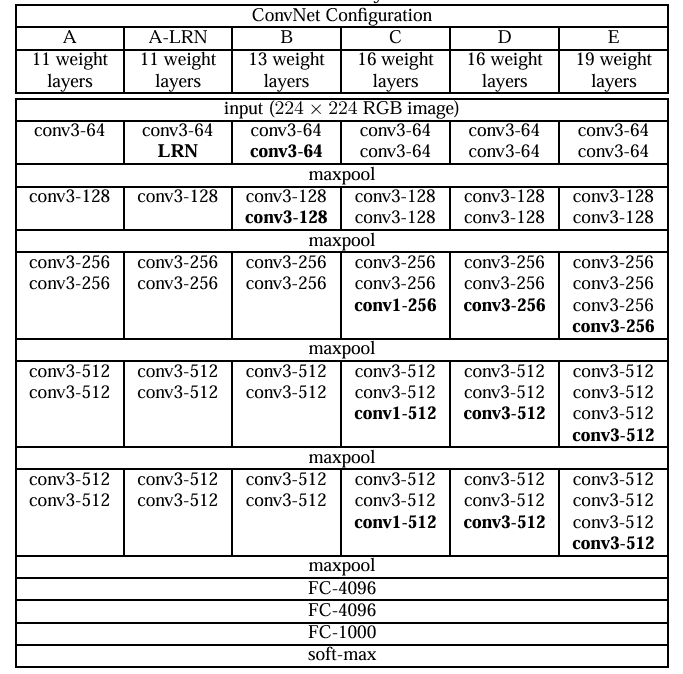

# CNN经典架构-VGG
在 AlexNet 取得成功后，研究者们开始探索 更深的卷积神经网络 是否能够进一步提升性能。2014 年，牛津大学的 Visual Geometry Group（简称 VGG）提出了 VGGNet，并在 ImageNet 2014 挑战赛中获得了优异成绩。VGG 的核心思想非常简单：通过堆叠多个小卷积核（3×3），构建更深的网络结构。这种设计理念不仅取得了良好效果，也对后续网络架构产生了深远影响。
## 网络结构
VGG 有多个变体，其中最常用的是 VGG-16 和 VGG-19，分别包含 16 层和 19 层可训练参数层（卷积层 + 全连接层）。其基本设计思想是：
- 使用 $$3\times 3$$ 卷积核：连续堆叠两个或三个 $$3\times 3$$ 卷积，相当于一个 $$5\times 5$$ 或 $$7\times 7$$ 的感受野，但参数更少。
- 使用 $$2\times 2$$ 最大池化层：逐步减小特征图尺寸，同时保留主要特征。
- 使用三层全连接层：最后通过 2 个 4096 单元的全连接层和 1 个输出层进行分类。


以 VGG-16 为例，也就是上面的表中的D，输入图像为 224×224×3，结构如下：
1. 卷积$$（3\times 3, 64） \times 2$$ → 最大池化
2. 卷积$$（3\times 3, 128） \times 2$$ → 最大池化
3. 卷积$$（3\times 3, 256） \times 3$$ → 最大池化
4. 卷积$$（3\times 3, 512） \times 3$$ → 最大池化
5. 卷积$$（3\times 3, 512） \times 3$$ → 最大池化
6. 全连接层（$$4096$$）
7. 全连接层（$$4096$$）
8. 输出层（$$1000$$ 类别）

## 设计思想
VGG 的最大特点是深而简洁：
- 小卷积核 + 深层堆叠：相比使用大卷积核，多个 3×3 卷积可以增加非线性，同时减少参数量。例如，一个 7×7 卷积核参数为 49，而连续三个 3×3 卷积参数为 27，计算效率更高。
- 模块化结构：VGG 的卷积与池化层交替堆叠，非常规则，便于理解和扩展。
- 强大的特征表达能力：随着网络加深，VGG 能逐层提取从边缘到纹理再到高级语义的特征。

VGG 在 ImageNet 上的表现优异，成为后续 CNN 的重要基准。它的设计理念影响了 GoogLeNet、ResNet 等后续模型。虽然 VGG 参数量（约 138M）和计算量较大，但其规则、简洁的结构使其成为特征提取和迁移学习的经典骨干网络，在目标检测、图像分割等任务中被广泛使用。

## 代码示例
我们可以用 PyTorch 实现一个简化版 VGG（以 VGG-16 为例），并在 CIFAR-10 数据集上测试。
```python
import torch
import torch.nn as nn
import torch.optim as optim
from torchvision import datasets, transforms
from torch.utils.data import DataLoader

# VGG 配置：卷积层通道数
cfg = {
    'VGG16': [64, 64, 'M', 
              128, 128, 'M', 
              256, 256, 256, 'M', 
              512, 512, 512, 'M', 
              512, 512, 512, 'M']
}

# VGG 模型定义
class VGG(nn.Module):
    def __init__(self, vgg_name, num_classes=10):
        super(VGG, self).__init__()
        self.features = self._make_layers(cfg[vgg_name])
        self.classifier = nn.Sequential(
            nn.Linear(512, 4096),
            nn.ReLU(True),
            nn.Dropout(),
            nn.Linear(4096, 4096),
            nn.ReLU(True),
            nn.Dropout(),
            nn.Linear(4096, num_classes)
        )

    def forward(self, x):
        out = self.features(x)
        out = out.view(out.size(0), -1)
        out = self.classifier(out)
        return out

    def _make_layers(self, cfg):
        layers = []
        in_channels = 3
        for x in cfg:
            if x == 'M':
                layers += [nn.MaxPool2d(kernel_size=2, stride=2)]
            else:
                layers += [nn.Conv2d(in_channels, x, kernel_size=3, padding=1),
                           nn.ReLU(inplace=True)]
                in_channels = x
        layers += [nn.AdaptiveAvgPool2d((1, 1))]
        return nn.Sequential(*layers)

# 数据预处理（CIFAR-10）
transform = transforms.Compose([
    transforms.Resize(224),  # 调整大小以适配 VGG
    transforms.ToTensor(),
    transforms.Normalize((0.5, 0.5, 0.5), (0.5, 0.5, 0.5))
])

train_dataset = datasets.CIFAR10(root='./data', train=True, transform=transform, download=True)
train_loader = DataLoader(train_dataset, batch_size=64, shuffle=True)

# 初始化模型、损失函数和优化器
device = torch.device("cuda" if torch.cuda.is_available() else "cpu")
model = VGG('VGG16', num_classes=10).to(device)
criterion = nn.CrossEntropyLoss()
optimizer = optim.SGD(model.parameters(), lr=0.01, momentum=0.9)

# 简单训练循环
for epoch in range(1):
    for batch_idx, (data, target) in enumerate(train_loader):
        data, target = data.to(device), target.to(device)

        outputs = model(data)
        loss = criterion(outputs, target)

        optimizer.zero_grad()
        loss.backward()
        optimizer.step()

        if batch_idx % 100 == 0:
            print(f"Epoch [{epoch+1}], Step [{batch_idx}], Loss: {loss.item():.4f}")
```
VGG 提出了一个极具启发性的设计思想：通过小卷积核堆叠构建深层网络。这种“深而简洁”的结构既提升了模型的表达能力，又在后续研究中被广泛采用。虽然 VGG 计算量和参数量较大，但它至今仍是迁移学习和特征提取的经典选择。

最新的文章都在公众号更新，别忘记关注哦！！！如果想要加入技术群聊，扫描下方二维码回复【加群】即可。
