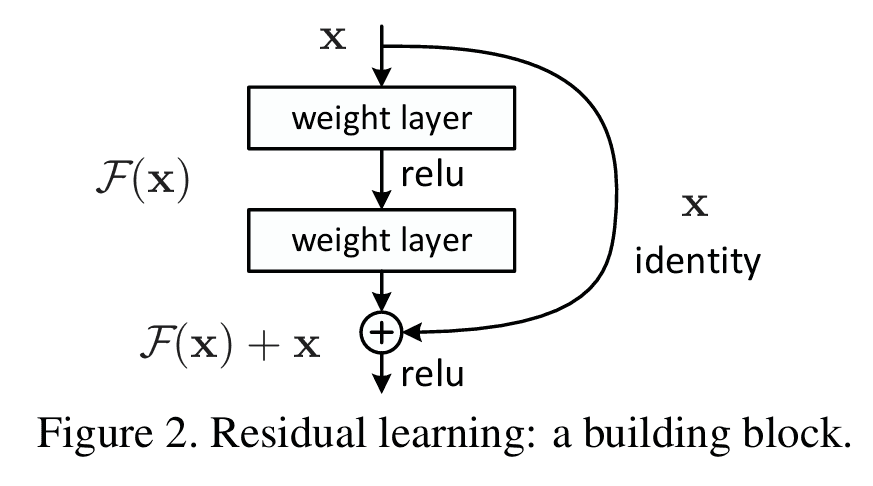
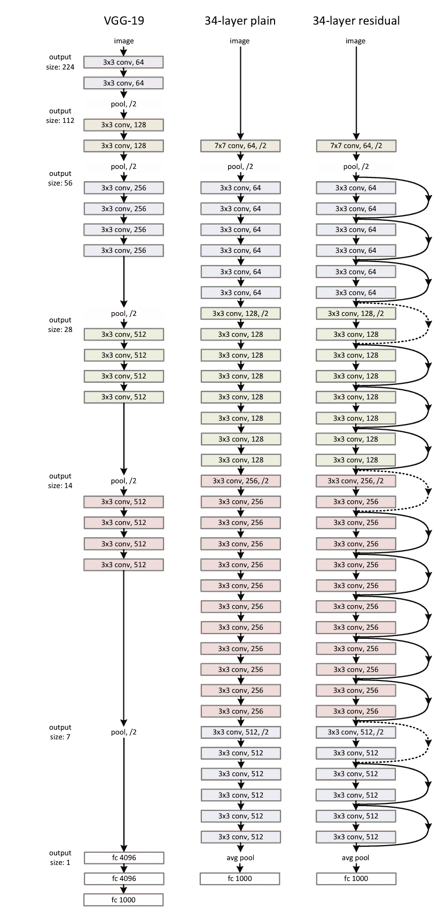

# CNN经典架构-ResNet
在深度学习的发展过程中，人们逐渐发现：随着神经网络层数的增加，模型的表现并不一定更好。在实际训练中，深层网络往往出现 梯度消失、梯度爆炸 或 退化问题 —— 即训练误差反而比浅层网络更高。

2015 年，何恺明等人提出了 ResNet（Residual Network），首次在 ImageNet 挑战赛中使用超过 100 层的网络结构，并获得了冠军。ResNet 的关键创新是 残差连接（Residual Connection），它解决了深层网络训练困难的问题，使深度学习真正进入超深网络时代。
## 残差思想
在传统的网络中，每一层都试图学习一个映射函数 $$H(x)$$。

ResNet 提出的思想是，让网络学习 残差函数：
$$H(x) = F(x) + x$$



其中， $$F(x) = H(x) - x$$ 表示残差。

这样一来，如果最优映射接近于恒等映射（Identity Mapping），则只需让 $$F(x) \approx 0$$，训练更容易。

这种设计通过 跳跃连接（skip connection），将输入 $x$直接加到卷积层的输出上，从而缓解了梯度消失问题。
## 网络结构
ResNet 的基本单元是 残差块（Residual Block），主要分为两类：
- 基本残差块（Basic Block）：常用于 ResNet-18 和 ResNet-34，包含两个 $$3×3$$ 卷积层。
- 瓶颈残差块（Bottleneck Block）：常用于 ResNet-50、ResNet-101 和 ResNet-152，使用 $$1×1→3×3→1×1$$ 三层卷积，减少计算量。

以 ResNet-34 为例，其结构大致为：


其中包含：
1. 卷积层 + BN + ReLU + 最大池化
2. 3 个残差块（64 通道）
3. 4 个残差块（128 通道）
4. 6 个残差块（256 通道）
5. 3 个残差块（512 通道）
6. 全局平均池化 + 全连接层

ResNet-50、101 等更深的版本采用瓶颈结构，但核心思想一致。

## 关键创新点
1. 残差连接（Skip Connection）：让梯度能够无障碍地传递到更早的层，缓解梯度消失。
2. 更深的网络可训练：ResNet 首次在 ImageNet 上成功训练超过 100 层的网络。
3. 模块化设计：残差块可以方便地堆叠，形成不同深度的模型。
4. 恒等映射易学性：相比直接学习复杂映射，学习残差更容易收敛。

## 代码示例
下面我们实现一个简化版 ResNet-18，并在 CIFAR-10 上演示。
```python
import torch
import torch.nn as nn
import torch.optim as optim
from torchvision import datasets, transforms
from torch.utils.data import DataLoader

# 定义残差块
class BasicBlock(nn.Module):
    expansion = 1
    def __init__(self, in_channels, out_channels, stride=1):
        super(BasicBlock, self).__init__()
        self.conv1 = nn.Conv2d(in_channels, out_channels, kernel_size=3, stride=stride, padding=1, bias=False)
        self.bn1 = nn.BatchNorm2d(out_channels)
        self.relu = nn.ReLU(inplace=True)
        self.conv2 = nn.Conv2d(out_channels, out_channels, kernel_size=3, stride=1, padding=1, bias=False)
        self.bn2 = nn.BatchNorm2d(out_channels)

        # 如果输入和输出维度不一致，使用 1x1 卷积调整
        self.shortcut = nn.Sequential()
        if stride != 1 or in_channels != out_channels:
            self.shortcut = nn.Sequential(
                nn.Conv2d(in_channels, out_channels, kernel_size=1, stride=stride, bias=False),
                nn.BatchNorm2d(out_channels)
            )

    def forward(self, x):
        identity = self.shortcut(x)
        out = self.relu(self.bn1(self.conv1(x)))
        out = self.bn2(self.conv2(out))
        out += identity
        out = self.relu(out)
        return out

# 定义 ResNet
class ResNet(nn.Module):
    def __init__(self, block, num_blocks, num_classes=10):
        super(ResNet, self).__init__()
        self.in_channels = 64
        self.conv1 = nn.Conv2d(3, 64, kernel_size=3, stride=1, padding=1, bias=False)
        self.bn1 = nn.BatchNorm2d(64)
        self.relu = nn.ReLU(inplace=True)
        self.layer1 = self._make_layer(block, 64, num_blocks[0], stride=1)
        self.layer2 = self._make_layer(block, 128, num_blocks[1], stride=2)
        self.layer3 = self._make_layer(block, 256, num_blocks[2], stride=2)
        self.layer4 = self._make_layer(block, 512, num_blocks[3], stride=2)
        self.avgpool = nn.AdaptiveAvgPool2d((1, 1))
        self.fc = nn.Linear(512 * block.expansion, num_classes)

    def _make_layer(self, block, out_channels, num_blocks, stride):
        strides = [stride] + [1]*(num_blocks-1)
        layers = []
        for s in strides:
            layers.append(block(self.in_channels, out_channels, s))
            self.in_channels = out_channels * block.expansion
        return nn.Sequential(*layers)

    def forward(self, x):
        out = self.relu(self.bn1(self.conv1(x)))
        out = self.layer1(out)
        out = self.layer2(out)
        out = self.layer3(out)
        out = self.layer4(out)
        out = self.avgpool(out)
        out = torch.flatten(out, 1)
        out = self.fc(out)
        return out

# ResNet-18
def ResNet18():
    return ResNet(BasicBlock, [2, 2, 2, 2])

# 数据预处理
transform = transforms.Compose([
    transforms.Resize(224),  # 调整输入大小
    transforms.ToTensor(),
    transforms.Normalize((0.5, 0.5, 0.5), (0.5, 0.5, 0.5))
])

train_dataset = datasets.CIFAR10(root='./data', train=True, transform=transform, download=True)
train_loader = DataLoader(train_dataset, batch_size=64, shuffle=True)

# 初始化模型、损失函数和优化器
device = torch.device("cuda" if torch.cuda.is_available() else "cpu")
model = ResNet18().to(device)
criterion = nn.CrossEntropyLoss()
optimizer = optim.SGD(model.parameters(), lr=0.01, momentum=0.9)

# 简单训练循环
for epoch in range(1):
    for batch_idx, (data, target) in enumerate(train_loader):
        data, target = data.to(device), target.to(device)

        outputs = model(data)
        loss = criterion(outputs, target)

        optimizer.zero_grad()
        loss.backward()
        optimizer.step()

        if batch_idx % 100 == 0:
            print(f"Epoch [{epoch+1}], Step [{batch_idx}], Loss: {loss.item():.4f}")
```
ResNet 的出现解决了深层网络训练难的问题，它通过 残差连接 提供了一条捷径，使梯度能够顺利传播。

ResNet 在 ImageNet 上取得了巨大成功，也成为后续网络（如 DenseNet、ResNeXt、EfficientNet）的基础。可以说，没有 ResNet，就没有今天的超深网络。

最新的文章都在公众号更新，别忘记关注哦！！！如果想要加入技术群聊，扫描下方二维码回复【加群】即可。
