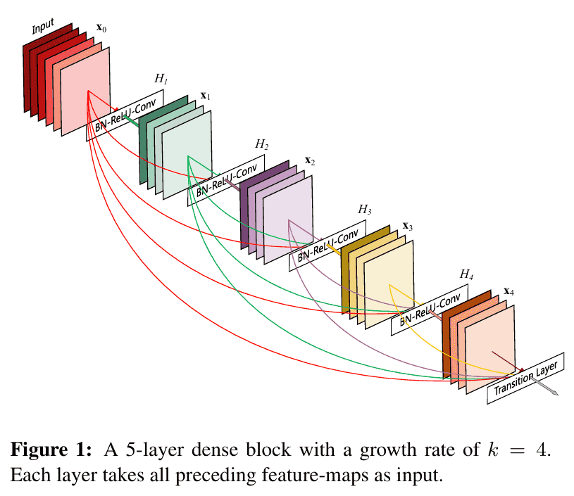
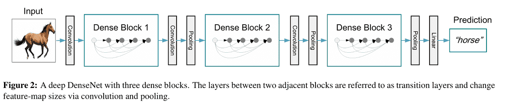

# CNN经典架构-DenseNet
在 ResNet 提出残差连接后，深层网络的训练问题得到了极大缓解。然而，ResNet 的连接方式仍然比较稀疏：每一层的输出只与后一层相加，信息传递路径有限。

2017 年，Gao Huang 等人提出了 DenseNet（Densely Connected Convolutional Networks），通过一种更加彻底的特征复用方式，使得网络在参数更少的情况下，依然能获得更好的性能。

DenseNet 的核心思想是**网络中任意一层都直接与之前所有层相连**，这种密集连接方式显著提高了信息流动效率。

## 核心思想
在传统的卷积网络中，第 $$l$$ 层的输入只来自第 $$l-1$$ 层。

在 ResNet 中，第 $$l$$层的输入是 $$x_{l-1} + F(x_{l-1})$$。

而在 DenseNet 中： $$x_l = H_l([x_0, x_1, \ldots, x_{l-1}])$$

这里， $$[x_0, x_1, \ldots, x_{l-1}]$$ 表示将所有前面层的输出在通道维度上进行拼接（concatenate）。这样，第 $$l$$ 层可以直接利用所有之前层的特征。

DenseNet就是让网络中的每一层都记得所有之前的特征，而不是只依赖最后一层的结果。
## 网络结构


DenseNet 主要由以下几个部分组成：
1. Dense Block（密集块）：核心组件，每一层都接收前面所有层的特征，并将自己的输出传递给后续层。
2. Transition Layer（过渡层）：用于控制模型复杂度，包括 $1×1$ 卷积（减少通道数）和 $2×2$ 平均池化（缩小特征图尺寸）。
3. Growth Rate（增长率）：每一层新增加的特征通道数，用 $k$ 表示。假设输入有 $m$ 个通道，经过 $l$ 层后，输出通道数为 $m+l×k$。

以 DenseNet-121 为例，它包含：
- 一个初始卷积层
- 四个 Dense Block，每个 Block 之间有 Transition Layer
- 每个 Dense Block 内包含多个卷积层，输出通道数逐渐增加
- 最后接全局平均池化和全连接层

DenseNet 相比 ResNet 和 VGG，有以下显著优势：
- 高效的特征复用：避免了重复学习冗余特征，提高了参数利用率。
- 缓解梯度消失：密集连接使得梯度可以直接流向前层，训练更稳定。
- 参数更少：由于特征被复用，DenseNet 的参数量比 ResNet 更少，但性能更好。
- 更强的正则化效果：信息流动更顺畅，使得模型不易过拟合。

## 代码示例
我们实现一个简化版 DenseNet（类似 DenseNet-121 的小型结构），并在 CIFAR-10 数据集上测试。
```python
import torch
import torch.nn as nn
import torch.optim as optim
from torchvision import datasets, transforms
from torch.utils.data import DataLoader

# 定义 DenseLayer
class DenseLayer(nn.Module):
    def __init__(self, in_channels, growth_rate):
        super(DenseLayer, self).__init__()
        self.bn = nn.BatchNorm2d(in_channels)
        self.relu = nn.ReLU(inplace=True)
        self.conv = nn.Conv2d(in_channels, growth_rate, kernel_size=3, padding=1, bias=False)

    def forward(self, x):
        out = self.conv(self.relu(self.bn(x)))
        out = torch.cat([x, out], 1)  # 拼接输入和输出
        return out

# 定义 DenseBlock
class DenseBlock(nn.Module):
    def __init__(self, num_layers, in_channels, growth_rate):
        super(DenseBlock, self).__init__()
        layers = []
        for i in range(num_layers):
            layers.append(DenseLayer(in_channels + i * growth_rate, growth_rate))
        self.block = nn.Sequential(*layers)

    def forward(self, x):
        return self.block(x)

# 定义 Transition Layer
class Transition(nn.Module):
    def __init__(self, in_channels, out_channels):
        super(Transition, self).__init__()
        self.bn = nn.BatchNorm2d(in_channels)
        self.relu = nn.ReLU(inplace=True)
        self.conv = nn.Conv2d(in_channels, out_channels, kernel_size=1, bias=False)
        self.pool = nn.AvgPool2d(2, stride=2)

    def forward(self, x):
        out = self.conv(self.relu(self.bn(x)))
        out = self.pool(out)
        return out

# 定义 DenseNet
class DenseNet(nn.Module):
    def __init__(self, growth_rate=12, block_layers=[6, 12, 24, 16], num_classes=10):
        super(DenseNet, self).__init__()
        self.growth_rate = growth_rate
        num_channels = 2 * growth_rate  # 初始通道数

        self.conv1 = nn.Conv2d(3, num_channels, kernel_size=3, padding=1, bias=False)

        self.features = nn.Sequential()
        for i, num_layers in enumerate(block_layers):
            block = DenseBlock(num_layers, num_channels, growth_rate)
            self.features.add_module(f"denseblock{i+1}", block)
            num_channels = num_channels + num_layers * growth_rate
            if i != len(block_layers) - 1:  # 在 Block 之间加 Transition
                out_channels = num_channels // 2
                trans = Transition(num_channels, out_channels)
                self.features.add_module(f"transition{i+1}", trans)
                num_channels = out_channels

        self.bn = nn.BatchNorm2d(num_channels)
        self.relu = nn.ReLU(inplace=True)
        self.avgpool = nn.AdaptiveAvgPool2d((1, 1))
        self.fc = nn.Linear(num_channels, num_classes)

    def forward(self, x):
        out = self.conv1(x)
        out = self.features(out)
        out = self.relu(self.bn(out))
        out = self.avgpool(out)
        out = torch.flatten(out, 1)
        out = self.fc(out)
        return out

# 数据预处理
transform = transforms.Compose([
    transforms.Resize(224),
    transforms.ToTensor(),
    transforms.Normalize((0.5, 0.5, 0.5), (0.5, 0.5, 0.5))
])

train_dataset = datasets.CIFAR10(root='./data', train=True, transform=transform, download=True)
train_loader = DataLoader(train_dataset, batch_size=64, shuffle=True)

# 初始化模型、损失函数和优化器
device = torch.device("cuda" if torch.cuda.is_available() else "cpu")
model = DenseNet(num_classes=10).to(device)
criterion = nn.CrossEntropyLoss()
optimizer = optim.SGD(model.parameters(), lr=0.01, momentum=0.9)

# 简单训练循环
for epoch in range(1):  # 演示一个 epoch
    for batch_idx, (data, target) in enumerate(train_loader):
        data, target = data.to(device), target.to(device)

        outputs = model(data)
        loss = criterion(outputs, target)

        optimizer.zero_grad()
        loss.backward()
        optimizer.step()

        if batch_idx % 100 == 0:
            print(f"Epoch [{epoch+1}], Step [{batch_idx}], Loss: {loss.item():.4f}")
```
DenseNet 通过 密集连接 提供了更高效的信息流动方式，使得每一层都能直接利用所有之前层的特征。这种设计不仅减少了参数量，还提升了训练稳定性和模型性能。

DenseNet 在图像分类、目标检测、医学影像分析等任务中表现优异，成为 ResNet 之后最具影响力的 CNN 架构之一。

最新的文章都在公众号更新，别忘记关注哦！！！如果想要加入技术群聊，扫描下方二维码回复【加群】即可。
