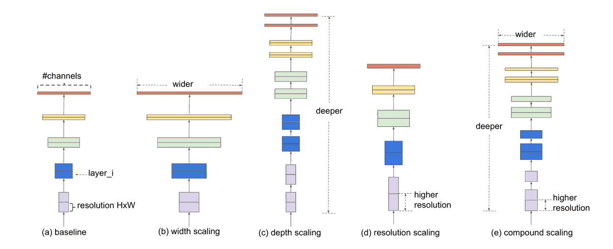
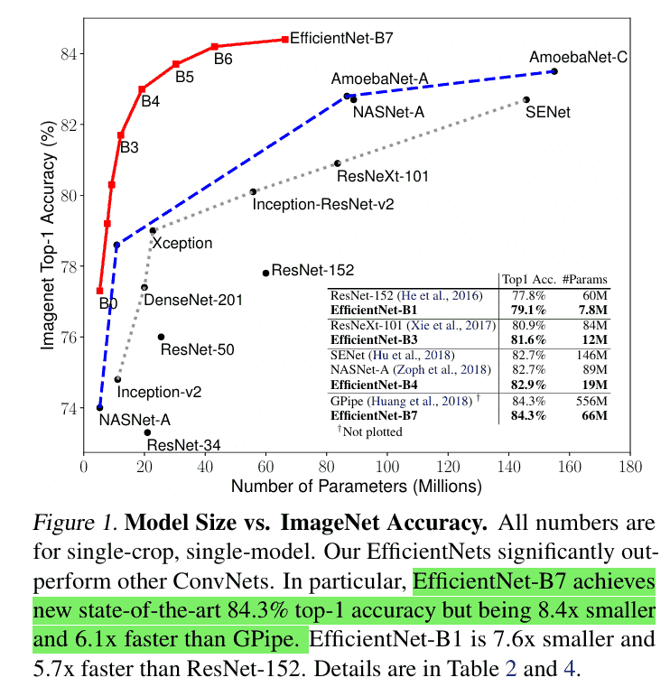

# CNN经典架构-EfficientNet
随着深度学习的发展，CNN 的精度不断提升，但代价是网络越来越深、参数越来越多。例如 VGG-19 有 144M 参数，ResNet-152 计算量达到 11.3 GFLOPs。这在实际应用（如移动端推理）中非常昂贵。

2019 年，谷歌团队提出 EfficientNet，其核心思想是通过一种系统化的复合缩放（Compound Scaling）方法，在计算量可控的前提下提升模型精度。EfficientNet 在 ImageNet 上取得了 SOTA 性能，同时参数量和计算量都显著减少。

## 核心思想
传统 CNN 的扩展方式主要有三种：

- 加深（Depth）：增加网络层数。
- 加宽（Width）：增加每层的通道数。
- 加大分辨率（Resolution）：输入更高分辨率的图像。

但简单地单独扩展某一个维度往往无法获得最优效果。

EfficientNet 提出 复合缩放公式：

$$depth = \alpha^\phi, \quad width = \beta^\phi, \quad resolution = \gamma^\phi$$

其中：
- $$\alpha, \beta, \gamma$$ 是常数超参数，用来控制三个维度的比例；
- $$\phi$$ 是一个用户定义的全局系数，决定计算资源的放大倍数。
这种方法保证了 深度、宽度和分辨率的协调扩展，避免了资源浪费。

## 网络结构
EfficientNet 的基础网络是 EfficientNet-B0，它由 MobileNetV2 的倒残差结构（MBConv）演化而来，并结合 Squeeze-and-Excitation (SE) 注意力模块。


EfficientNet-B0 的设计包括：
1. Stem：3×3 卷积，输出 32 通道。
2. MBConv Blocks：若干个倒残差模块（扩展卷积 → 深度卷积 → SE 模块 → 压缩卷积）。
3. Head：1×1 卷积扩展通道数，全局平均池化，全连接层输出分类结果。

通过复合缩放方法，EfficientNet 系列扩展为 B0 ~ B7：
- B0：基准网络（约 5.3M 参数）。
- B7：最深最大版本（约 66M 参数）。

## 关键优势
1. 系统化扩展：通过复合缩放方法，解决了 CNN 扩展的非最优问题。
2. 高效性：在相同精度下，参数量和计算量比 ResNet、DenseNet 显著减少。
3. 性能强大：在 ImageNet 上，EfficientNet-B7 Top-1 精度达到 84.3%，远超同类模型。
4. 可迁移性好：在目标检测、分割和医疗影像等下游任务中表现优异。

## 示例代码
我们用 PyTorch 实现一个简化版 EfficientNet-B0（仅示例，不完全复现所有细节），并在 CIFAR-10 数据集上演示。
```python
import torch
import torch.nn as nn
import torch.optim as optim
from torchvision import datasets, transforms
from torch.utils.data import DataLoader

# Squeeze-and-Excitation 模块
class SEModule(nn.Module):
    def __init__(self, channels, reduction=4):
        super(SEModule, self).__init__()
        self.fc1 = nn.Conv2d(channels, channels // reduction, kernel_size=1)
        self.relu = nn.ReLU(inplace=True)
        self.fc2 = nn.Conv2d(channels // reduction, channels, kernel_size=1)
        self.sigmoid = nn.Sigmoid()

    def forward(self, x):
        w = torch.mean(x, dim=(2, 3), keepdim=True)  # 全局平均池化
        w = self.fc1(w)
        w = self.relu(w)
        w = self.fc2(w)
        w = self.sigmoid(w)
        return x * w

# MBConv 模块
class MBConv(nn.Module):
    def __init__(self, in_channels, out_channels, expansion=6, stride=1, use_se=True):
        super(MBConv, self).__init__()
        mid_channels = in_channels * expansion
        self.use_residual = (stride == 1 and in_channels == out_channels)

        layers = []
        if expansion != 1:
            layers.append(nn.Conv2d(in_channels, mid_channels, kernel_size=1, bias=False))
            layers.append(nn.BatchNorm2d(mid_channels))
            layers.append(nn.ReLU6(inplace=True))

        layers.extend([
            nn.Conv2d(mid_channels, mid_channels, kernel_size=3, stride=stride, padding=1, groups=mid_channels, bias=False),
            nn.BatchNorm2d(mid_channels),
            nn.ReLU6(inplace=True),
        ])

        if use_se:
            layers.append(SEModule(mid_channels))

        layers.extend([
            nn.Conv2d(mid_channels, out_channels, kernel_size=1, bias=False),
            nn.BatchNorm2d(out_channels)
        ])

        self.conv = nn.Sequential(*layers)

    def forward(self, x):
        out = self.conv(x)
        if self.use_residual:
            return x + out
        else:
            return out

# EfficientNet-B0 简化版
class EfficientNetB0(nn.Module):
    def __init__(self, num_classes=10):
        super(EfficientNetB0, self).__init__()
        self.stem = nn.Sequential(
            nn.Conv2d(3, 32, kernel_size=3, stride=1, padding=1, bias=False),
            nn.BatchNorm2d(32),
            nn.ReLU6(inplace=True)
        )
        self.blocks = nn.Sequential(
            MBConv(32, 16, expansion=1, stride=1),
            MBConv(16, 24, stride=2),
            MBConv(24, 40, stride=2),
            MBConv(40, 80, stride=2),
            MBConv(80, 112, stride=1),
            MBConv(112, 192, stride=2),
            MBConv(192, 320, stride=1)
        )
        self.head = nn.Sequential(
            nn.Conv2d(320, 1280, kernel_size=1, bias=False),
            nn.BatchNorm2d(1280),
            nn.ReLU6(inplace=True),
            nn.AdaptiveAvgPool2d((1, 1)),
        )
        self.fc = nn.Linear(1280, num_classes)

    def forward(self, x):
        x = self.stem(x)
        x = self.blocks(x)
        x = self.head(x)
        x = torch.flatten(x, 1)
        x = self.fc(x)
        return x

# 数据预处理（CIFAR-10）
transform = transforms.Compose([
    transforms.Resize(224),
    transforms.ToTensor(),
    transforms.Normalize((0.5, 0.5, 0.5), (0.5, 0.5, 0.5))
])

train_dataset = datasets.CIFAR10(root='./data', train=True, transform=transform, download=True)
train_loader = DataLoader(train_dataset, batch_size=64, shuffle=True)

# 初始化模型、损失函数和优化器
device = torch.device("cuda" if torch.cuda.is_available() else "cpu")
model = EfficientNetB0(num_classes=10).to(device)
criterion = nn.CrossEntropyLoss()
optimizer = optim.Adam(model.parameters(), lr=0.001)

# 简单训练循环
for epoch in range(1):
    for batch_idx, (data, target) in enumerate(train_loader):
        data, target = data.to(device), target.to(device)

        outputs = model(data)
        loss = criterion(outputs, target)

        optimizer.zero_grad()
        loss.backward()
        optimizer.step()

        if batch_idx % 100 == 0:
            print(f"Epoch [{epoch+1}], Step [{batch_idx}], Loss: {loss.item():.4f}")
```
EfficientNet 提出了 复合缩放 的方法，系统化地平衡了网络的深度、宽度和分辨率，从而在精度和效率之间取得了最佳平衡。它在 ImageNet 和下游任务上都取得了出色表现，成为轻量化 CNN 的代表之一。

最新的文章都在公众号更新，别忘记关注哦！！！如果想要加入技术群聊，扫描下方二维码回复【加群】即可。
